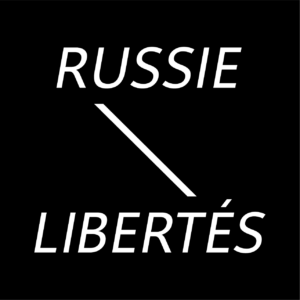

FR - **L’association :**

Russie-Libertés est une association française loi 1901, ayant pour **objectif la défense de droits humains, l’information, et la sensibilisation du public français et européen sur l’état des droits et des libertés en Russie.**

Créée en 2012 à Paris par des citoyens engagés, Russie-Libertés porte la voix de la société civile russe en France et en Europe. **Notre association est indépendante et ne représente aucun parti ou mouvement politique**. Nous agissons, toujours de manière pacifique et transparente, pour la construction d’un État de Droit en Russie.

**Russie-Libertés s’oppose fermement à la guerre en Ukraine**. Nous soutenons les mouvements anti-guerre russes non-violents et prônons la nécessité d'attraire en justice les responsables de cette agression et de crimes de guerre commis par l'armée russe en Ukraine. Nous combattons la propagande du Kremlin en apportant notre soutien aux opposants à la guerre, ainsi qu'aux journalistes et artistes russes indépendants.

**Comment agissons-nous ?**

Depuis sa création en 2012, l'association Russie-Libertés :

- Organise de nombreuses actions, conférences, rassemblements, expositions et autres événements avec des figures de l’activisme russe, des femmes et hommes politiques, des journalistes, des universitaires, des artistes engagés russes et français.

- Participe au débat public et publie régulièrement des rapports, tribunes et livres sur celles et ceux qui forment les autres visages de la Russie et luttent pour une transformation démocratique du pays.

- Intervient auprès des institutions françaises et européennes pour porter la voix de la société civile russe.

- Apporte son soutien aux Ukrainiens, Bélarusses, Géorgiens et tous les peuples agressés par le Kremlin.

Nos nombreuses actions et publications sont faites en collaboration avec d’autres ONG françaises et internationales de défense des droits humains, dont notamment _Amnesty International_, _FIDH_, _RSF_, _Les Nouveaux Dissidents_ et _Mémorial_.

Nous sommes également membres du _[Comité Russie Europe](https://esprit.presse.fr/actualites/comite-russie-europe/creation-du-comite-russie-europe-43426)_ , du mouvement international de Russes anti-guerre [Free Russians Global](https://freerussians.global), de la [Plateforme des initiatives humanitaires et anti-guerre](https://platforma.international) et de la Coalition internationale pour les Droits humains.

**Pourquoi nous rejoindre et nous soutenir ?**

Nous portons un mouvement de type nouveau, jeune et indépendant, engagé pour la défense des libertés civiles et des droits humains en Russie. Nos modes d’action sont originaux et inventifs, notre fonctionnement est démocratique et transparent.

**[Nous appelons tous les citoyens engagés pour une Russie libre à nous rejoindre !](https://russie-libertes.org/index.php/adherer/)**

**ILS NOUS SOUTIENNENT**

- 
- 
- 
- 
- 
- 
- 
- 
- 

* * *

**Notre équipe**: la nouvelle composition de notre conseil d'administration et de notre conseil de consultation est disponible via une requête par e-mail: **contact@russie-libertes.org**
