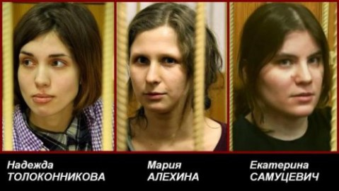

> Communiqué de presse de Russie-Libertés
> 
> ... 
>  Nadejda Tolokonnikova, Maria Alekhina et Ekaterina Samoutsevitch 
> 
>  en détention provisoire depuis bientôt 3 mois. **Déni de justice pour les Pussy Riot** Plus de 300 personnes sont venues aujourd'hui soutenir Nadezhda Tolokonnikova, Katerina Samoutsevitch et Maria Alekhina devant le siège du tribunal de l'arrondissement Taganski à Moscou où une requête de l'accusation dans le cadre du procès politique du groupe punk féministe Pussy Riot était examinée.
> 
> La requête visant à réduire les délais pour l'examen par la défense du dossier d'accusation a été acceptée par le le tribunal. Désormais, la défense aura seulement jusqu'au 9 juillet pour examiner le dossier, ce qui réduit très fortement ses possibilités de réponse. En réaction à cette décision, Nikolay Polozov, un des avocats des Pussy Riot, [a déclaré à RFI](http://www.russian.rfi.fr/rossiya/20120704-nikolai-polozov-konets-pravosudiya-v-rossii) qu'il s'agissait de "la fin de la justice en Russie". Suite à cette décision du tribunal, Nadezhda Tolokonnikova s'est mise en grève de la faim.
>       La police a violemment dispersé plusieurs journalistes et militants venus soutenir les Pussy Riot devant le tribunal. 9 personnes ont été interpellées.
> 
> Le 27 juin dernier, la radio [Echo de Moscou a publié un appel](http://www.echo.msk.ru/doc/903154-echo.html) signé par plus de 200 personnalités du monde de la culture russe demandant la libération des Pussy Riot. Fait remarquable, cet appel a également été [signé en ligne par plus de 34.000 personnes](http://russie-libertes.org/2012/07/03/pussy-riot-appeal-of-actors-and-artists-of-the-russian-federation/) et ce nombre ne cesse de croître.
> 
> Dans le même temps le site de soutien international [freepussyriot.org](http://freepussyriot.org) subit actuellement une attaque DDoS le rendant inaccessible. En attendant son rétablissement nous publions toutes les informations sur notre site dans [la rubrique Free Pussy Riot](http://russie-libertes.org/category/free-pussy-riot/) .
> 
> L'association Russie-Libertés réitère son soutien aux prisonnières de conscience du groupe Pussy Riot et exige la libération immédiate de Nadezhda Tolokonnikova, Katerina Samoutsevitch et Maria Alekhina.
> 
> Russie-Libertés
