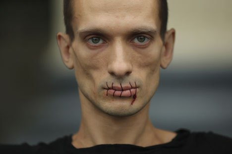

**[Rosbalt](https://www.rosbalt.ru/video/2012/07/24/1014379.html) -** 24 juillet 2012
L'artiste de Saint-Pétersbourg Piotr Pavlenski s'est cousu la bouche et s'est rendu à la Cathédrale Notre-Dame de Kazan avec une pancarte : « La prestation des Pussy Riot était une reprise de la célèbre action du Christ (Mat. 21 : 12-13) ». Ce chapitre du Livre contient le célèbre épisode de l'expulsion des marchands du temple. L'artiste a décidé de soutenir de la sorte les membres du groupe punk Pussy Riot.
... 
 Selon l'artiste, la bouche cousue symbolise la position de l'artiste moderne en Russie, l'interdiction de la transparence et le renforcement de la censure. 

 Crédit photo : Reuters « Piotr Pavlenski exhorte les croyants à trouver en eux la force et à se rendre compte que la culture chrétienne est inséparable des actes de Jésus-Christ, et les artistes à surpasser leur peur et, au moins une fois, à exprimer honnêtement et ouvertement leur opinion », a expliqué l'assistante de l'artiste, Ioulia.

Les policiers n'ont pas arrêté le militant. Une heure et demie plus tard, une ambulance est arrivée sur les lieux, et l'artiste a été acheminé vers une clinique psychiatrique. Les médecins l'ont reconnu sain d'esprit et il est rentré chez lui, où il a enlevé ses coutures.

Plus tard, Pavlenski a déclaré aux médias que la détention des Pussy Riot était contraire aux valeurs chrétiennes fondamentales. Selon lui, la bouche cousue symbolise la position de l'artiste moderne en Russie, l'interdiction de la transparence et le renforcement de la censure.

L'artiste ne sait pas encore s'il va lancer de nouvelles actions. « Le plan de base était de mettre en œuvre une action qui mettrait en évidence les contradictions fondamentales inhérentes à l'appareil idéologique de l'Église orthodoxe russe, a-t-il dit. Ensuite, il faudra voir si cela éveillera chez certains une conscience civique et s'il s'en suivra une réaction du public, visant à améliorer la situation actuelle ».

----------------------------
Soutenir les Pussy Riot
Ce n'est pas la première action visant à soutenir Pussy Riot à Saint-Pétersbourg. Le 12 juin, la militante Elena Passynkova, déguisée en membre de Pussy Riot, s'est crucifiée sur une croix près de la Cathédrale Saint-Sauveur-sur-le-Sang-Versé, où elle est restée pendant environ 40 minutes.
-------------------------- __Trouvez le texte original (en russe) sur le site [Rosbalt](https://www.rosbalt.ru/video/2012/07/24/1014379.html) .
traduction par La Russie d'Aujourd'hui__