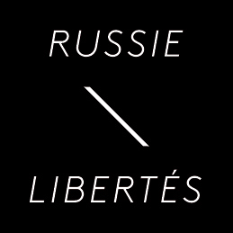

 ******Communiqué de presse****** Paris, 14 septembre 2012 — Le député russe Guennadi Goudkov, un des organisateurs des manifestations de l'opposition contre le régime de Vladimir Poutine, s'est vu retirer vendredi son mandat parlementaire par la chambre basse du Parlement (Douma), [a constaté une journaliste de l'AFP](https://www.lepoint.fr/monde/russie-le-parlement-retire-son-mandat-a-un-depute-anti-poutine-14-09-2012-1506215_24.php) .
L'initiative de priver M.Goudkov de son mandat de député, et donc de son immunité parlementaire à la veille de [la Marche des millions du 15 septembre](https://www.lecourrierderussie.com/2012/09/11/la-marche-des-millions-aura-bien-lieu-a-moscou-et-saint-petersbourg/) , est de nature exclusivement politique et s'inscrit dans la ligne de répressions contre les chefs de file de l'opposition adoptée par Vladimir Poutine depuis son auto-intronisation en tant que président en mars 2012.

Russie-Libertés condamne fermement cette décision de la Douma qui bafoue ouvertement la lettre et l'esprit de la Constitution russe.

Par ailleurs, n'oublions pas que les dernières élections législatives de décembre 2011 ont été massivement truquées, et que les députés du parti majoritaire Russie unie n'ont donc aucune légitimité pour légiférer. Une des principales revendications de l'opposition est l'organisation rapide de nouvelles élections législatives, cette fois honnêtes.