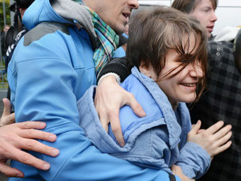

**Communiqué de presse**
**Le 10 octobre le Tribunal de Moscou s'est prononcé en appel à la suite du verdict énoncé par la juge Syrova le 17 août dernier. L'audiance d'appel initialement prévu pour le 1 octobre avait été repoussé suite à la volonté de Katia Samoutsevitch de changer d'avocat. Ce changement, qui avait alors créé la surprise, à trouvé hier une explication.**
Les avocats des plaignants se sont souvenus que Katia n'avait pas participé à la prière punk dans la Cathédrale du Christ Sauveur. L’accusation a souligné qu'elle n’avait ni chanté, ni dansé, ni prié suite à l'intervention rapide d'un gardien qu'il lui avait interdit l'entrée. Et, ô miracle, la juge annonce la libération de Katia avec le maintien d'une peine conditionnelle.

Les membres de Russie-Libertés sont très heureux pour Katia et ses proches, mais restent fortement préoccupés par le sort des deux jeunes femmes restant en prison.

Par ailleurs, vu le
[caractère politique](http://www.elle.fr/Societe/Interviews/Pussy-Riot-les-dessous-d-une-liberation-2224266)
de cette libération, il existe un
[risque de scission](http://tempsreel.nouvelobs.com/monde/20121011.AFP1721/russie-une-des-pussy-riot-liberee-denonce-une-manoeuvre-du-pouvoir-pour-diviser.html)
au sein des groupes de soutien aux Pussy Riot. Nous appelons tous ces groupes à rester soudés, et soulignons que lors du procès en appel Katia a exprimé sa solidarité avec les autres membres du groupe et a confirmé que leur prière était une action purement politique en aucun cas dirigée contre les sentiments des croyants.

Russie-Libertés exige la libération inconditionnelle de toutes les membres du collectif punk Pussy Riot, et l'arrêt immédiat des poursuites.

Photo: AFP, par Natalia Kolesnikova