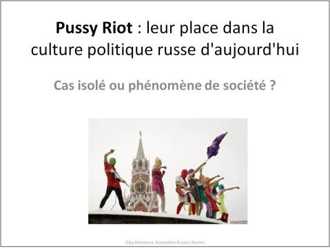

Présentation d’Olga Nikolaeva, Association Russie-Libertés, à la conférence de Samovar Sciences-Po, Paris, 8 novembre 2012.
Avertissement : la présentation contient les images interdites au moins de 18 ans !

**Notes :**
**Le carnaval comme moyen d’expression**
Chez Bakhtine, le carnaval comme moyen d’expression est le point de départ d’une forme de subversion face au discours officiel : « Le discours carnavalesque brise les lois du langage censuré par la grammaire et la sémantique, et par ce même mouvement il est une contestation sociale et politique : il ne s’agit pas d’équivalence, mais d’identité entre la contestation du code linguistique officiel et la contestation de la loi officielle ». Julia Kristeva, « Bakhtine. Le mot, le dialogue et le roman », p.83, Recherches pour une sémanalyse.

Les Pussy Riot se définissent elles-mêmes comme “un groupe punk (
[sous-genre oi !](https://fr.wikipedia.org/wiki/Oi!)
) qui se produit illégalement en public. L’idée du groupe PUSSY RIOT est apparue en 2011 quand, à la faveur du printemps arabe, il est devenu clair qu’il manquait à  la Russie la liberté politique et sexuelle, l’audace, la cravache féministe et une femme-président. […] Les intérêts politiques des participantes et participants du groupe sont le féminisme, la lutte contre les services judiciaires [contre la police – ndt], la défense des LGBT, l’anti-poutinisme et la décentralisation radicale du pouvoir, la défense de la forêt de Khimki et le transfert de la ville capitale du pays en Sibérie de l’Est » (citation tirée du blog des Pussy Riot, source : https://pussy-riot.livejournal.com/).

Les Pussy Riot parlent un langage qui tient à la fois du discours politique (chansons « Poutine a eu la frousse » / Путин зассал, « A bas la prison, libérez la contestation!»/ Смерть тюрьме, свободу протесту!) et du discours féministe (« Tuez le sexiste » / Убей сексиста). Mais elles s’adressent à tous les citoyen(ne)s actifs(-ves)  , notamment à travers leur dernière chanson intitulée « Le pays en marche ! » / Страна идет!).
**Féministes aux visages cagoulés contre sexistes-poutinistes**
Les Pussy Riot dévoilent le caractère sexiste du pouvoir russe d’aujourd’hui, en phase avec l’image machiste de M. Poutine, qui se présente par exemple dans les médias torse nu et seul (bien qu’étant un homme marié). Pour faire la genèse de cette imagerie macho, on se souvient du cadeau offert par de jeunes étudiantes de la  faculté de journalisme de Moscou, qui ont publié un calendrier érotique le jour de l’anniversaire de Poutine (source : https://krispotupchik.livejournal.com/92592.html).

La couverture du calendrier, et l’illustration du mois de février, intitulée « Et si l’on faisait ça une troisième fois », une allusion à la possibilité pour Poutine de se présenter à la présidentielle pour la troisième fois.

On peut aussi citer l’exemple du concours « Déchire pour Poutine » visant à sélectionner la meilleure vidéo d’une jeune fille déchirant ses vêtements pour « son président » (source : https://www.youtube.com/watch?v=1Easr8WTwxs).

**L’hypocrisie de bureaucrates n’a pas de foi**
L’Eglise orthodoxe comme cible ?
L’action des Pussy Riot à la Cathédrale du Christ Sauveur visait l’alliance entre le pouvoir exécutif et le patriarche. Leur mise en scène dans la Cathédrale était une réponse au discours du patriarche Cyrille aux croyants orthodoxes, qu’il a appelés à voter pour Poutine aux élections présidentielles. Cette déclaration du patriarche faisait elle-même suite à une série de révélations scandaleuses sur le fonctionnement de la cathédrale (comparé à celui d’un centre commercial) et les montres de luxe portées par le patriarche, lesquelles disparaissent des photos grâce aux miracles de Photoshop.

#### Le contexte qui a vu naître les Pussy Riot

**Notes :**
**Par rapport aux Pussy Riot, les médias se demandent souvent à quoi est liée cette apparition de l’activisme artistique en Russie.**
**Premièrement**
, les Pussy Riot ne marquent pas l'« apparition de l’activisme artistique », car les actions artistiques de ce genre ont toujours existé en Russie. La question est de savoir pourquoi on a attendu jusqu’à aujourd’hui pour commencer à parler de ces actions.

La réponse est donnée par le titre du livre de Guy Débord : parce que nous sommes en Russie de plus en plus dans
**la société du spectacle**
. Et que des nouveaux moyens de communication sont apparus ces dernières années, notamment l’internet.

Un artiste russe, Anton Nikolaev (qui n’est pas un proche de l’auteur de cette présentation, le beau-fils du célèbre artiste Oleg Koulik) a proposé la dénomination suivante pour désigner le phénomène des artistes engagés dans la Russie d’aujourd’hui : l’artivisme. Qu’est-ce que cela veut dire ?

Le champ artistique en Russie a connu déjà un phénomène de la manifestation artistique – nommé  « actionnisme de Moscou ». Alors, qu'est-ce qui distingue l’artivisme de cet actionnisme ?

Dans l’actionnisme, le sens d’un geste artistique était caractérisé par le hic et nunc de l’action même : les artistes se mettaient nus (comme le faisait Oleg Koulik) à l’entrée d’un vernissage à Zurich en 1994 (cf. le diapo sur l’histoire soviétique).

Dans la Russie des années 2000, le sens d’une action n’est pas seulement déterminé par l’acte même, mais plutôt par sa mise en œuvre, c’est-à-dire, « par l’élaboration du scénario, par le montage et par la diffusion de l’information dans les médias »  - ce que Andrey Griazev, qui a présenté en 2012 son film « Zavtra » sur les membres du groupe artistique Voïna, appelle un « show théâtralisé ».

Dès lors, le succès des initiatives des Pussy Riot comme de celles de leurs prédecesseurs dans le champ artistique (comme le groupe « Bombili » ou « le collectif artistique Voïna ») est autant déterminé par la réaction du public que par l’idéologie de ses auteurs. Nous avons vu que les premiers happenings des Pussy Riot n’ont pas reçu une telle attention des médias ni n’ont été poursuivis si sévèrement par le pouvoir que ne l’a été leur chanson dans la Cathédrale du Christ Sauveur. C’est qu'un nouvel élément est rentré en jeu et a changé la réaction du public vis-à-vis de leur action dans la Cathédrale : c’est « la personne destinataire » du message artistique et politique.
**Deuxièmement**
, pour expliquer le succès des Pussy Riot, ce mouvement artistique engagé politiquement et socialement, il faut évoquer le rôle important joué par la censure politique, qui se durcit depuis 2004-2005. 2008 a notamment vu la création au sein du ministère des affaire intérieures d’une structure nommée
**« Centre E »**
. Ce service s’occupe officiellement de la lutte contre l’extrémisme, mais qualifie souvent d’extrémistes tous les activistes politiques.

« Les art-actionnistes [artistes activistes – ndt] ont piqué le pouvoir à vif : il est permis de rire de tout thème et de n’importe quelle image, à l’exception d’une image sacrée – celle du soi-disant leader national » (source : « Арт-акционисты нащупали наиболее болезненную для власти мозоль: можно ерничать практически на тему любых образов, нельзя смеяться лишь над одним святым ликом — ликом так называемого национального лидера », Alek D. Epstein, source : https://www.gazeta.ru/culture/2012/08/09/a_4718321.shtml)

L’exposition en soutien aux Pussy Riot était aussi inacceptable par le pouvoir russe que l’exposition des artistes des années 60-70 en URSS.

#### D'autres phénomènes artistiques qui portent l'idée de contestation en Russie aujourd'hui

**Notes :**
Nadia Tolokonnikova, une des Pussy Riot condamnée à 2 ans de peine en Mordovie, était dans les années 2007-2011 membre du collectif « Voïna ». Elle décrit ainsi ce groupe artistique : « la naissance de « Voïna » a résulté de ma rencontre avec Piotr Verzilov, Oleg Vorotnikov et Natalia Sokol. Ils avaient tous un bagage commun : de la sympathie pour une culture rebelle, et le refus de se chercher une place dans les milieux artistiques et politiques établis. […] Le format du groupe « Voïna » allait devenir un genre auquel tous ceux qui souhaitent se révolter pourraient  avoir recours. C’est le but ultime de ce groupe : montrer la voie » (source – https://wisegizmo.livejournal.com/57735.html)

Anton Nikolaev, beau-fils du célèbre artiste Oleg Kulik, connu pour ces performances radicales des années 1990-2000, a joué un rôle important dans la création de ce groupe. C’est dans son yourte, que Kulik a amené de Mongolie pour son exposition « Je crois » en 2007 à Moscou, que Piotr Verzilov et Oleg Vorotnikov se rapprochèrent et décidèrent de travailler ensemble. « Là-bas, nous vivions comme dans l’état major. Et par la suite, deux semaines plus tard, le concept de « Voïna » est né » (Piotr Verzilov, source : la lettre à Alek D. Epstein, cité dans le livre d’Alek D. Epstein « Totalnaya Voïna », page 18).

“Это пространство, на котором мы впервые близко сошлись с Воротниковым и две недели там прожили вместе, после чего было решено совместно работать. В огромном подвале был шатер, привезенный Куликом из Монголии, с печками и козьими шкурами. Там и жили, это был как бы штаб. А еще через две недели появилось понятие “группа Война””[3].

Anton Nikolaev, qui avait déjà une expérience de l’activisme en tant que membre fondateur du groupe « Bombili », a tissé des liens entre ces foyers artistiques. Ainsi, le 27 avril 2007 les trois activistes qui fondèrent par la suite le collectif « Voïna » participaient à une action du groupe « Bombili » intitulée « Nous ne savons pas ce que nous voulons ».

En ce qui concerne une mise en scène très décriée, celle des ébats sexuels collectifs, fin février 2008 :  tout d’abord, il ne faut pas confondre l’action du groupe « Voïna » avec celles des Pussy Riot. De plus, l’action de « Voïna » illustrée par cette photo doit être considérée dans son contexte. Cette action a eu lieu en février 2008, au moment où le peuple russe a appris le nom de son prochain président, le candidat proposé par M.Poutine. D’où le surnom de M.Medvedev : « héritier ourson » (car en Russe Medvedev est un nom qui fait référence au mot « ours »).
**Pourquoi “niquer”, alors, dans le musée ?**
Ici, il faut se souvenir des déclarations alarmantes du pouvoir sur la situation démographique en Russie (qui reste alarmante) : le pouvoir exécutif se proposait d’inciter les couples à faire des bébés dans l’espoir d’augmenté le taux de natalité en Russie. Le président du pays, M. Poutine proposait dans son message adressé au Parlement en 2006 :  « Je propose un programme de stimulation des naissances, incluant : des mesures de soutien aux jeunes familles, aux femmes qui prennent la décision d'accoucher et d'élever un enfant. Notre tache est aujourd'hui de stimuler la naissance d'au moins un deuxième enfant », tiré du livre d'Alek D. Epstein « Totalnaya Voïna », page 84.

Les artivistes du groupe « Voïna » ont répondu à cet appel par leur séance de coït collectif dans un lieu public, manière de signifier que pour les membres de ce groupe, l’acte sexuel est protégé par le droit de l’individu à sa vie privée, et ne peut pas être soumis aux ordres du pouvoir. (“…По замыслу участников эта акция должна была показать, что контроль над обществом – это контроль над сексуальной сферой. И единственный возможный протест, который не будет вписан в политический спектакль, – это демонстрация сексуальной свободы” – Alek D. Epstein « Totalnaya Voïna », page 83).

La photo de l'action « Flic en soutane » témoigne de l'effet que l'image d'uniforme et de la soutane produit sur les gens en Russie. Un activiste du groupe « Voïna » est entré dans un supermarché moscovite en portant la casquette d'un policier et la robe d'un prêtre. Il a rempli son panier de produits dans son panier (l'alcool, magazines pour hommes, etc.) et il est sorti sans payer ses courses. Preuve que la casquette du policier fait peur, et que la croix demeure un symbole de la légitimité.

**Notes :**
La réaction des artistes à la vie politique en Russie n’est pas tout à fait « silencieuse » (même si beaucoup d’artistes le sont). Il faut réaliser que la chanson ainsi que la littérature et le théâtre étaient et restent de puissants moyens d’exprimer sa révolte contre le système politique (je veux ici faire référence à des artistes comme Victor Tsoï, star de la contre-culture soviétique). Mais dès que les artistes se mettent à critiquer le système politique, ils s’exposent à de vraies sanctions, directes ou indirectes. Voilà deux exemples d‘artistes engagés qui ont subi tous deux l’interdiction de leurs concerts ou même 10 jours de prison (Ivan Alekseev).

**Notes**:

La lutte des habitants de la ville de Khimki pour le sauvetage de la forêt attira l'attention de beaucoup d'artistes activistes : les membres du groupe  «Voïna » ainsi que Noize MC étaient là pour protéger ce qu'on surnomme « le poumon de la ville de Moscou » - la forêt risque d'être détruite par la construction d'une autoroute (les travaux sont menés par une entreprise française, Vinci).

Les photos de ce diapo illustrent la controverse lancée par l'artiste Sergueï Chnourov, du groupe «Leningrad », qui a créé une vidéo sur Youtube, dans laquelle il critiquait l'engagement civile et politique des artistes (en référence directe à Iouri Chevtchouk) affirmant que l'artiste se promeut d'abord lui-même en prétendant promouvoir la démocratie. Deux semaines plus tard, Ivan Alekseev, aka Noize MC répondit à Chnourov, également sur Youtube, par une nouvelle chanson où il dénonce la réaction de Chnourov, exemple de jalousie vis à vis d'un engagement qui n'entend pas vendre des ticket de concerts, mais défendre des valeurs importantes pour la société, comme  la protection de la forêt de Khimki.

**Notes :**
Parmi d’autres exemples de contestation revêtant une forme artistique figurent les actions de « Sinéé védro » (le sceau bleu en russe, - ndt). Des voitures avec des sceaux d’enfant sur le toit symbolisant le gyrophare ont commencé à défiler lors de rallyes dans plusieurs villes de Russie, afin d’exprimer la désapprobation des citoyens ordinaires envers les privilèges des fonctionnaires, à qui on permet de commettre des infractions au code de la route grâce à un gyrophare spécial.

**Notes**
:

« Monstratsïa » est un mot inventé dérivé de « démonstratsïa », qui est l’analogue russe du mot « manifestation ». Le concept : on prend le mot, on l’ampute d’une syllabe et on obtient un mot à la signification très proche de l’original, mais sous une forme qui permet l’ambigüité. Exemple : la photo de droite sur laquelle une dame appelle à des “ordres de masse » (on appelle d’ordinaire à des “désordres de masse ».

D’autres exemples de slogans volontairement absurdes :

* Nous sommes ton rêve (sur la photo à gauche)
* Tania, ne pleure pas!

L’auteur de la première « monstration » est un artiste de la ville de Novosibirsk,  Artiom Loskoutov, en 2004.

A l’origine de ce concept, il y a aussi la participation du groupe SVOÏ 2000 à la manifestation du 1
er
mai 2000, avec des slogans absurdes promouvant les services de particuliers à particuliers : «Сочинения. Рефераты», «Нелинейный монтаж. Видеосъёмка», «Уроки химии» и др.

**Notes**
:

Les conditions d’expression de l’opinion politique en Russie aujourd’hui évoquent par certains aspects la censure qui existait en URSS. En 2012, une série de lois a été adoptée par le Parlement à l’encontre de la liberté d’expression : les manifestations libres ne sont plus possibles, la documentation des ONG soutenues par des dons provenants de l’étranger doit obligatoirement porter la mention « agent de l’étranger » en guise d’avertissement, les mesures contre la haute trahison ont été durcies, un projet de la loi pour la protection des sentiments des croyants a été présenté, etc.

Mais la parole cherche toujours des moyens de s’exprimer. Des manifestations artistiques ressemblant à certaines initiatives évoquées dans cette présentation ont eu lieu en URSS depuis les années 70. «
[Le conceptualisme de Moscou](https://ru.wikipedia.org/wiki/%D0%9C%D0%BE%D1%81%D0%BA%D0%BE%D0%B2%D1%81%D0%BA%D0%B8%D0%B9_%D0%BA%D0%BE%D0%BD%D1%86%D0%B5%D0%BF%D1%82%D1%83%D0%B0%D0%BB%D0%B8%D0%B7%D0%BC)
», notamment, a présenté en 1977 son slogan, aussi absurde que la « monstratsïa » d’aujourd’hui (voir sur la photo à gauche : « je ne me plains de rien, j’aime tout, malgré le fait que je n’ai jamais été ici et je ne connais rien de cet endroit » par le groupe « Les actions collectives, Коллективные действия», 1977. Ce groupe était, d’après un des inspirateurs de « Voïna », Alexey Plucer-Sarno, l’une des sources d’inspiration principales de ce qu’on appelle aujourd’hui en Russie « l’activisme politique ». (source : "Я НИ НА ЧТО НЕ ЖАЛУЮСЬ И МНЕ ВСЕ НРАВИТСЯ, НЕСМОТРЯ НА ТО, ЧТО Я ЗДЕСЬ НИКОГДА НЕ БЫЛ И НЕ ЗНАЮ НИЧЕГО ОБ ЭТИХ МЕСТАХ",
[https://plucer.livejournal.com/190952.html](https://plucer.livejournal.com/190952.html)
).

La photo de droite montre la performance d’Oleg Kulik à Zurich, où il s’est présenté sous la forme d’un chien, nu et gardant l’entrée du vernissage. L’interprétation de son action est la suivante : « Je voulais protéger les gens de cet art effrayant, l’art commercial. Je voulais dire que la chose la plus importante dans l’art, c’est l’homme, sa vie, son énergie, ses sentiments et ses souffrances. Et en Suisse, c’était très visible, cette approche marketing par rapport à l’art. Beaux objets de meuble, tout est beau, protégé. Et c’est mieux que ça soit de l’art abstrait que l’on puisse déposer dans une banque. Mais ce n’est pas une bonne conception de l’art : l’art est un expérience de l’esprit, c’est sale, ça fait mal, c’est une souffrance. Ce n’est pas la vitrine d’un magasin ». (Source : le film d’Evguéni Mitta « Oleg Kulik : le défi et la provocation », 2011). Il a également déclaré : « L’artiste nu est une métaphore de sa sincérité ». (Soure : le film d’Evguéni Mitta, «Напряжение в искусстве создается только той страстью, которую он в него вкладывает. Если человек что-то так яростно защищает, то там что-то есть, там что-то важное. И они войдут в галерею, а там ничего нет – чистый воздух. И они поймут, что самое важное – это та страсть, энергия, которую ты проявляешь в искусстве. Любовь, а не какие-то те или иные построения. […] Художник голый – это некая метафора его искренности »).

Et pour conclure, voici la phrase du célèbre Daniil Harms, l’écrivain qui a résumé ce crédo protestataire pour tous les artistes : « Il faut écrire les poèmes de telle sorte que, si l’on jette un vers contre la fenêtre, la vitre se brise ».

En fait, en URSS, beaucoup d’écrivains qui ne pouvaient pas publier leurs ouvrages ont dû se convertir en écrivain pour enfants. Harms lui-même est devenu écrivain pour enfants, mais la forme nouvelle de son discours n’a pas desservi son sens original. Voici un extrait de son ouvrage intitulé « La victoire de Mychine » (source : Gérald Auclin « Incidents, d’après des textes de Daniil Harms, traduits du russe par Anna Zaytseva », The Hoochie Coochie, 2011) :
-         Ce n’est pas convenable de se reposer ici. Où vivez-vous, citoyen ? Où est votre chambre ?
-         Ici.
-         Il est enregistré dans notre appartement, mais il n’a pas de chambre à lui.

L'auteure de la présentation remercie François Christophe pour la relecture du texte et l’association Samovar Sciences-Po pour l’organisation de la conférence.
