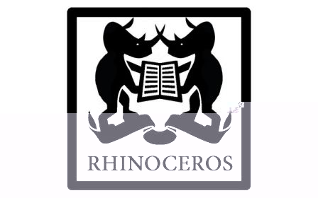
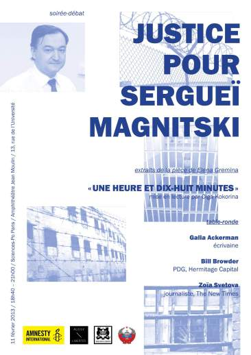

- 
- 
- 

**INVITATION EVENEMENT**

 | **Soirée-débat**   **« JUSTICE POUR SERGUEI MAGNITSKI »**   __Lundi 11 février 2013 – 18h40 à 21h00__   __Sciences-Po Paris - Amphithéâtre Jean Moulin__ – __13, rue de l'Université, Paris__   Entrée libre | 
 | ---- | 

**Programme :**

* Introduction par **Galia Ackerman** , écrivaine, historienne, journaliste et traductrice franco-russe spécialiste du monde russe et ex-soviétique.

**Table-ronde « Quelle justice pour Sergueï Magnitski ? » avec :**

* **Bill Browder** , Président directeur général du fonds d’investissement Hermitage Capital Management. Ex-employeur de Sergueï Magnitski.

* **Zoïa Svetova** , journaliste pour l’hebdomadaire russe « The New Times », essayiste, défenseure des droits humains. Récompensée par le prix Amnesty International en 2003 et le prix Andreï Sakharov « Pour le journalisme comme acte de courage » en 2004. Auteure en 2012 de l’ouvrage « Les innocents seront coupables ».

Table-ronde animée par
**Elena Servettaz**
, journaliste au service russe de RFI.
**Lecture d'extraits de la pièce "Une heure et dix-huit minutes" d'Elena Gremina, traduit du russe par Tania Moguilevskaia et Gilles Morel, mise en lecture par Olga Kokorina (Russie-Libertés). Avec la participation des étudiants de la compagnie de théâtre "Rhinocéros" de SciencesPo Paris.**
Echanges et discussion avec la salle.

Une traduction simultanée sera assurée.

Inscriptions pour assister à la soirée-débat : amnesty.sciencespo@gmail.com

Organisateurs :
- [https://www.facebook.com/AmnestyPersonnesEnDanger?fref=ts](https://www.facebook.com/AmnestyPersonnesEnDanger?fref=ts)
- [https://www.facebook.com/amnestyscpo](https://www.facebook.com/amnestyscpo)
- [https://www.facebook.com/RussieLibertes?ref=ts&fref=ts](https://www.facebook.com/RussieLibertes?ref=ts&fref=ts)
- [https://www.facebook.com/rhinoceros.sciencespo?ref=ts&fref=ts](https://www.facebook.com/rhinoceros.sciencespo?ref=ts&fref=ts)
- [https://www.facebook.com/samovar.sciencespo?ref=ts&fref=ts](https://www.facebook.com/samovar.sciencespo?ref=ts&fref=ts)

Pour info :
- Entretien de Galia Ackerman avec Bill Browder :
[http://www.politiqueinternationale.com/revue/article.php?id_revue=134&id=1088&content=synopsis](http://www.politiqueinternationale.com/revue/article.php?id_revue=134&id=1088&content=synopsis)
- Livre de Zoïa Svetova "Les innocents seront coupables" :
[http://www.bourin-editeur.fr/livre/les-innocents-seront-coupables.html](http://www.bourin-editeur.fr/livre/les-innocents-seront-coupables.html)
- Pièce d'Elena Gremina "Une heure et dix-huit minutes", traduction Tania Moguilevskaia, Gilles Morel:
[http://www.theatre-russe.info/pages/textes/magnitski01.htm](http://www.theatre-russe.info/pages/textes/magnitski01.htm)
