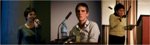
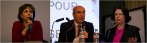

Ce lundi 11 février, à Paris, l’amphithéâtre Jean Moulin à Sciences Po Paris a accueilli
[la soirée « Justice pour Sergueï Magnitski »](http://russie-libertes.org/2013/01/30/soiree-debat-justice-pour-serguei-magnitski/)
organisée par Amnesty International France, Russie-Libertés et les associations de Sciences Po "Rhinocéros" et "Samovar".

Les étudiants de Sciences-Po ont montré au public un "procès russe"  illustrant notamment les conditions carcérales en Russie. Ana Marion et Charles-Henri Ménival ont témoigné au nom des juges et d’une femme médecin impliqués dans l’affaire Sergueï Magnitski – le juriste-fiscaliste russe, mort dans une prison moscovite le 16 novembre 2009.

La lecture des extraits d’une pièce documentaire « Une heure et dix-huit minutes »* a eu lieu lors de la soirée-débat « Justice pour Sergueï Magnitski » .

[youtube=http://www.youtube.com/watch?v=vCJVYJ6UFkM]

Magnitski était juriste-fiscaliste et travaillait pour un fond d’investissements dirigé par Bill Browder. Alors, pourquoi le nom de Magnitski est-il devenu un symbole ?  Pourquoi cette présentation des juges et des médecins de système pénitentiaire en Russie a été produite par les étudiants à Sciences-Po ?
Sergueï Magnitski est mort le 16 novembre 2009 dans des circonstances suspectes dans une prison russe. Il s’est trouvé en prison pour avoir enquêté sur une immense affaire d’escroquerie ayant permis à des fonctionnaires du Trésor public et de la police de détourner 230 millions de dollars des caisses de l’Etat russe. Magnitski a bien fait son travail et l’a payé de sa vie. Celles et ceux qu’il accusait ont utilisé la machine de la « justice » russe, qui n’a de justice que le nom, pour le jeter en prison et s’assurer qu’il n’en sorte pas.

Pendant 358 jours dans les prisons à Moscou, Sergueï Magnitski a écrit 450 plaintes dénonçant les conditions de détention. Sa santé se dégradait rapidement. Dans de telles conditions, le service médical ne lui accordait pas de soins nécessaires – ce qui était aussi un outil puissant pour mettre la pression sur un détenu. Mais Sergueï restait fidèle à ses convictions et lors d’un procès, quatre jours avant sa mort, il a même persévéré dans ses accusations contre les "fonctionnaires mafieux".

Deux étudiants de l'association « Rhinocéros » Sciences-Po ainsi que la responsable de l’Amnesty International France, Anne Nerdrum, ont lu des extraits de la pièce qui comporte les témoignages de Sergueï et des déclarations qu’on peut imaginer si on interroge les travailleurs dans les prisons russes. Exemples : un juge ne se considère pas comme un être humain, mais comme un outil dans le système, une femme qui travaille comme médecin dans la prison et qui est sûre que les détenus sont coupables avant que le procès ait lieu !

...

Olga Kokorina (Russie-Libertés), Charles-Henri Ménival (Rhinocéros, Sciences-Po) et Anne Nerdrum (Amnesty International France). Source photo: François Christophe et Alexander Ivanov

L’affaire Magnitski met en lumière une multitude de cas similaires qui se produisent chaque année en Russie et qui montrent le niveau affolant de corruption au cœur du régime. A ce jour, aucune personne parmi celles qui ont détourné ces fonds, accusé, emprisonné puis torturé Magnitsky n’a été arrêtée. Au contraire, ils sont nombreux à avoir été promus à des postes plus importants.

Bill Browder (ex-employeur de Sergueï Magnitski) et Zoïa Svetova (journaliste de "The New Times", spécialiste dans le domaine des droits de l’homme en Russie) ont parlé de l’impossibilité de trouver la justice en Russie pour des cas comme celui de Sergueï Magnitski. Selon eux, c’est maintenant aux hommes politiques français et européens de relever la question sur la possibilité des lois comme « Magnitsky Act » signé par le président américain en décembre dernier. Bill Browder a insisté sur l'importance de faire adopter une telle loi en France où on peut supposer trouver beaucoup de fonds et d'immobilier appartenant aux fonctionnaires russes. Zoïa Svetova a souligné que des centaines, voire des milliers, de procès inéquitables comme celui de Magnitski se déroulent chaque année en Russie, comme les enquêtes lancées récemment par le parquet contre plusieurs opposants.

...

Zoïa Svetova, Bill Browder et Galia Ackerman. Source photo: François Christophe

* Extrait de la lecture d'une pièce documentaire écrite par Elena Gremina au Théâtre.doc, Moscou. Traduit du russe par Tania Moguilevskaia et Gilles Morel.

Mise en lecture par Olga Kokorina (Russie-Libertés).
