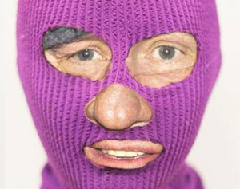

...
Source de l'image : www.independent.co.uk

__Gérard Depardieu aurait-il tourné le dos à Poutine et Kadyrov pour rejoindre l'opposition russe ?__
__En tout cas l'acteur, qui n'en est pas à son premier revirement, aurait subit dans la nuit de dimanche à lundi des perquisitions et un contrôle du fisc russe à son domicile en Mordovie. Les policiers l'auraient déclaré "agent de l'étranger" selon la nouvelle loi russe, une enquête aurait également été ouverte.__
Les proches de l'acteur auraient déclaré ce matin leur stupéfaction : "La police russe a défoncé la porte de sa maison en pleine nuit, il était nu, menotté, il ne comprenait pas ce qui lui arrivait."

Libéré ce matin, l'acteur aurait dit : "Poutine et moi c'est fini, je rejoins l'opposition russe dès aujourd'hui !". Ses proches indiqueraient qu'il aurait pris directement la direction du camp de travail pour femmes où Nadia Tolokonnikova, une des Pussy Riot, est enfermée pour lui signaler son soutien et essayer de négocier sa libération anticipée. Avant de partir l'acteur aurait déclaré "Je veux marcher main dans la main avec ces nombreux citoyens et artistes russes dont les droits les plus élémentaires sont bafoués par le régime. Attendez-vous à m'entendre dans les manifs !".

Aujourd'hui, 1er avril 2013, l'association Russie-Libertés déclare de nouveau son soutien à toutes celles et tous ceux qui luttent contre les injustices et pour les droits humains en Russie. Nous appelons à la mobilisation contre les lois anti-ONG et contre toutes les lois répressives. La Russie sera libre !

Russie-Libertés

(cette information est bien évidemment une fiction pour le 1er avril !)

