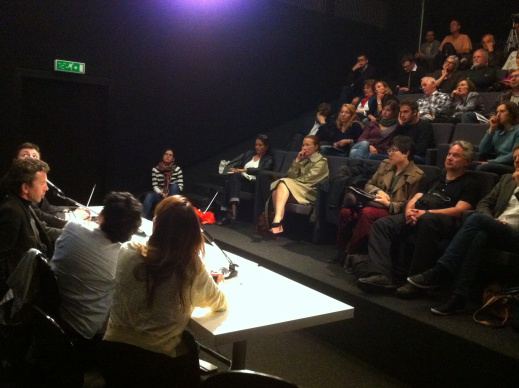
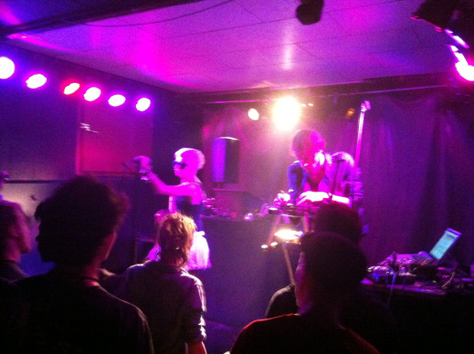

...
Vidéo-conférence avec Yekaterina Samutsevich

Ce vendredi 19 avril la ville de Genève (Suisse) a accueilli un
[forum-concert exceptionnel](http://russie-libertes.org/2013/03/24/19-avril-geneve-forum-concert-liberte-pour-les-prisonniers-politiques-en-russie/)
"Liberté pour les prisonniers politiques en Russie". Organisé par l’association Russie-Libertés, Amnesty International (Section suisse) et la Fédération internationale des ligues des droits de l’homme (FIDH) cet évènement en deux parties a de nouveau attiré l'attention de l'opinion publique sur le durcissement de la situation en Russie et la multiplication de procès politiques contre des opposants.
    La soirée a commencé par une table ronde sur le thème "Qui sont les prisonniers politiques en Russie ?". Les différents intervenants ont présenté la diversité des visages de celles et ceux qui sont aujourd'hui enfermé-e-s pour leurs opinions.
**Jean-Sébastien Blanc**
de Amnesty International (Section suisse) a rappelé l'importance du travail réalisé par les ONG en Russie et les difficultés, voire les menaces, qu'elles subissent. Il a également souligné l'importance du soutien apporté par Amnesty International au niveau mondial aux "prisonniers de conscience" en Russie.

...

Table-ronde

Après la projection du
[film "Le prisonnier du Kremlin"](http://www.arte.tv/fr/le-prisonnier-du-kremlin/1917168,CmC=1907326.html)
(2007) sur Mikhaïl Khodorkovski la discussion s'est engagée autour des différents visages des personnes enfermées pour des raisons politiques ou pour leurs opinions.
**Anne Nerdrum**
, Amnesty International France, a précisé la différence entre un "prisonnier politique" et un "prisonnier de conscience" selon Amnesty international et a rappelé qu'en 2012 son organisation a également "adopté" comme prisonnières de conscience les jeunes femmes du groupe féministe russe "Pussy Riot". Le porte-parole de Mikhail Khodorkovski en France,
**Boris Durande**
, a décrit les conditions difficiles dans lesquelles se trouve actuellement sans doute le plus célèbre des prisonniers politiques russes. Il a également insisté, avec
**Andrey Sidelnikov**
, de l'organisation Speak Up! UK, sur le "double anniversaire" qui aura lieu en 2013 : ce sont les 50 ans de vie et les 10 ans d'emprisonnement pour "MBK".

Par ailleurs, Andrey Sidelnikov, aujourd'hui réfugié politique à Londres, a expliqué les raisons de son départ en Russie et les risques que prennent les militants politiques quand ils s'engagent pleinement contre le régime actuel.

La table-ronde s'est conclue par une vidéo-conférence avec
**Yekaterina Samutsevich**
, membre des Pussy Riot, actuellement en liberté très surveillé à Moscou. Elle a pu donner au public des nouvelles de ses amies Nadia et Maria actuellement enfermée dans deux camps en Mordovie et dans la région de Perm. Lors des questions-réponses avec la salle elle a également fait part de son désir de continuer le combat artistique et militant pour les libertés en Russie.

...

Barto

La soirée s'est poursuivie à la Gravière avec un double concert du groupe français Orties et du groupe russe Barto qui était pour la première fois en Suisse. Les artistes ont enflammé la salle avec des vibrations positives portant l'espoir et la demande de libérer les prisonniers politiques en Russie.

...

Orties

Photos : Nina Berezner
