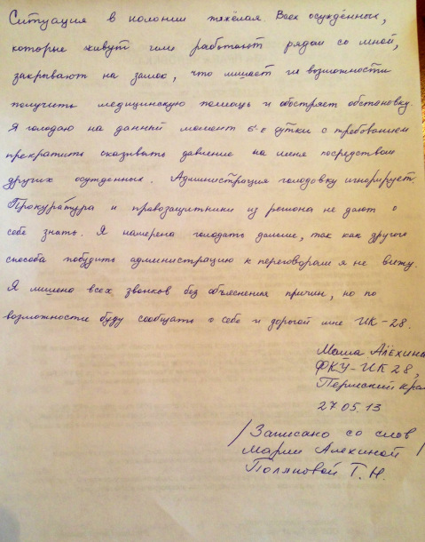
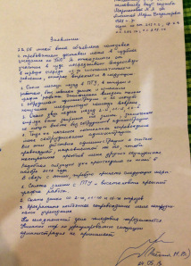

Paris, 28/05/2013

Communiqué de presse
**Maria Alekhina, en grève de la faim depuis une semaine, doit être libérée !**
__Maria Alekhina, membre du groupe Pussy Riot, emprisonnée dans un camp de la région de Perm, est en grève de la faim depuis une semaine. Elle dénonce ses conditions de détention, les pressions qu’elle subit et exige de pouvoir assister à sa propre audience. Russie-Libertés demande sa libération immédiate.__
Cela fait désormais une semaine que Maria est en grève de la faim, ce qui met en danger sa santé. En entamant cette lutte pacifique Maria Alekhina se bat aussi pour les droits de ses co-détenues qui subissent également des pressions de la part des autorités. Dans une lettre du 27 mai 2013 (que nous publions ici) elle exige l’arrêt de ces pressions et l’amélioration des conditions de détention dans le camp de Perm. Par ailleurs,  elle formule de nouveau une demande simple et normale : pouvoir assister à sa propre audience sur sa demande de libération anticipée.

L’association Russie-Libertés salue le courage de Maria Alekhina doit le combat montre une nouvelle fois l’injustice que subissent les défenseurs des libertés et les opposants politiques en Russie. La machine carcérale s’est transformée en bulldozer qui écrase la contestation, cette situation doit cesser.

Russie-Libertés exige la libération immédiate de Maria Alekhina et de tous les prisonniers politiques en Russie. Nous appelons à la mobilisation à Paris le 12 juin 2013, à 19h00, lors du rassemblement « Libérez les prisonniers politiques en Russie ! ».

Facebook du rassemblement :
[https://www.facebook.com/events/526687934033341/](https://www.facebook.com/events/526687934033341/)
Russie-Libertés

- 
- 

La situation dans la colonie est très difficile. Toutes les condamnées qui habitent ou travaillent à côté de moi sont isolées, ce qui les prive de la possibilité de recevoir l’aide médicale et aggrave la situation. Ça fait 6 jours déjà que je suis en grève de la faim demandant de cesser la pression sous laquelle me met la situation avec d’autres prisonnières. L’administration ne fait aucune attention à la grève. Le parquet et les défenseurs des droits de l’homme dans la région ne font aucun signe de vie. Je veux continuer la grève parce que je ne vois pas d’autre moyen pour pousser l’administration aux négociations. Je suis privée du droit des appels téléphoniques sans motivation, mais je ferai tout possible pour faire connaître ma situation et celle la colonie 28 chère à mon coeur.
