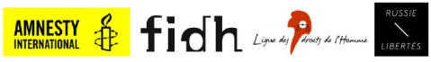

 **Пресс-релиз** **Пикет**

**"Свободу российским узникам совести!"** **Среда, 12 июня 2013, 19:00 – 20:30** **Площадь Игоря Стравинского – Центр Жоржа Помпиду – Париж**

12 июня 2013 года французское отделение «Международной амнистии», Международная федерация за права человека (FIDH), Лига за права человека (LDH) и ассоциация Russie-Libertés призывают французов присоединиться к пикету, приуроченному ко Дню России. Цель пикета - протест против беспрецедентного подавления гражданских свобод в России с конца 2011 года и требование освободить узников совести. Парижский пикет пройдет в поддержку марша, организованного российскими гражданскими активистами и представителями политической оппозиции, который состоится в тот же день в Москве.
    В течение последних полутора лет многочисленные манифестации, собравшие десятки тысяч человек, были жестоко разогнаны.

В декабре 2011 года в ответ на парламентские выборы, которые многочисленные наблюдатели признали сфальсифицированными, сформировалось новое, массовое протестное движение. Его активность выразилась в манифестациях, собравших десятки тысяч граждан, требующих свободных и честных выборов, а также соблюдения прав и свобод, прописанных в Конституции России.

Власти отреагировали жестко. Были посажены в тюрьму многие оппозиционеры и активисты: «узники 6 мая», феминистская панк-группа Pussy Riot. Их имена пополнили список политзаключенных, в который входят Платон Лебедев и Михаил Ходорковский, лишенные свободы в 2003 году. Условия содержания под стражей узников совести нередко жестокие и бесчеловечные, право на судебную защиту и медицинскую помощь нередко не соблюдаются.

В ноябре 2012 года вступил в силу закон, требующий от НКО, получающих средства из-за границы, регистрироваться в качестве «иностранных агентов». Он повлек за собой волну обысков и проверок, поскольку НКО приняли коллективное решение игнорировать этот абсурдный шантаж, нарушающий многочисленные соглашения, подписанные Россией.

Многие НКО уже признаны виновными в нарушении закона и оштрафованы. Это означает, что отныне правозащитники подвергаются судебным преследованиям и рискуют стать новыми узниками совести.

Информация о пикете доступна по ссылкам:
https://www.facebook.com/events/52668793403334z1/
https://www.amnesty.fr/Mobilisez-vous/Bougez/Rassemblement-pour-la-liberation-de-tous-les-prisonniers-d-opinion-en-Russie-8719