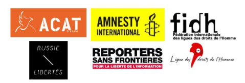

 | ПРИГЛАШЕНИЕ   ФОРУМ-КОНЦЕРТ   **«РОССИЯ: ГОЛОСА ЗА СВОБОДУ»**      **25 октября 2013 года, пятница, 18:00 – 00:00**   Баржа Six/Huit – 74-78 Quai d’Austerlitz, Париж. Метро Gare d’Austerlitz   Вход бесплатный / Запись по адресу: [russie.libertes@gmail.com](mailto:russie.libertes@gmail.com)   Facebook : [https://www.facebook.com/events/482571195175439/](https://www.facebook.com/events/482571195175439/) | 
 | ---- | 

2011-2012 годы ознаменовались беспрецедентной мобилизацией россиян против нарушения властями их прав и свобод. Впервые за многие годы граждане вышли на улицы, чтобы потребовать уважения к их базовым правам. Реакция на эту массовую мобилизацию не заставила долго ждать: удушающие свободу законы, аресты, судебные процессы и угрозы стали частью жизни не только активистов, но и обычных российских граждан.

Несколько несколько десятков « узников 6 мая » рискуют тюремным заключением или уже посажены в тюрьму. Надя и Маша, участницы группы Pussy Riot, пишут жалобы на бесчеловечные условия содержания в заключении. Активисты-экологи и два журналиста арестованы за участие в мирной акции. Каждый день список узников совести пополняется новыми именами, а самые знаменитые узники совести современной России, Михаил Ходорковский и Платон Лебедев, сидят в тюрьме уже десять лет. В преддверии Олимпийских игр в Сочи свобода более чем когда-либо является в России предметом ожесточенной борьбы.

В солидарность со всеми, кто борется, нередко ценой собственной жизни, за свою свободу, за права человека в России, организации «Христианское действие за отмену пыток» (ACAT), французское отделение Международной амнистии, (AIF) Международная федерация Лиг за права человека (FIDH), Лига за права человека (LDH), ассоциация Russie-Libertés и Репортеры без границ (RSF) приглашают вас на форум-концерт, который пройдет 25 октября в Париже.
**Программа:**
**18**
**h**
**–18:30: Вступительное слово огранизаторов**
**18**
**h**
**30 – 20:00: Выступления участников**
при участии:

* Гали Аккерман, журналистки, специализирующейся на России;
* Зары Муртазалиевой, молодой чеченки, проведшей 8 лет в трудовом лагере;
* Зои Световой, журналистки New Times, правозащитницы;
* Васи Обломова, музыканта, гражданского активиста.

Круглый стол, модератор – Мишель Эльтчанинов, заместитель главного редактора « Philosophie Magazine »

* Вопросы из зала

Читка текстов Михаила Ходорковского в рамках акции « Worldwide reading 2013 » (
[http://www.worldwide-reading.com/archiv-en](http://www.worldwide-reading.com/archiv-en)
)
**20:40 – 00:00: Концерт «Свободу российским узникам совести».**
В программе

* Anyhting Maria (Франция) [http://mmachagray.wix.com/anythingmaria](http://mmachagray.wix.com/anythingmaria)
* Chat (Франция) [http://www.lamusiquedechat.com](http://www.lamusiquedechat.com/)
* Вася Обломов (Россия)
* DJ set

Место проведения:

Баржа располагается у набережной Аустерлиц, рядом с  Центром моды и дизайна
