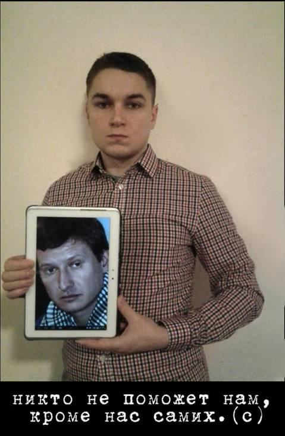
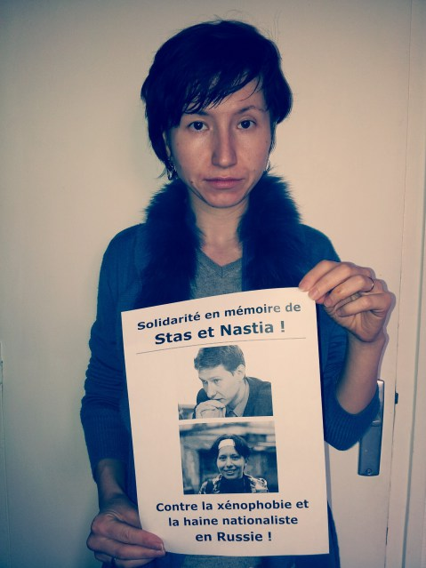

Il y a cinq ans à Moscou l'avocat et défenseur des droits humains, Stanislav Markelov, et la journaliste, Anastasia Babourova, tous deux antifascistes, ont été froidement assassinés à quelques centaines de mètres du Kremlin. Leurs assassins appartiennent au milieu néo-nazi et étaient dérangés par l’activité que Stanislav menait contre la xénophobie et la violence nationaliste. Stas et Nastia ont payé pour leurs convictions. Mais malgré cela, la xénophobie n’a pas disparu et a même pris une plus large ampleur. Comme exemple, citons les émeutes nationalistes dans les villes russes à l'été 2013 et les actes réguliers de violence contre d’autres minorités, notamment les personnes LGBT.

Pour commémorer la date du 19 janvier, des manifestations ont eu lieu aujourd’hui dans plusieurs villes en Russie et dans d'autres pays. A Moscou, les autorités cherchent chaque fois à perturber le bon déroulement de l’action. Cette fois-ci, la marche a pu avoir lieu sans que des participants ne soient arrêtés par la police. En revanche, à la fin de l’action, plusieurs manifestants — dont le chanteur d’un groupe connu en Russie : Kiril Medvedev — ont été attaqués par des néo-nazis.

Selon la tradition de ces marches, les participants ne viennent pas accompagnés des drapeaux de leurs partis respectifs, car la lutte contre la xénophobie en Russie est l’affaire de tout un chacun. En effet, le 19 janvier, des antifascistes, des militants LGBT, des représentants de syndicats et de différents partis politiques russes (des socialistes et anarchistes aux libéraux) continuent de dénoncer ce fléau de la violence nationaliste et révèlent l’encouragement indirect des radicaux néo-nazis par le pouvoir ainsi que la politique xénophobe du pouvoir. « La Douma fasciste est une honte pour la Russie ! » ; «On n’oublie pas, on ne pardonne pas ! », «Milonov, Mizoulina - en prison !» - voici quelques slogans forts de la marche. Les manifestants ont en outre exigé la libération de tous les prisonniers politiques en Russie, en particulier des prisonniers du 6 mai (affaire Bolotnaïa).

En mémoire de Stanislav et Anastasia et en solidarité avec les organisations de défense des droits de l’homme et contre la xénophobie en Russie, nous avons demandé à des journalistes et défenseurs des droits humains en France de dire quelques mots sur la situation. Voici une série de photos :

Préparé par Olga Bronnikova et Olga Nikolaeva