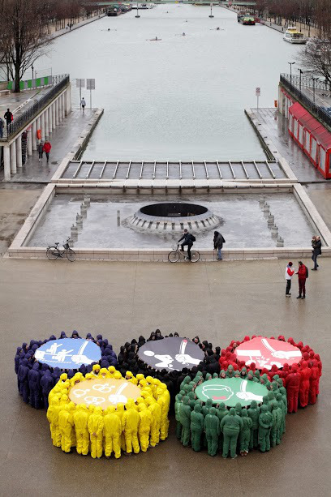
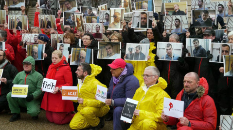
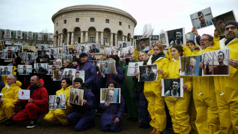

**A une semaine de l’ouverture des Jeux olympiques (JO) d’hiver de Sotchi, Action des Chrétiens contre la torture (ACAT-France), Amnesty International France (AIF), la Fédération Internationale des Ligues des droits de l’Homme (FIDH), Inter-LGBT et Russie-Libertés se mobilisent.**
Samedi 1er février, près de 200 personnes se sont retrouvées pour dénoncer ce que le faste des JO ne peut masquer ; une situation alarmante en matière de droits humains en Russie où manifester, informer, militer s’avère de plus en plus risqué, où les minorités sexuelles sont stigmatisées et victimes de violence, où le racisme et la xénophobie alimentent la violence.

### Répression des manifestations

**2012 :**
modification de la loi réglementant les manifestations de rue imposant de nouvelles restrictions aux événements publics et de nouvelles sanctions aux organisateurs. En 2012, près de 4 000 personnes ont été arrêtées lors de 200 manifestations à Moscou et dans la région de la capitale.
**En 2013,**
malgré un nombre de manifestations en nette diminution, plusieurs centaines de personnes ont été arrêtées.

La tendance s'est poursuivie après le début de l'année 2014: un rassemblement pacifique organisé en solidarité avec les « prisonniers de Bolotnaïa » dans le centre de Moscou a été dispersé le 6 janvier 2014. Au moins 28 participants auraient été arrêtés, puis relâchés par la police.

De petits rassemblements de rue pacifiques, « non autorisés », ont été régulièrement dispersés par la police avec des moyens souvent injustifiés ou disproportionnés. Aucune plainte n'a fait l'objet d'une enquête effective.

### Restriction de la liberté de parole et de l'information

Une nouvelle loi de fin décembre prévoit le blocage immédiat des sites Internet comportant des informations jugées « extrémistes » par le parquet. Une nouvelle étape dans la dérive liberticide russe en matière de liberté de l’information en ligne : à aucun moment la procédure de blocage des sites ne sera désormais contradictoire. Le propriétaire du site concerné ne sera informé du blocage qu’a posteriori par l’hébergeur, et tenu de supprimer sans délai les contenus incriminés.
**Novembre 2012 :**
adoption d’une loi obligeant les ONG recevant des fonds de l'étranger et engagées dans des activités très généralement qualifiées de « politiques » à s'enregistrer comme des « agents étrangers ». Plus d’un millier d’inspections ont ainsi eu lieu courant 2013. Plus de cinquante organisations ont reçu des avertissements officiels et plusieurs d’entre elles font l’objet de poursuites. Cinq organisations ont été condamnées au versement d’une amende, parmi elles deux ont eu gain de cause en appel. Au moins trois autres ont cessé d’exister.

### Discriminations en raison de l'orientation sexuelle ou de l'identité de gentre

**Juin 2013 :**
promulgation d’une loi discriminatoire interdisant la « propagande en faveur des relations sexuelles non traditionnelles auprès des mineurs». Au moins 3 personnes ont été condamnées à des amendes.
**2013 :**
un militant LGBT qui avait manifesté seul contre les discriminations, dans la ville de Kazan, a été inculpéde « propagande ». 10 manifestations pacifiques LGBT ont fait l’objet d’agressions violentes homophobes. Au cours de l’une d’elle, un activiste a perdu un oeil. L'église orthodoxe russe, en lien étroit avec le pouvoir, manifeste de plus en plus fréquemment une homophobie active.

Ces lois liberticides mettent en péril la lutte contre les épidémies de VIH/SIDA et d’Hépatite C en Russie : En dix ans, lenombre de séropositifs y est passé de 100 000 à plus d'un million dont seul 25% ont accès à des traitements.

### Stigmatisation et exploitation des migrants

La xénophobie et le racisme, en montée constante en Russie, en partie provoqués par le discours des autorités souvent intolérant et discriminatoire, conduisent à de véritables pogroms dans diverses régions de la Russie et à une exploitation en toute impunité des milliers des migrants. Chaque année, plusieurs dizaines de personnes trouvent la mort dans les rues de Russie suite à des agressions racistes.

### Recours à la torture 

Le recours à la torture et aux mauvais traitements est présent à tous les stades de la chaîne pénale russe, depuis l’arrestation jusqu’à l’exécution de la peine en colonie pénitentiaire. Malgré les espoirs suscités par des réformes en cours, ce phénomène perdure grâce à l’impunité et à l’absence de volonté politique au plus haut niveau de prévenir et réprimer la torture.

Suite à l'amnistie déclarée à l'occasion de la journée de la Constitution, le 12 décembre 2013, ou à une grâce présidentielle, certains prisonniers politiques ont été remis en liberté. Si ces libérations étaient très attendue par la société civile en Russie et à l’étranger, cette loi d'amnistie est davantage un effet de communication qu’un véritable tournant vers un système judiciaire efficace et indépendant.

Les libérations emblématiques des Pussy Riot et de Mikhail Khodorkovsky interviennent à quelques mois de la fin de leur peine,
[Agir pour la Russie](https://www.amnesty.fr/AI-en-action/Protegeons-les-personnes/Personnes-en-danger/Actions/Russie-il-faut-liberer-tous-les-manifestants-pacifiques-de-Bolotnaia-encore-emprisonnes-10451)
.

Le climat politique en Russie laisse craindre un nouveau durcissement de la répression après les festivités olympiques.

- 
- 
- 
