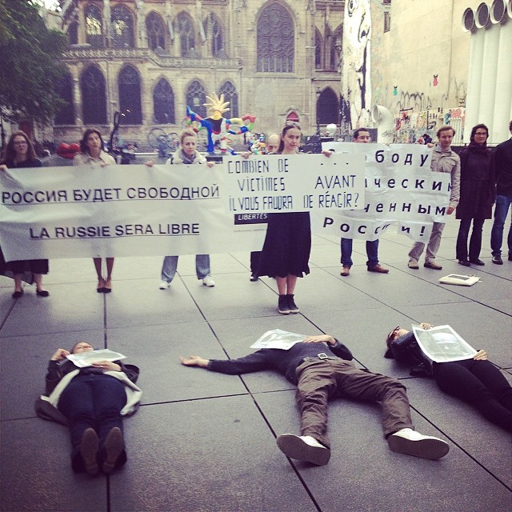
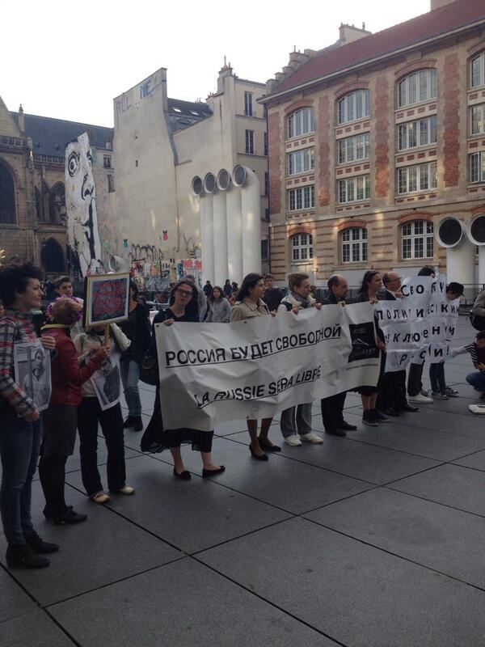

Le 6 mai 2014 plusieurs personnes se sont rassemblées sur la place Igor Stravinsky à Paris pour exiger la libération des prisonniers politiques en Russie.
    Le 6 mai 2012 – jour du retour de Vladimir Poutine à la présidence de la Russie – des débordements ont éclaté sur la place Bolotnaïa à Moscou. Plusieurs témoins ainsi que les journalistes de Novaïa Gazeta indiquent que les troubles avaient été organisés par les mouvements de jeunesse pro-Kremlin et qu’il s’agissait d’une provocation. Toutefois, le Comité d’enquête fédéral a ouvert plusieurs enquêtes contre des militants et des opposants. Un vaste mouvement de solidarité avec les "prisonniers du 6 mai" s’est crée en Russie, notamment à travers les réseaux sociaux. Sous la pression, plusieurs de ces prisonniers politiques ont été libérés à la fin de l’année 2013. Sept "prisonniers du 6 mai" ont été condamnés à de lourdes peines de prison ferme allant jusqu’à quatre ans et une figurante du dossier a été condamnée à trois ans avec sursis.

Par ailleurs, plusieurs militants et opposants sont aujourd’hui considérés comme des prisonniers politiques. Il s’agit notamment de l’écologiste Evgueni Vitichko, condamné à 3 ans de camps, et des opposants Alexei Navalny et Sergueï Oudaltsov, assignés à domicile et privés de liberté.

Dans le contexte actuel où les attaques contre les libertés en Russie sont aussi des menaces pour les libertés des autres pays, Russie-Libertés a appelé à manifester, le 6 mai 2014, date anniversaire, pour exiger la libération des prisonniers politiques en Russie.

Plusieurs personnalités ont pris la parole lors du rassemblement : le sociologue Alexandre Bikbov, le sénateur EELV André Gattolin et un des responsables de Euromaidan Paris Igor Rashetnyak.

- 
- 
