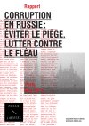

Mercredi 21 mai 2014 l’association « Russie-Libertés » a présenté le [rapport « Corruption en Russie : éviter le piège, lutter contre le fléau »](https://russie-libertes.org/2014/05/15/presentation-du-rapport-corruption-en-russie-eviter-le-piege-lutter-contre-le-fleau-mercredi-21-mai-2014-a-19h45/) à l’Assemblée nationale.

Analyser et comprendre la corruption en Russie, ce fléau qui ronge toute la société russe, pour éviter le piège et mettre en place des outils pour la combattre, tel est l’objectif du rapport de l’association « Russie-Libertés ».
Avec le soutien de Serguei Gouriev, professeur d’économie à Sciences Po, ancien recteur de la New Economic School à Moscou, et William Bourdon, avocat et président de l’association SHERPA, les experts et militants de « Russie-Libertés » ont examiné les rapports et analyses sur la situation économique en Russie et les relations avec les entreprises et organisations européennes afin de dresser un constat et une série de propositions.

Le constat du rapport est clair : « l’ampleur de la corruption en Russie est clairement disproportionnée par rapport à son niveau de développement économique » et « le Gouvernement russe opte pour une position d’inaction, voire de création de climat favorable au développement de ce fléau. » Il s’agit donc d’une violation manifeste des droits humains des citoyens russes, qui devraient avoir la protection de l’Etat de Droit malheureusement inexistant, mais aussi un risque certain et avéré, surtout dans le contexte actuel, pour les entreprises et organisations européennes qui souhaitent travailler avec la Russie.

Aujourd’hui, le système corrompu alimente et renforce le régime en Russie ce qui place, compte tenu du climat, la lutte contre ce fléau comme une priorité.

* [Téléchargez la version française du rapport en cliquant ici.](uploads/2015_02_rapport_corruption-en-russie-final.pdf)
* [Download the English version of the report here.](uploads/2015_02_report_corruption_englishversion_final.pdf)
