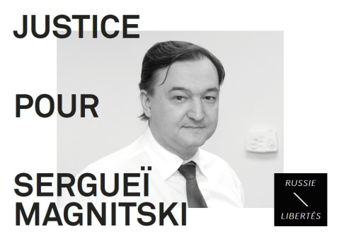

**L’avocat Sergueï Magnitski a été assassiné il y a cinq ans, le 16 novembre 2009, dans une prison russe.**
Son « crime »? Avoir enquêté sur une affaire d’escroquerie ayant permis le détourner 230 millions de dollars des caisses de l’État russe. Aujourd'hui, cinq ans après sa mort, la Justice russe n'a toujours pas mené d'enquête indépendante et les responsables de ce crime sont toujours en liberté.

Russie-Libertés demande la justice pour Sergueï Magnitski et pour toutes les victimes de l'absence de l’État de Droit en Russie. Nous proposons également d'améliorer la lutte contre la corruption en Russie et d'adopter une "loi Magnitski européenne".

En savoir plus sur le
["dossier Magnitski" : cliquez ici.](http://russie-libertes.org/2012/11/15/justice-pour-serguei-magnitski/)
En savoir plus sur notre
[rapport sur le lutte contre la corruption en Russie : cliquez ici.](http://russie-libertes.info/wp-content/uploads/2014/05/rapport_corruption-en-russie-final.pdf)