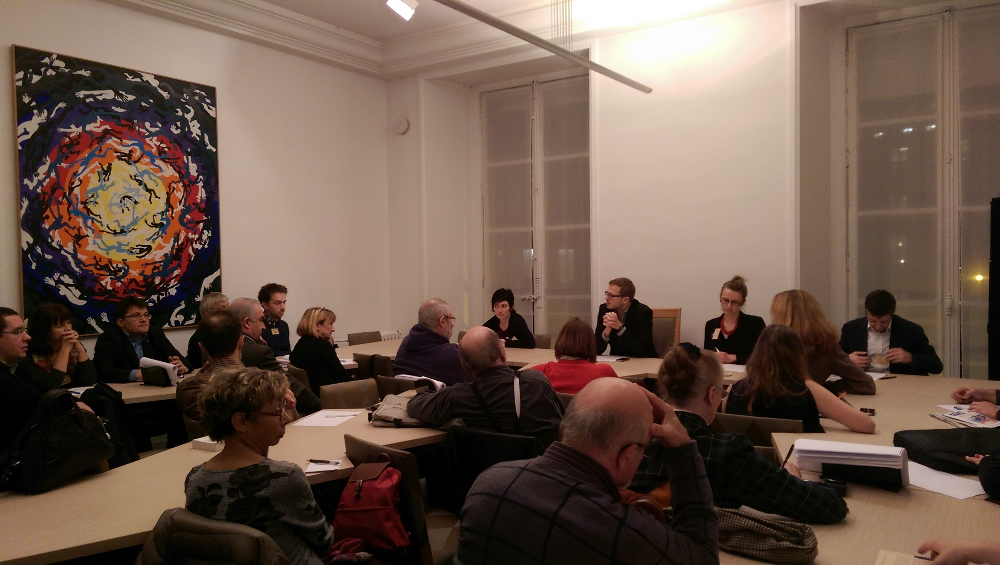
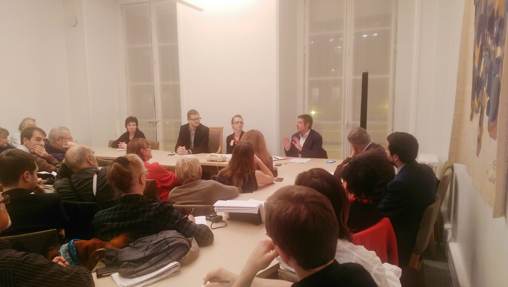

Mardi 25 novembre 2014 s’est déroulée à Paris une conférence sur le thème **« Quelle réponse démocratique face à l’offensive du régime de Vladimir Poutine en Europe ? »** organisée par l’association Russie-Libertés et le député Noël Mamère.

Devant une salle comble du Palais Bourbon, **Noël Mamère** a insisté en introduction sur la nécessité de défendre les libertés en Russie et de soutenir politiquement celles et ceux qui, au sein de la société civile, se battent pour la démocratie et l’État de Droit.

Les échanges et débats ont été nombreux et vifs. **Ioulia Berezovskaia**, directrice du site d’information Grani.ru bloqué en Russie, a décrit l’offensive menée par le Kremlin contre la liberté de l’expression et contre le pluralisme des médias en Russie. Elle a indiqué plus de 600 sites ont été récemment bloqués et a insisté sur la résistance que mènent certains sites, journalistes et blogueurs contre ces fermetures et blocages.

**Anthony Bellanger**, journaliste aux Inrockuptibles et à France Inter, a fait part de son expérience personnelle et des tentatives des proches du pouvoir russe qui consistent à recruter des journalistes en France et en Europe pour les transformer en communicants du Kremlin. Il a souligné l’importance du débats au sein des médias et la nécessité de développer des médias indépendants.

**Anna Garmash**, militante ukrainienne, porte-parole du collectif Euromaidan France, a énuméré les pressions exécrées par la Russie en Ukraine : pressions économiques, diplomatiques et politiques. Elle a insisté sur le besoin d’une voix européenne unie face à l’offensive du régime de Poutine en Europe et sur la nécessité de soutenir la société civile qui agit pour le changement en Russie.

Enfin, **Alexis Prokopiev**, président de l’association Russie-Libertés, a décrit l’action du Kremlin en Europe qui consiste à créer des liens, parfois financiers, avec des partis politiques (souvent d’extrême droite, mais parfois de droite ou de gauche « classique ») et des relais dans l’opinion. Selon lui, la réponse serait la lutte contre la corruption en Russie, la protection des lanceurs d’alerte et des militants russes en Europe mais aussi l’affirmation d’un projet européen basé sur les libertés et les droits humains.
