Le 22 mars 2015 a eu lieu la soirée-lancement du livre "Les Autres visages de la Russie" sur la Péniche Le Marcounet.

En partenariat avec Mediapart et l’éditeur Les Petits Matins, Amnesty International France, la Fédération internationale des ligues des droits de l’homme (FIDH), l’Action des chrétiens pour l’abolition de la torture (ACAT), Russie-Libertés, Reporters sans frontières et Inter-LGBT font tour à tour surgir ces autres visages de la Russie.

Le livre sera disponible le 2 avril 2015 dans les librairies et sur le site de l'éditeur :
[https://www.lespetitsmatins.fr/collections/les-autres-visages-de-la-russie-artistes-militants-journalistes-citoyens-face-a-larbitraire-du-pouvoir/](https://www.lespetitsmatins.fr/collections/les-autres-visages-de-la-russie-artistes-militants-journalistes-citoyens-face-a-larbitraire-du-pouvoir/)
Quelques photos de la soirée :
- 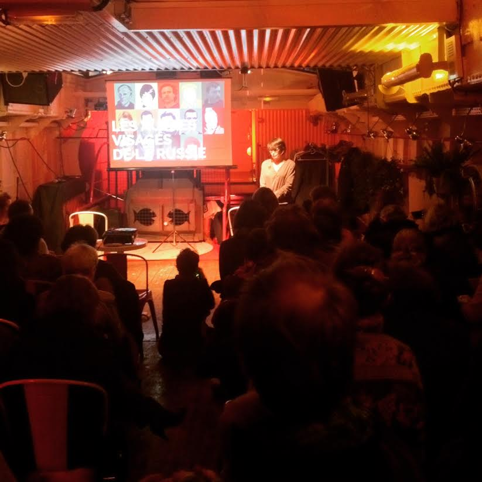
- 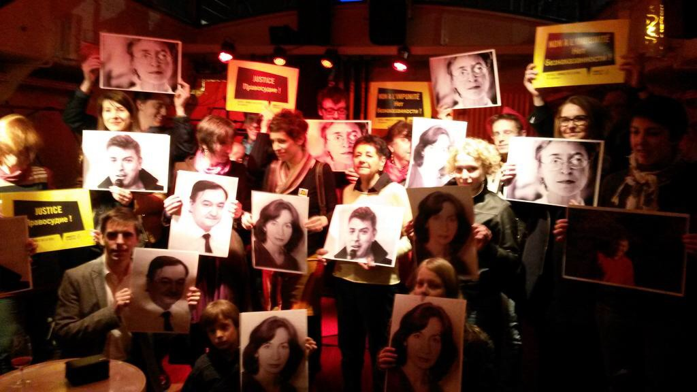
- 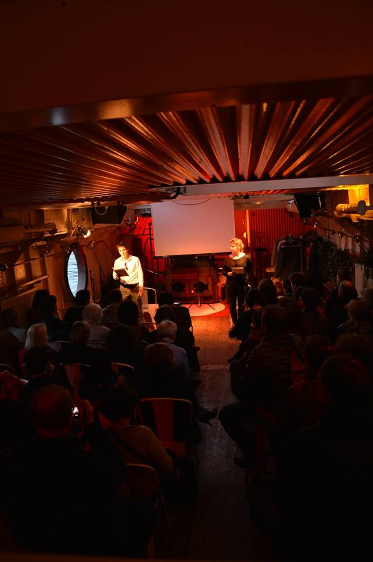
- 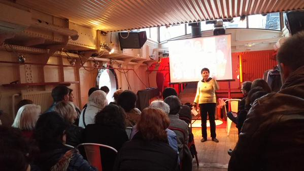
- 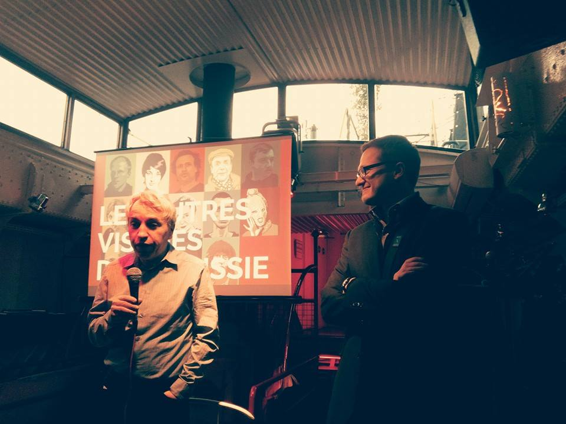
- 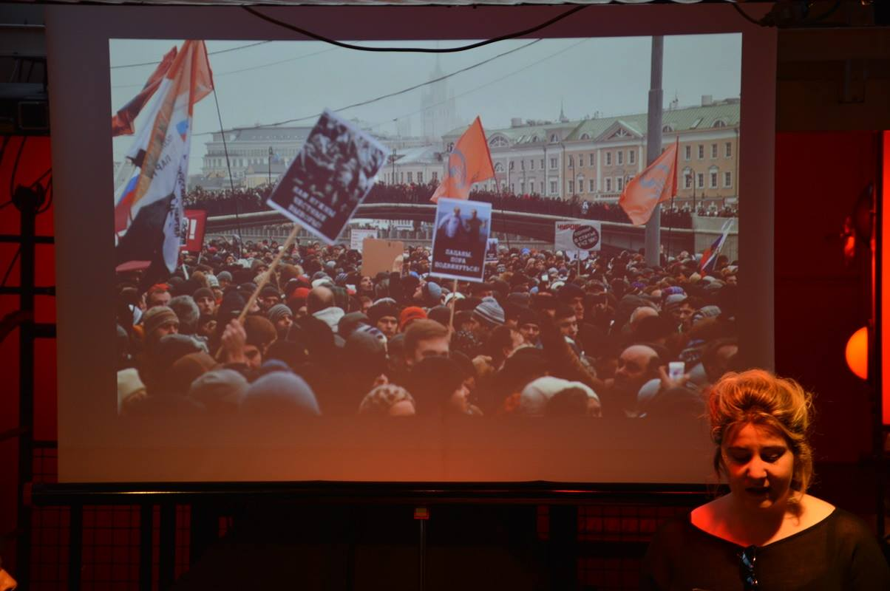
- 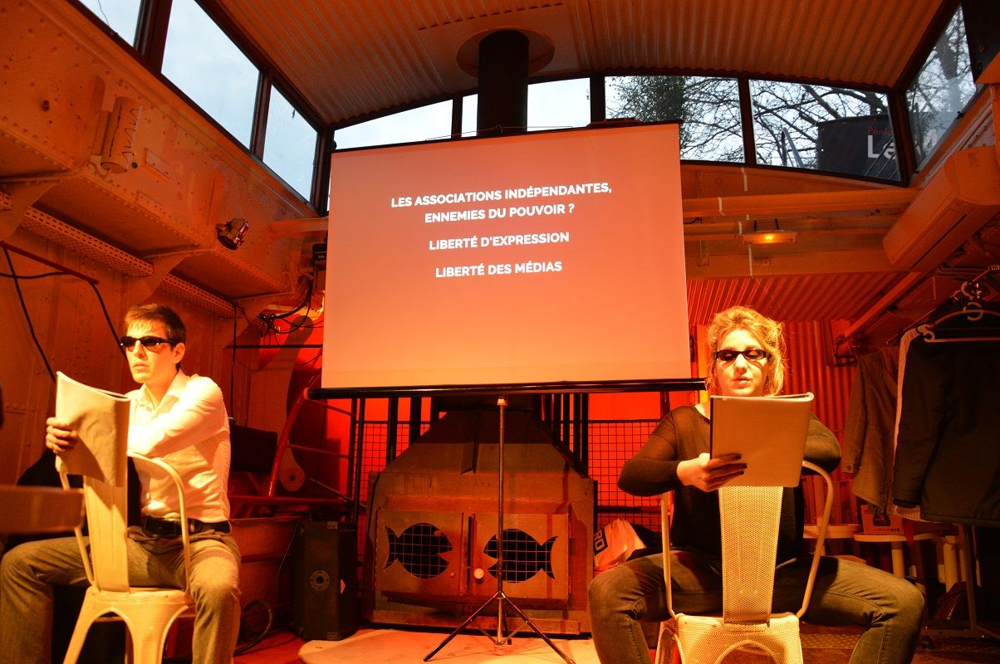
- 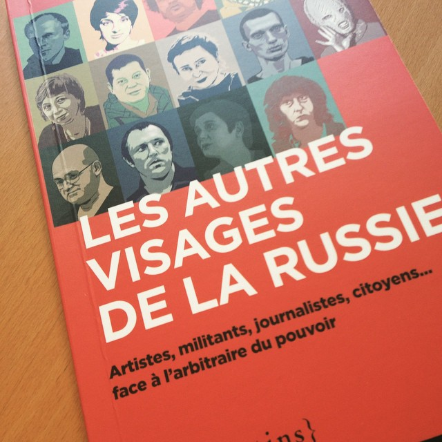
- 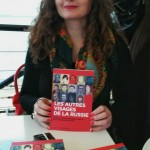
- 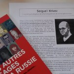
- 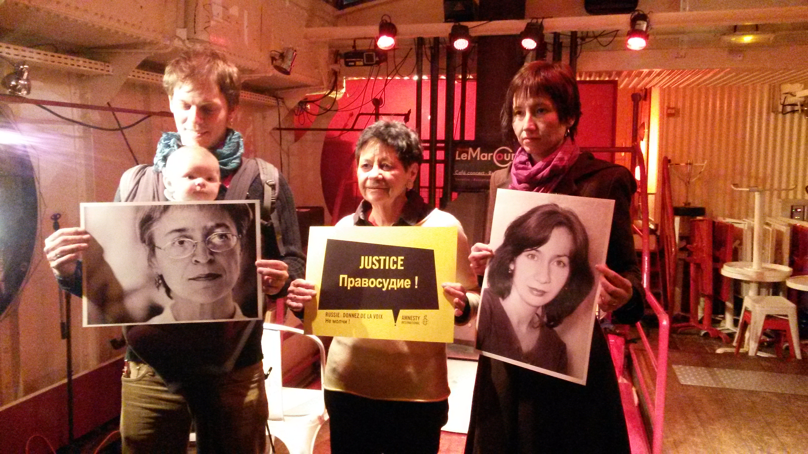
- 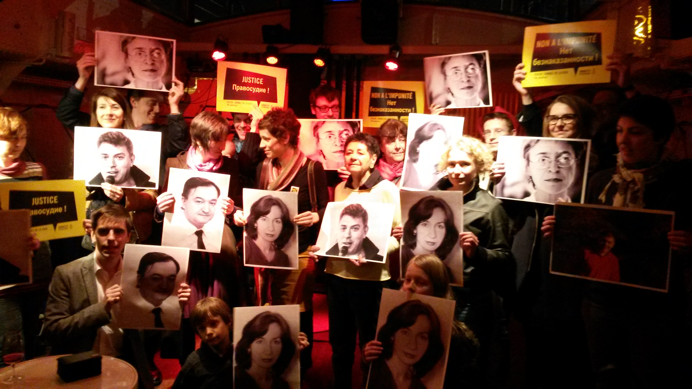
Photos par : Adèle Humbert (twitter :
[https://twitter.com/AdeleHumbert](https://twitter.com/AdeleHumbert)
[blog : Paris to Kiev](https://pariskiev.wordpress.com/)
), Dominique Curis (
[https://twitter.com/DoCuris](https://twitter.com/DoCuris)
), Evan O'Connell (
[https://twitter.com/evanoconnell](https://twitter.com/evanoconnell)
)  et Fabien Cazenave (
[https://twitter.com/FabienCazenave](https://twitter.com/FabienCazenave)
).
