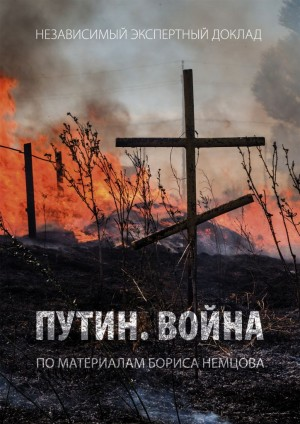

**>>> COMPLET <<<**

 |  | **Mardi 23 juin à 19h.** **Conférence exceptionnelle** **Présentation du rapport « Poutine et la guerre »** **et de sa traduction en français.** __**--- Attention changement de salle ---**__ __**Nouvelle salle : 6 ème bureau** ****126 rue de l’Université, Paris 75007** **métro Assemblée Nationale.****__ | 
 | ---- | ---- | 

Le rapport « Poutine et la guerre » compile des informations et des témoignages sur la présence de militaires russes sur le territoire ukrainien. Il analyse également les raisons de l’implication russe, les outils de communication employés par le Kremlin et le coût de la guerre pour les citoyens russes.
**Avec la participation de :**

 |  | **Ilya Yashin – militant de l’opposition russe, membre du conseil politique de RPR-PARNAS, co-auteur du rapport « Poutine et la guerre ».** |  | **Krystyna Biletska** **– militante de l’association « Ukraine Action », coordinatrice de la traduction du rapport « Poutine et la guerre ».** |  | **Danielle Auroi – députée du Puy-de-Dôme, présidente de la commission des Affaires européennes de l’Assemblée nationale.** |  | **Alexis Prokopiev – militant pour les droits humains et les libertés, président de l’association « Russie-Libertés ».** | 
 | ---- | ---- | ---- | ---- | ---- | ---- | ---- | ---- | 
 |  | **Ilya Yashin – militant de l’opposition russe, membre du conseil politique de RPR-PARNAS, co-auteur du rapport « Poutine et la guerre ».** |  | **Krystyna Biletska** **– militante de l’association « Ukraine Action », coordinatrice de la traduction du rapport « Poutine et la guerre ».** |  | **Danielle Auroi – députée du Puy-de-Dôme, présidente de la commission des Affaires européennes de l’Assemblée nationale.** |  | **Alexis Prokopiev – militant pour les droits humains et les libertés, président de l’association « Russie-Libertés ».** | 

La traduction française du rapport « Poutine et la guerre » a été réalisée grâce à une coopération de plusieurs associations et de traducteurs indépendants, avec l’accord d’Ilya Yashin.

Nombre de places limité.
**>>> COMPLET <<<**
__**--- Attention changement de salle ---**__
__**Nouvelle salle : 6 ème bureau** ****126 rue de l’Université, Paris 75007** **métro Assemblée Nationale.****__
