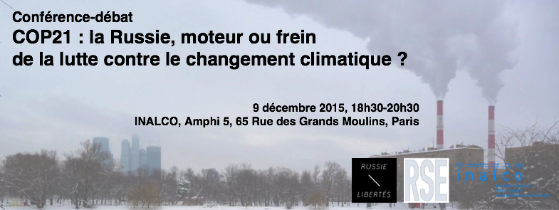
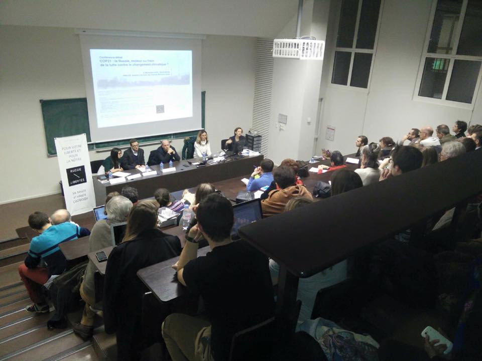
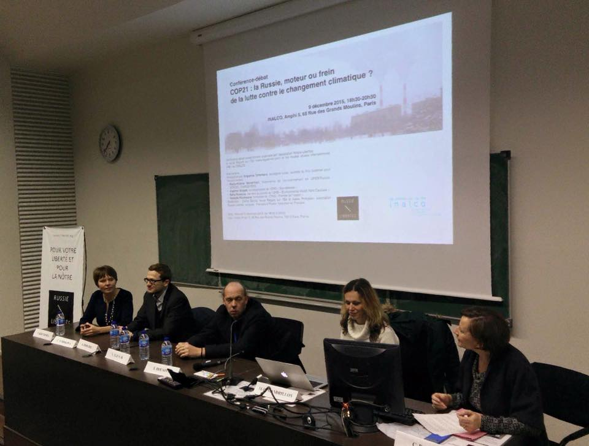

**Conférence-débat** **COP21 : la Russie, moteur ou frein** **de la lutte contre le changement climatique ?**

**9 décembre 2015, 18h30-20h30**
**INALCO, Amphi 5, 65 Rue des Grands Moulins, Paris**
A l’occasion de la COP21 à Paris, l’association Russie-Libertés, la revue Regard sur l’Est (www.regard-est.com) et les Hautes études internationales (HEI) de l’INALCO vous invitent à une conférence-débat exceptionnelle avec des acteurs de la société civile russe.

La Russie est aujourd’hui l’un des plus grands émetteurs de CO2 et l’un des plus importants producteurs d’hydrocarbures dans le monde. A l’heure de la COP21, elle devient donc un acteur incontournable dans les négociations autour de la lutte contre le changement climatique. La position de la Russie dans ces négociations ne peut toutefois être considérée sans prise en compte de plusieurs facteurs externes et internes comme les politiques économiques, écologiques et l’évolution des relations entre les autorités et la société civile constatées ces dernières années.

Quelle est la position de la Russie dans les négociations climat ? Quelles sont les politiques écologiques et anti-écologiques menées en Russie ? Quelle est la place de la société civile dans le contexte actuel ? Et enfin, la Russie est-elle un acteur majeur climat qui ne joue pas le jeu ?
**Intervenants :**
Introduction par Evguenia Tchirikova, écologiste russe, lauréate du Prix Goldman pour l’environnement.
Marie-Hélène Mandrillon, Historienne de l'environnement en URSS/Russie, CERCEC, CNRS/EHESS.
Vladimir Slivyak, co-responsable de l'ONG « Eco-défense ».
Sofia Rousova, membre du comité de l’ONG « Environmental Watch Nord Caucase ».
Nadejda Koutepova, fondatrice de  l’ONG « Planète de l’espoir ».

Modération : Céline Bayou, revue Regard sur l’Est et Alexis Prokopiev, association Russie-Libertés.
Langues : Français et Russe, traduction en Français.

Photos de la conférence :
- 
- 
