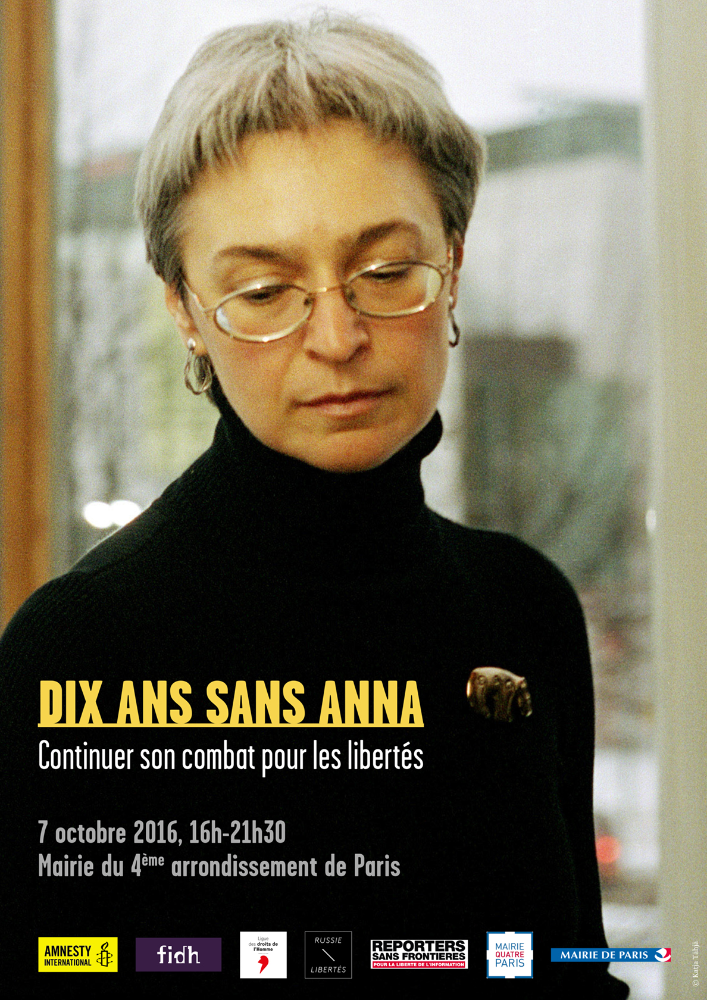

**Dix ans sans Anna :**

**Continuer son combat pour les libertés**

**Vendredi 7 octobre 2016, 16h00 – 21h30**

**Mairie du 4ème arrondissement de Paris, 2 Place Baudoyer, 75004 Paris**

Le 7 octobre 2006, Anna Politkovskaïa était abattue devant l’entrée de l’ascenseur de son immeuble. L’émotion suscitée par son assassinat a fait d’elle un emblème de la liberté d’expression bafouée en Russie, et plus largement dans le monde. Cette journaliste russe de Novaïa Gazeta incarnait le courage et l’indépendance, un îlot de résistance et de liberté dans les médias russes de l’époque. Mais c'était aussi une éminente défenseure des droits humains, mettant consciemment en jeu son confort et sa sécurité pour dénoncer les violations et porter la voix des victimes, dans le Caucase comme dans le reste de la Russie.

Depuis dix ans, force est de constater que le climat de travail des défenseurs des droits humains et de la presse indépendante s’est profondément détérioré dans ce pays. D'autres noms sont venus allonger la liste des personnalités assassinées. Mais depuis le retour à la présidence de Vladimir Poutine en 2012, les mécaniques et les cibles des pressions des autorités se sont largement diversifiées et élargies : les voix libres ou contestataires sont désormais prises en tenaille entre une législation criminalisant ou censurant toute forme de critique, et une propagande visant à les faire passer pour des ennemis internes.

La Russie, loin d’être un phénomène isolé, est un modèle qui s’exporte et trouve de nombreux échos : dans plusieurs pays d’Europe et dans son voisinage immédiat, les mécaniques de cette spirale répressive sont reproduits, amplifiés, adaptés, à différentes échelles. En cela, la Russie d’aujourd’hui constitue un laboratoire assumé et revendiqué dont s’inspirent de nombreux gouvernements.

A l’occasion du dixième anniversaire de la mort d'Anna Politkovskaïa, et avec le soutien de la Mairie de Paris, nos organisations souhaitent lui rendre hommage et prolonger le débat par une table ronde sur l’état de la liberté d’expression en Russie, mais aussi plus largement en Europe.

**Organisateurs** : Amnesty International France (AIF), FIDH (Fédération Internationale des Ligues des Droits de l’Homme), LDH (Ligue des Droits de l’Homme), RSF (Reporters sans frontières) et l’association Russie-Libertés.

**Partenaires** : Mairie de Paris, Mairie du 4ème arrondissement de Paris.

__Entrée gratuite – Inscription obligatoire en ligne avant le 6 octobre : [https://www.tickasso.com/e/dixanssansannacontinuersoncombatpourlesliberts34](https://www.tickasso.com/e/dixanssansannacontinuersoncombatpourlesliberts34)__

__Programme préliminaire (sous réserve)__
      
__**16h00-17h00 : Discours officiels et hommages**__

**Animation**
:
**Alexis Prokopiev**
, Président de Russie-Libertés.

* **Christophe Girard** , Maire du 4ème arrondissement de Paris.
* **Un(e) représentant(e) de la Mairie de Paris.**
* **Patrizianna Sparacino-Thiellay** , Ambassadrice pour les droits de l’Homme en charge de la dimension internationale de la Shoah, des spoliations et du devoir de mémoire, Ministère des Affaires étrangères.
* **Florence Mangin** , Directrice Europe Continentale, Ministère des Affaires Etrangères et du Développement International.
* **Marie Mendras,** Politologue au CNRS et CERI-SciencesPo.
* **Jean-François Bouthors,** J ournaliste, éditeur et écrivain, éditeur d’Anna Politkovskaïa (éditions Buchet/Chastel).
* **Galia Ackerman** , Journaliste et essayiste, traductrice et amie d'Anna Politkovskaia.

__**17h30 – 19h00 : Projection du film documentaire « Lettre à Anna »** . Un film de Eric Bergkraut__

Avec Anna Politkovskaïa, la voix de Catherine Deneuve, Vera Politkovskaïa

Prix Spécial Vaclav Havel – Festival One World – Prague 2008

**Festival Cinema For Peace – Berlin 2008**

**Distributeur : Nour Films.**

__**19h-21h : Table ronde**__

**Répression des libertés, un modèle qui s'exporte.**
Depuis le retour à la présidence de Vladimir Poutine en 2012, les voix contestataires sont prises en tenaille entre une législation criminalisant toute forme de critique, et une propagande faisant d’eux des ennemis internes. Loin d’être isolé, le modèle russe semble inspirer, à différentes échelles, d’autres pays en Europe et dans son voisinage immédiat.
**Modérateur :**
**Nicolas Krameyer,**
Responsable programme Libertés, Amnesty International France.
**Intervenants :**

* **Elena Milachina** , Journaliste, Novaïa Gazeta, Russie.
* **Pavel Tchikov** , Avocat, ONG Agora, Russie.
* **Malgorzata Szuleka** , Avocate et chercheuse, Helsinki Foundation for Human Rights, Pologne.
* **Christine Mardirossian,** Conseillère du Commissaire aux droits de l'Homme du Conseil de l'Europe.
* **Piotr Pavlenski** , Artiste militant, Russie.

__**21h-22h : Fin de la soirée et buffet solidaire.**__

