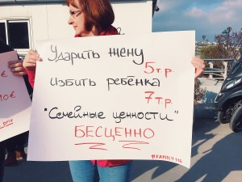
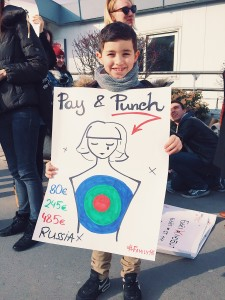
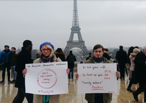

Le 19 février 2017, un groupe de militants s’est rassemblé à Paris sur la Place de la Résistance afin de manifester contre la décriminalisation de la violence domestique en Russie.

L'événement a rassemblé des étudiants de Sciences Po et de la Sorbonne, des membres de l’association Russie-Libertés, d’autres militants et défenseurs des droits de l'homme Russes et Français tels que la responsable de la coordination Russie à Amnesty International France Anne Nerdrum et la militante et écologiste Russe Nadezhda Kutepova.

L'événement, organisé par l’association française Russies-Libertés et une militante russe Ekaterina Petrikevich, a prit place en face du Centre culturel et spirituel russe et Cathédrale de la Sainte-Trinité russe dans le but d’informer la population à l’égard des violences domestiques en Russie.

Le 7 février 2017, le président Vladimir Poutine a promulgué une loi décriminalisant les «coups et blessures » qui avait auparavant été régi par l’article 116 du Code pénal Russe. La loi est entrée en vigueur immédiatement après sa publication, transformant le délit en une infraction administrative punie par une amende de 30 000 roubles (soit 485€) ou 15 jours de détention provisoire ou encore 120 heures de travaux d’intérêts général.

Selon la déclaration d’Anna Kirey, directrice adjointe du travail de campagne pour la Russie et l'Eurasie à Amnesty International « le gouvernement russe affirme que cette réforme va "protéger les valeurs familiales", mais en réalité elle bafoue les droits des femmes. »

Les manifestants ont exprimé leur forte inquiétude envers ce recul en terme de modernisation de la société Russe et ont demandé au gouvernement Russe de reconsidérer toute forme de violence domestique en tant que délit et de durcir les poursuites et condamnations.

« Nous combattons pour soutenir les femmes russes, pour faire face à ce recul vers la violence, prouver que la violence n'est pas une tradition de la Russie et ne peut être

considérée comme valeur dans une société moderne! Il y a bien plus que l'autorité dans les relations humaines et surtout dans les relations familiales, où amour et respect doivent

prévaloir sur le rapport de forces! La loi doit protéger les faibles et non pas soutenir des prétendues valeurs imposées par la politique d'Etat à la société! » a prononcé Olga Prokopieva, membre de Russie-Libertés et co-organisatrice de l’évènement.

Des manifestations similaires ont eu lieu ce mois-ci à Moscou, Saint Pétersbourg, Chelyabinsk et dans d’autres villes Russes, afin de mettre en lumière la gravité de la situation et la forte détermination des citoyen-ne-s à prendre des initiatives. « Il y a tant de choses qui se produisent dans le monde, il semble que les gens se soient accoutumés à tous et soient prêt

à accepter n’importe quelle norme, les victoires des populistes, l’atteinte aux droits... c’est pourquoi je voulais rencontrer et parler à des gens qui s’en préoccupent... C’est plus facile de résister et d’avancer quand on voit que l’on est pas seul », a exprimé Zoya Bragina, une des participantes à la manifestation.

Environ 10 000 femmes par an meurent à la suite de violences domestiques en Russie, en d’autres termes, la violence domestique tue une femme toutes les 45 minutes. Pour comparer,

en 2015, la France, un pays de 66.9 million d’habitants, a vu 115 femmes mourir sous les coups de leurs maris ou ex-compagnons. Ce chiffre est dix fois moins élevé que les

statistiques russes, bien que la population en Russie soit seulement deux fois plus élevée qu’en France.

La Russie est signataire de la Convention de l’ONU sur l'élimination de toutes les formes de discrimination à l'égard des femmes et de la Convention relative aux droits de l’enfant. Ces derniers reconnaissent la violence domestique en tant que discrimination. La Constitution de la Fédération Russe a également une clause de non discrimination qui garantit l’égalité des droits et des libertés de chaque citoyen et se porte garant de leurs droits fondamentaux.

Inês Soldado et Ekaterina Petrikevich

Si vous souhaitez signer la pétition contre les violences domestiques en Russie, cliquez ici
[https://www.change.org/p/state-duma-of-russian-federation-la-violence-domestique-en-russie-doit-%C3%AAtre-un-d%C3%A9lit-poursuivi-p%C3%A9nalement-2](https://www.change.org/p/state-duma-of-russian-federation-la-violence-domestique-en-russie-doit-%C3%AAtre-un-d%C3%A9lit-poursuivi-p%C3%A9nalement-2)

- 
- 
- 
- 
- 
- 
