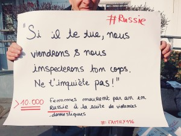
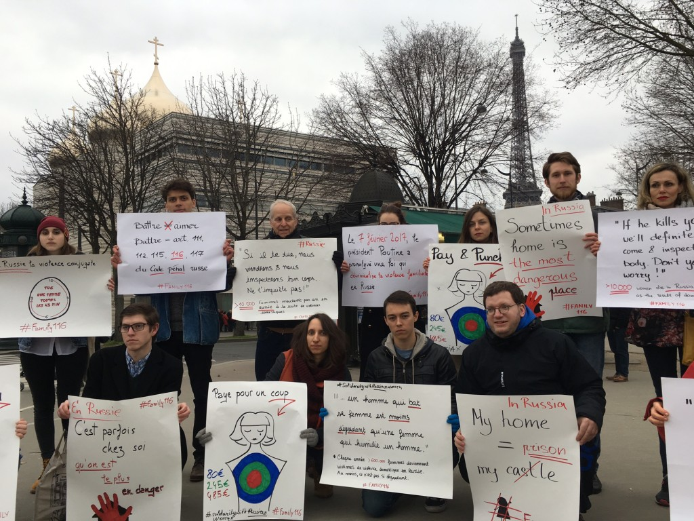
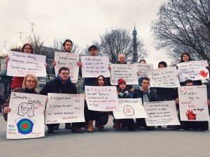

19 февраля 2017, на Площади сопротивления в Париже прошел протест против декриминализации домашнего насилия в России.

Этот протест собрал участников из ведущих университетов Франции Сьянс По и Сорбонна, членов французской организации Russie-Libertés, а также других русских и французских активистов, среди которых были координатор Amnesty International France по вопросам России Анна Нердрум и эколог и правозащитница из Челябинской области Надежда Кутепова.

Это мероприятие организованное французской ассоциацией Russie-Libertés и русской активисткой Екатериной Петрикевич прошло напротив русского культурно-духовного центра и Свято-Троицкого собора с целью повышения осведомленности людей о проблеме домашнего насилия в России.

7 февраля 2017 г. президент Владимир Путин подписал указ о декриминализации некоторых форм домашнего насилия. Этот указ вступил в действие сразу после его публикации, переведя побои из уголовного преступления по статье 116 УК РФ в разряд административных нарушений, наказуемых штрафом до 30 000 рублей, заключением сроком до 15 суток и от 60 до 120 часами исправительных работ.

Согласно официальному заявлению Анны Кирей, заместителя директора Amnesty International по России, “хотя власти России утверждают, что эта реформа направлена на «защиту семейных ценностей», в действительности она попирает права женщин.”

Протестующие выразили свою сильную обеспокоенность данным шагом назад на пути к модернизации России и требовали, чтобы российские правительство и парламент признали все формы домашнего насилия уголовно наказуемым преступлением и ужесточили наказание за данные виды злодеяний. В течение данного протеста участники распространяли петицию против домашнего насилия в России и обязались организовать дальнейшие мероприятия в поддержку данной инициативы.

"Мы боремся, чтобы поддержать русских женщин, чтобы встать на пути насилию, доказать что насилие не является традицией в России и не может быть ценностью в современном обществе! Человеческие отношения не строятся на авторитете и силе, и особенно внутри семьи, где сила должна уступать любви и уважению! Закон должен защищать слабых, а не поддерживать мнимые ценности навязанные обществу государственной политикой!" - утверждает Ольга Прокопьева, член ассоциации Russie-Libertés и ко-организатор данного мероприятия.

Аналогичные протесты прошли в этом месяце в Москве, Санкт-Петербурге, Челябинске и других городах России, подчеркивая важность данной проблемы и желание граждан взять инициативу в свои руки. “Последнее время столько всего происходит в мире, что кажется, что люди привыкли ничему не удивляться и воспринимать как норму победы популистов, ограничения прав... Поэтому мне хотелось познакомиться и поговорить с людьми, которым не всё равно... Противостоять и двигаться дальше легче, когда видишь, что ты не один!” - отмечает Зоя Брагина, одна из участниц протеста.

Ежегодно в результате домашнего насилия в России умирает более 10.000 женщин, что означает, что в результате домашнего насилия каждые 45 минут погибает одна женщина. Для сравнения, в 2015 году во Франции, стране с населением 66.9 мил в результате домашнего насилия погибло 115 женщин. Эта цифра меньше российской почти в десять раз, несмотря на то, что население России больше населения Франции всего в два раза.

Россия также является страной-участницей Конвенции ООН о ликвидации всех форм дискриминации в отношении женщин и Конвенции о правах ребенка, которые признают домашнее насилие одной из форм дискриминации. Конституция Российской Федерации также имеет положение о недискриминации, гарантирующее равенство прав и свобод граждан вне зависимости от их пола, а выступающее гарантом фундаментальных прав всех граждан Российской Федерации.

Инес Солдадо и Екатерина Петрикевич

Вы можете подписать петицию против декриминализации домашнего насилия перейдя по данной ссылке
[https://goo.gl/UExdGW](https://goo.gl/UExdGW)

- 
- 
- 
