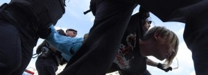

Au total, «1074 personnes ont été arrêtées pour des infractions diverses au cours d’une manifestation non autorisée dans le centre de la capitale», a déclaré la police de Moscou, citée par les agences de presse russes.

Moins d’une semaine après un rassemblement sans précédent depuis le mouvement qui avait accompagné le retour de Vladimir Poutine au Kremlin en 2012, les forces de l’ordre n’ont laissé cette fois aucune chance aux protestataires de participer à cette nouvelle manifestation, non autorisée, devant la mairie de la capitale russe.

L’opposition dénonce le rejet des candidatures indépendantes en vue des élections locales du 8 septembre, qui s’annoncent difficiles pour les candidats soutenant le pouvoir dans un contexte de grogne sociale. Selon les chiffres officiels de la police de Moscou, quelque 3500 personnes, parmi lesquelles environ 700 journalistes professionnels et blogueurs, étaient présentes samedi à la manifestation et « 1.074 » ont été arrêtées « pour des infractions diverses ». L’ONG OVD-Info, spécialisée dans le suivi des manifestations, a également dit avoir recensé vers 19h GMT plus de mille arrestations.

Mobilisées en grand nombre, elles ont arrêté massivement les protestataires qui affluaient sur la principale artère de Moscou, l’avenue Tverskaïa, criant « Honte » ou « Nous voulons des élections libres », et les ont repoussés manu militari vers les ruelles alentour. L’opposition dénonce le rejet des candidatures indépendantes lors des élections locales du 8 septembre, qui s’annoncent difficiles pour les candidats soutenant le pouvoir.

lusieurs figures de l’opposition ont été arrêtées tels Ilia Iachine, Lioubov Sobol ou Dmitri Goudkov qui avait affirmé vendredi que l’enjeu dépassait les élections locales. «Il s’agit de savoir si, dans la Russie d’aujourd’hui, il est possible de faire légalement de la politique», avait-il déclaré. Les domiciles et permanences de plusieurs candidats exclus avaient été perquisitionnés par avance et, mercredi, l’opposant numéro un au Kremlin, Alexeï Navalny, avait été renvoyé en prison 30 jours pour des infractions «aux règles des manifestations».

Ces procédures font suite à l’ouverture d’une enquête pour «entrave au travail de la Commission électorale» de Moscou lors de manifestations mi-juillet. Elles peuvent aboutir à des peines atteignant cinq ans de prison, rappelant les importantes condamnations prononcées lors du mouvement de 2011-2012 contre le retour à la présidence de Vladimir Poutine. En amont du rassemblement de samedi, la police de Moscou a publié une mise en garde aux citoyens et, fait inédit, proposé aux journalistes couvrant l’événement de transmettre leurs identités, augurant de nombreuses arrestations.

## «Recours à la force excessif»
L’ONG Amnesty International a dénoncé samedi soir un « recours à la force excessif » de la police russe, appelant à une « libération immédiate des protestataires pacifiques ». En amont du rassemblement de samedi, la police de Moscou a diffusé une mise en garde aux citoyens et, fait inédit, proposé aux journalistes couvrant l’événement de transmettre leur identité.

Le maire de Moscou Sergueï Sobianine, un proche de Vladimir Poutine, a averti que se préparaient de « sérieuses provocations ».

## Popularité en berne
Exceptionnellement élevée après l’annexion de la Crimée, la popularité de Vladimir Poutine a baissé depuis sa réélection pour un quatrième mandat l’année dernière et les scrutins de début septembre s’annoncent difficiles pour le pouvoir. L’enregistrement d’une soixantaine de candidats aux élections du Parlement de Moscou a été rejeté, officiellement en raison de vices dans la collecte des signatures nécessaires pour se présenter. Des participants indépendants exclus du scrutin ont dénoncé des irrégularités fabriquées selon eux de toutes pièces et ont accusé le maire loyal au pouvoir, Sergueï Sobianine, de vouloir étouffer l’opposition.

Malgré de grands projets de modernisation et l’amélioration de la qualité de vie ces dernières années, la mégapole de 12 millions d’habitants officiels demeure plus favorable à l’opposition que le reste du pays.

[Le Figaro avec Reuters](http://www.lefigaro.fr/flash-actu/arrestations-preventives-a-moscou-avant-un-rassemblement-illegal-20190727)
