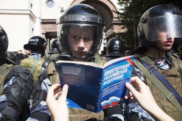

**Les citoyens russes doivent pouvoir choisir leurs représentants librement**

**Samedi dernier, des milliers de manifestants pacifiques ont de nouveau défilé à Moscou afin d’exiger des élections libres, honnêtes et démocratiques. Plus de 1000 personnes ont été arrêtées. La brutalité des autorités visait clairement à empêcher les Moscovites de défendre leurs droits à des élections libres. Plusieurs candidats de l’opposition ont été emprisonnés. Des journalistes qui diffusaient la manifestation ont été menacés par les autorités.**

**Cela fait suite au refus des autorités d’enregistrer plusieurs candidats indépendants et d’opposition et ainsi empêcher leur participation aux élections municipales de septembre 2019. Plusieurs de ces candidats d’opposition figuraient en bonne position dans les intentions de vote, ils affirment également avoir rempli les conditions (notamment le nombre de signatures) afin de pouvoir participer au scrutin.**

**Russie-Libertés exige des autorités russes le respect des droits constitutionnels de tous les candidats et électeurs, et de permettre la tenue d’élections libres, honnêtes et démocratiques sur tout le territoire de la Fédération de Russie. Nous exigeons également la libération de tous les prisonniers politiques injustement emprisonnés en Russie.**

**En solidarité avec les Moscovites, nous appelons à manifester le 3 août devant l&rsquo;ambassade de Russie à Paris.**

**Russie-Libertés**
