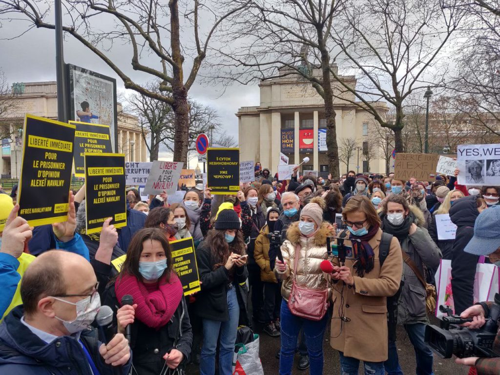
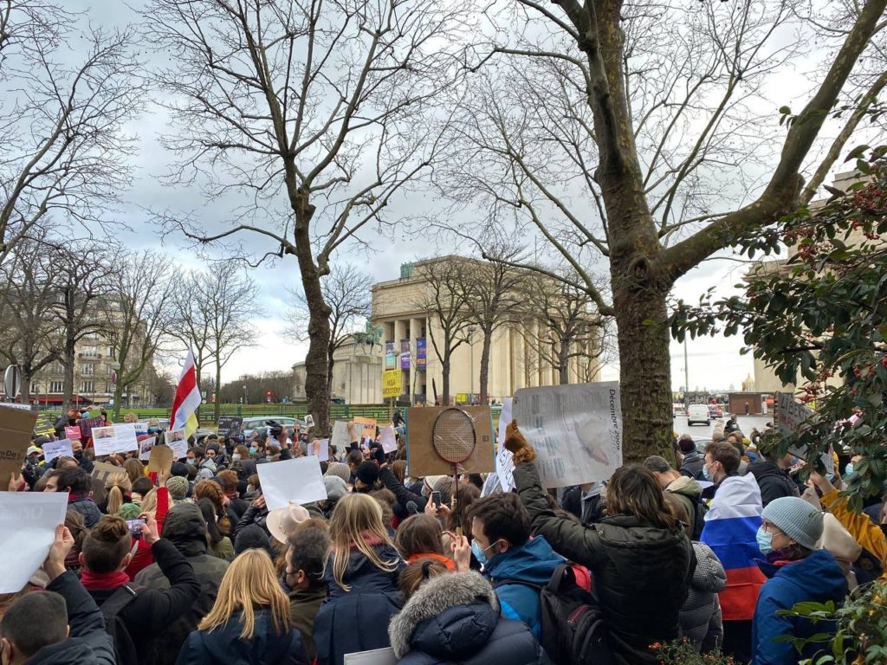
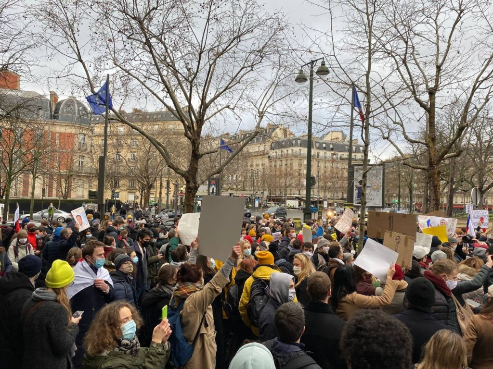

Plusieurs centaines de personnes se sont rassemblées aujourd’hui, 23 janvier 2021, place du Trocadéro à Paris pour exiger la libération de l'opposant russe Alexeï Navalny et de tous les prisonniers politiques en Russie. (Source photos : Russie-Libertés)

