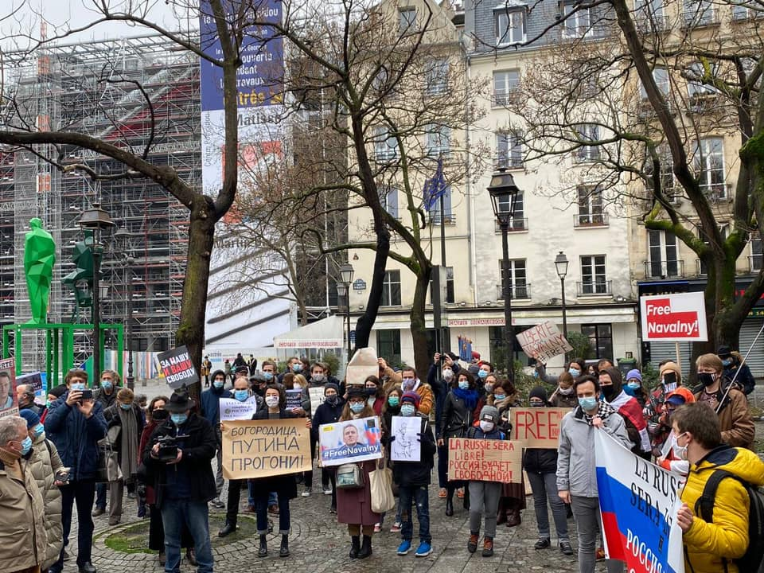
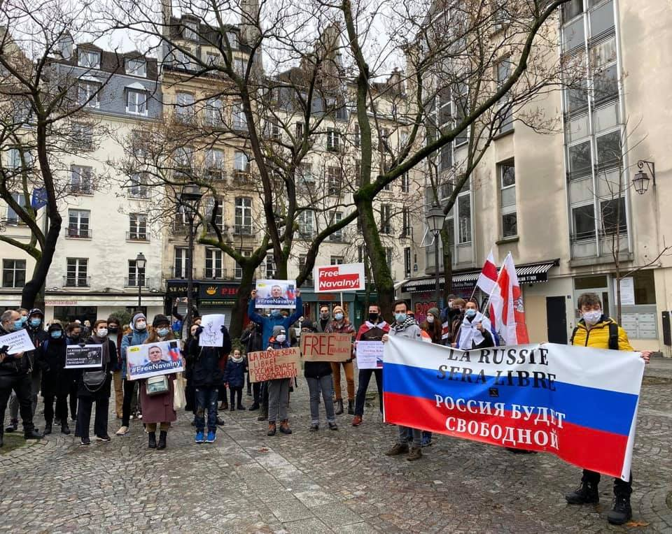

Important rassemblement aujourd’hui, 31.01.21, à Paris, en solidarité avec les manifestants russes et pour exiger la libération d’Alexeï Navalny et de tous les prisonniers politiques en Russie.

Avec Amnesty International France, Russie-Libertés, Marie Mendras, Sergei Guriev, André Gattolin, Nicolas Tenzer et d’autres. [#FreeNavalny](https://www.facebook.com/hashtag/freenavalny?__eep__=6&__cft__[0]=AZV8ksSgqoopjWNM5KK-JscSeKEPgLwXSXBWgaUokTYLUg8Y1vwb5MrkAbyWE_VMfG04hSGASudXdP2LHjIRXmFHNzo2VVVkaEiStxp0OjkDtZAruyw2SUhQyEqI4khFOVjcnzSX8XnfFeMac29CcLvX_cZ7NulNPhMiJFay3ZruoMSYfTm_nLWaaIgakxjUMpc&__tn__=*NK-R)

<video playsinline muted loop controls src="images/2021_01_IMG_6147.mov"></video>

