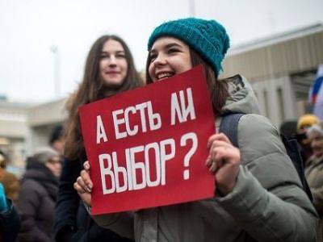

__Notre guide pour tout comprendre à la mécanique juridique en place avant les législatives des 17-19 septembre en Russie.__

Le droit d'être candidat aux élections, une composante du droit aux élections libres, est protégé au titre de l’article 3 du Protocole additionnel n°1 à la Convention de sauvegarde des droits de l'homme et des libertés fondamentales et par l’article 32 de la Constitution russe.

Les normes internationales en matière d'élections disposent clairement que l'une des conditions les plus importantes du déroulement des élections est la stabilité de la loi, l’indicateur principal de l’absence de manipulation par les autorités des règles électorales aux fins d’obtention d’un avantage sur leurs adversaires politiques.

Cependant, peu de campagnes électorales en Russie ne se sont déroulées sans un changement significatif des règles par rapport aux élections précédentes. Les élections législatives du 17 au 19 septembre 2021 ne font pas exception et se déroulent sans surprise dans un contexte de renforcement de la législation répressive. Depuis les précédentes élections de 2016, la **loi fédérale sur l'élection des députés à la Douma a été modifiée 19 fois** , parmi lesquelles 12 ont apporté des changements significatifs aux règles sur le déroulement des élections. Sept d'entre eux ont été adoptés au cours de l'année écoulée, dont six à moins de quatre mois avant le début de la campagne électorale.

Le nombre d'amendements de fond adoptés et leur densité dans les derniers mois précédant le début de la campagne électorale permettent d’affirmer que le principe de stabilité législative en tant que garantie contre les abus de pouvoir n’a pas été respecté. En effet, un grand nombre de ces innovations législatives visent à créer un environnement moins concurrentiel pour le parti au pouvoir en instaurant de nombreuses difficultés pour ses adversaires politiques.

Ainsi, le rejet des candidatures est devenu une routine dans cette élection à la Douma d’Etat, selon un rapport du mouvement indépendant de défense des droits des électeurs Golos. À la fin de la campagne électorale précédente de 2016, 234 personnes ont été retirées de la course, tandis que cette année, au 17 août, **244 candidats potentiels avaient déjà été forcés à abandonner la campagne électorale** **ou ont vu leurs candidatures refusées pour divers motifs.**

La pluralité politique a également diminué. Au cours des cinq années qui ont suivi les élections de 2016, le nombre de partis politiques pouvant se présenter aux élections à la Douma d'État russe est passé de 74 à 32. En cinq ans, 47 partis politiques ont disparu et cinq ont émergé. Quatre partis ont été dissous volontairement, tandis que les 43 autres l'ont été sur décision de la Cour suprême russe : un pour activités extrémistes, quatre pour n'avoir pas présenté les documents nécessaires, 11 pour ne pas avoir le nombre requis de branches régionales, un pour des violations à la réglementation et 26 pour participation insuffisante aux élections. Plusieurs de ces décisions peuvent être considérées comme arbitraires ou injustifiées, et politiquement motivées.

Il est impossible à ce jour de calculer le nombre exact de citoyens qui ont été privés de leur droit d’être candidat aux élections. Toutefois, d'après le rapport de l’organisation Golos, **le nombre total de citoyens à qui l'État interdit de se présenter aux élections est d'au moins 9 millions** , soit environ 8% du nombre total d'électeurs. L'entrée en vigueur des nouveaux amendements dits "anti-extrémistes" et la reconnaissance abusive comme organisations extrémistes des structures d'Alexeï Navalny signifient que plusieurs centaines de milliers de citoyens politiquement actifs pourraient bientôt être visés par ces restrictions et devenir inéligibles.

La Constitution russe de 1993 ne prévoit cependant que **deux motifs** de privation de l'éligibilité (résultant obligatoirement d’une décision judiciaire) : la reconnaissance de l'incapacité juridique et l'enfermement dans des lieux de privation de liberté. Cependant, en dépit de l’existence de ces deux critères exhaustifs, à partir du milieu des années 2000, la pratique de réinstauration des restrictions à l’éligibilité commence à réapparaître, en dépit de vives critiques de la part des juristes constitutionnels russes. Tout comme à l'époque soviétique, **les récentes vagues de restrictions du droit des citoyens à être candidats, sont motivées par des considérations politiques** . La Cour constitutionnelle russe a pourtant elle-même à plusieurs reprises affirmé que les restrictions au droit de se présenter aux élections doivent être raisonnables, proportionnelles, strictement nécessaires et justifiées, et poursuivre des objectifs constitutionnellement établis.

À la suite de plusieurs vagues de limitation de l’éligibilité, les principales catégories de personnes privées de l’éligibilité :

**1. Titulaires du titre de séjour ou de la nationalité d’un pays étranger, ou personnes détenant des instruments financiers/comptes bancaires étrangers**

Le plus grand nombre de citoyens privés de l’éligibilité se trouve parmi ceux ayant une deuxième nationalité ou un titre de séjour. Selon diverses estimations, le nombre des personnes concernées pourrait dépasser les 6 millions.

Quelques candidats écartés de l’élection de 2021 sur ce fondement (liste non-exhaustive) :

* Alexander Davankov, vice-président du parti Nouveau peuple (Novye Liudi) et chef du groupe régional pour Saint-Pétersbourg (citoyenneté grecque) ;
* Dmitry Potapenko, homme d'affaires (possession d'actions dans des sociétés étrangères) ;
* Pavel Grudinine, ex-candidat présidentiel du parti communiste (détention alléguée des parts d’une société offshore enregistrée au Belize). Grudinine nie la détention de ces actifs au moment de sa nomination. Son parti a vu dans cette interdiction l'exercice de la pression sur les candidats.

L'expert de Golos, Arkady Lyubarev, considère que les interdictions prononcées sont pour la plupart sélectives et politiquement motivées.

**2. Personnes ayant été condamnées pour les faits d'incitation à l'extrémisme, la propagande d'exclusivité ou l'utilisation de symboles nazis, ou  ayant été jugées administrativement responsables de la production et de la distribution du matériel extrémiste** ;

Au cours de l’année passée, ont reçu des sanctions administratives en vertu des articles 20.3 (“Affichage public de symboles nazis”) et 20.29 du code administratif (“Production et distribution de matériel extrémiste”) notamment :

* Evgeny Domozhirov, ancien député du conseil municipal de Vologda et président du mouvement Vmeste (diffusion d'une vidéo dans laquelle il comparait le maire et le gouverneur en exercice de la région de Vologda à des fascistes) ;
* Yuri Yukhnevich, un député de la Douma régionale de Tyumen et membre du parti communiste (partage de la vidéo d'Alexei Navalny) ;
* Anton Mirbadalev, député de la république Mari El du parti LDPR (partage d’une vidéo en 2010 jugée extrémiste).

L’application du terme “extrémiste” est de plus en plus utilisé par les autorités de manière abusive, notamment pour écarter du scrutin les partisans de l’opposant démocrate anti-corruption Alexeï Navalny.

**3. Personnes ayant été condamnées pénalement à une peine privative de liberté** (y compris avec sursis) pour un certain nombre d’infractions graves et de moyenne gravité. Parmi les infractions de moyenne gravité on trouve un certain nombre d'infractions susceptibles d’être qualifiées de “politiques” visant souvent les membres de l'opposition. Il s'agit notamment des infractions suivantes :

* La violation répétée de l'ordre établi pour l'organisation ou la tenue d'une réunion, d'un rassemblement, d'une manifestation (article 212.1 du code pénal). Ainsi, la participation répétée à des rassemblements non autorisés, même pacifiques, est susceptible de recevoir la qualification d’un délit pénal, comme cela s'est produit pour la députée municipale Yulia Galiamina, l’ayant privée de se présenter aux élections ;
* L'appel public à des activités extrémistes (article 280) ;
* La diffusion publique d'informations sciemment fausses ayant une importance sociale et ayant entraîné de graves conséquences (article 207) ;
* Le trafic de stupéfiants (article 228). L’affaire politiquement motivée la plus médiatisée ces dernières années est l'affaire Ivan Golunov. Le député de Saint-Pétersbourg Maxim Reznik a également été arrêté et assigné à résidence sur ce fondement le 17 juin 2021.

Au cours de l'année écoulée, d’autres activistes politiques ont également été privés de l’éligibilité sur des fondements pour le moins contestables. C’est le cas d’Andrei Borovikov, ancien coordinateur du bureau régional de Navalny à Arkhangelsk qui a été condamné à 2,5 ans de prison ferme pour avoir publié en 2014 sur sa page personnelle du réseau social Vkontakte une vidéo du groupe Rammstein. Ou encore de Nikolai Platoshkin, diplomate soviétique et russe, leader du mouvement “Pour un nouveau socialisme”, condamné à 5 ans de prison avec sursis pour avoir “incité” à participer aux manifestations, qualifiées comme des “émeutes de masse” par la publication de  vidéos sur YouTube. Après avoir purgé leur peine, ils ne seront pas autorisés à se présenter aux élections avant cinq ans.

Ont également été écartés des élections avec un risque d’inéligibilité sur le long terme Sergei Furgal, Andrey Pivovarov et Ketevan Kharaidze, qui sont actuellement en détention provisoire et Dmitry Gudkov, qui a fui la Russie sous la menace de poursuites pénales.

**4. Personnes ayant participé ou étant liées aux activités d'une organisation reconnue comme extrémiste ou terroriste** , avec cette particularité que la “participation” ou le “lien” peuvent être caractérisés par voie de soutien affiché sur internet par un “like” ou “partage”, ou par des dons intervenus avant l’interdiction formelle de l’organisation. La loi a été adoptée en un temps record d'un mois ; cinq jours plus tard, le 9 juin 2021, les organisations d'Alexei Navalny ont été abusivement déclarées extrémistes. Selon l’avis unanime des experts, cette loi est juridiquement inacceptable du seul fait de sa rétroactivité : elle punit des actions qui n'étaient pas illégales au moment où elles ont été commises. En outre, elle permet de priver les citoyens de leur droit à l’éligibilité pour des périodes allant d'un an (pour les participants/sympathisants) à cinq ans (pour les organisateurs).

Les personnes dont la candidature a été rejetée après l’entrée en vigueur de la nouvelle loi :

* Ilya Yashin, député municipal et Oleg Stepanov, ancien coordinateur du bureau régional de Navalny à Moscou, ont été les premières personnes visées, en raison de leurs liens présumés avec le FBK (La Fondation anti-corruption d’Alexei Navalny) ;
* Irina Fatyanova, ancienne coordinatrice du bureau régional de Navalny à Saint-Pétersbourg ;
* Artem Vazhenkov, l'ancien coordinateur d'Open Russia ;
* Ivan Luzin et Ragnar Rein, militants à Kaliningrad ;
* Artem Vazhenkov, militant à Tver ;
* Natalia Rezontova, journaliste à Nijni Novgorod (affirme n'avoir aucun lien avec les organisations de Navalny) ;
* 11 candidats indépendants se présentant aux élections du conseil municipal de Berdsk (région de Novosibirsk), suite d'une lettre du ministère de la Justice dans le cadre de la vérification des antécédents des candidats. Selon le ministère, les candidats seraient impliqués dans les activités du bureau régional de Navalny.

Tous ces rejets de candidature ont eu lieu avant que la Cour d'appel ne décide que le FBK et les bureaux régionaux de Navalny étaient des organisations extrémistes, ce qui confirme leur illégalité. Par exemple, dans le cas de Yashin la décision de justice statuant sur son inéligibilité a été rendue postérieurement au rejet de sa candidature.

D’autres personnes, comme la députée municipale de Moscou Galina Filchenko, l’ancien coordinateur du bureau régional de Navalny à Kaliningrad, Alexandre Tchernikov, ou encore Lev Shlosberg, leader de la branche de Pskov de Yabloko ont été “dénoncées” par un autre candidat d’avoir un lien avec les organisations extrémistes.

Il s’agit d’une technique largement utilisée, selon le politologue Alexei Makarkine, l’expert interrogé par le journal Novaya Gazeta. En effet, les commissions électorales elles-mêmes n'ont pas la capacité de vérifier tous les candidats qui se présentent aux élections. Ils s'appuient donc sur les informations fournies par les autorités judiciaires à la suite de demandes d’investigation d'autres candidats pour écarter les personnes soupçonnées d’implication dans des activités/organisations prohibées.

La liste de Golos, sans doute incomplète, comptait, au mois de juin 2021, 75 personnalités publiques et politiques susceptibles d’être frappées par l’inéligibilité dans une perspective assez proche. La plupart d'entre elles, en raison de différentes pressions subies, ont soit  renoncé à se présenter aux élections de septembre, soit ont considérablement réduit leurs ambitions politiques, se présentant à un niveau inférieur à celui auquel elles auraient pu éventuellement prétendre.

Ekaterina Oleinikova

[https://www.linkedin.com/in/ekaterinaoleinikova/](https://www.linkedin.com/in/ekaterinaoleinikova/)

Sources:

[Rapport analytique, Les nouveaux privés de droits : pourquoi les citoyens russes sont massivement privés de leurs droits lors des élections de 2021, Golos, 22 juin 2021](https://www.golosinfo.org/articles/145272)

[Rapport analytique, Particularités juridiques de l'élection des députés à la Douma d'Etat de la Fédération de Russie le 19 septembre 2021, Golos, 1 juillet 2021](https://www.golosinfo.org/articles/145285)

[Rapport analytique, Résultats de la nomination et de l'enregistrement des candidats à la Douma d'Etat de la Fédération de Russie le 19 septembre, Golos, 24 août 2021](https://www.golosinfo.org/articles/145400)

[https://novayagazeta.ru/articles/2021/09/07/izbirkomy-snimaiut-s-vyborov](https://novayagazeta.ru/articles/2021/09/07/izbirkomy-snimaiut-s-vyborov)

[https://novayagazeta.ru/articles/2021/07/02/deviat-millionov-lishentsev](https://novayagazeta.ru/articles/2021/07/02/deviat-millionov-lishentsev)

[https://novayagazeta.ru/articles/2021/06/26/vybory-zakonchilis](https://novayagazeta.ru/articles/2021/06/26/vybory-zakonchilis)

[https://novayagazeta.ru/articles/2021/08/24/tsentr-ella](https://novayagazeta.ru/articles/2021/08/24/tsentr-ella)
