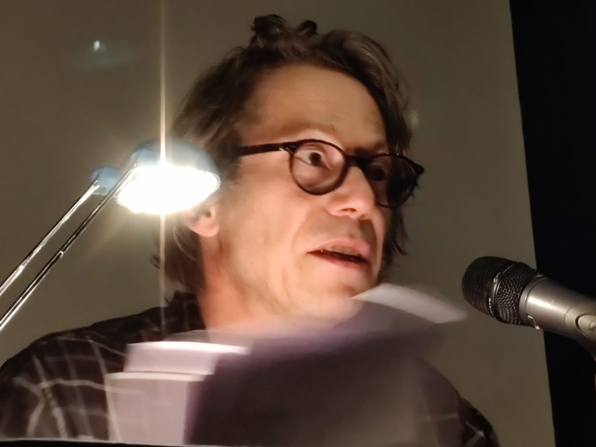

**Le 20 octobre 2021 s’est tenue à l’Hôtel de Ville de Paris, la conférence « 15 ans sans Anna. Une parole libre est-elle encore possible en Russie ? »**

**Jean-Luc Romero Michel, adjoint à la Maire de Paris aux Droits humains** est venu souligner le courage de toutes celles et de tous ceux qui se battent pour les libertés en Russie.

Les organisations partenaires ont ouvert la conférence par une courte présentation : Amnesty international France, Reporters sans Frontières, FIDH, Mémorial France, Russie-Libertés, Les Nouveaux Dissidents, la maison d’édition « les petits matins », la revue Esprit et le Comité Russie Europe.

Présentation du livre « Ils font vivre le journalisme en Russie » par Johann Bihr qui en a dirigé la rédaction. 15 portraits de journalistes qui se battent pour imposer une presse libre.

**Table ronde « 15 ans sans Anna Politkovskaïa. Une parole libre est-elle possible en Russie ? »**

Modération :

**Marie Mendras,** politologue au CNRS, professeure à Sciences Po Paris. Membre de la revue Esprit et de son Comité Russie Europe

**Michel Elchaninnoff,** fondateur et rédacteur en chef de Philosophie magazine. Fondateur de l’ONG « les Nouveaux Dissidents » Auteur du livre « dans la tête de Vladimir Poutine »

Intervenants :

**Alexandre Tcherkassov,** président du Centre des Droits Humains Mémorial

**Elena Milachina,** journaliste à la Novaya Gazeta (par vidéo)

En préambule, Marie Mendras félicite Elena Milachina pour le prix Nobel de la paix 2021 attribué à Dmitry Muratov, fondateur et rédacteur en chef de la Novaya Gazeta. Ce Prix Nobel étant partagé avec la journaliste philippine Maria Ressa, il s’agit d’un message fort en direction des journalistes du monde entier qui se battent pour une presse honnête.

Marie Mendras annonce également qu’Alekseï Navalny est le lauréat du Prix Sakharov 2021.

Elle rappelle que malgré les risques Elena Milachina a repris le travail d’Anna Politkovskaïa et de Natalia Estemirova, toutes les deux assassinées. Elle a reçu le prix international « Women for courage. »

__Intervention d’Elena Milachina__

Historique et analyse de la situation des droits humains en Russie : comment en est-on arrivé là ?

Après une courte période de liberté véritable correspondant à la présidence de Boris Eltsine, la situation a changé au tournant des années 2000 avec deux événements majeurs. L’arrivée au pouvoir de Vladimir Poutine et les attaques terroristes aux Etats-Unis. La notion de « terrorisme » va désormais être instrumentalisée par les pouvoirs en place, y compris en Russie par Vladimir Poutine..

Comment les libertés ont-elles peu à peu disparu en Russie ?

Après la chute de l’URSS les assassinats fréquents d’oligarques ne provoquaient pas de réelle émotion dans l’opinion publique persuadée qu’enrichis sur le dos de leurs concitoyens ils avaient en quelque sorte bien mérité leur sort. De même les premières atteintes à des médias indépendants, propriétés pour la plupart de ces mêmes oligarques tant détestés, n’ont ému personne.

Peu à peu les atteintes contre la presse libre et les ONG se sont multipliées avec la mise en place des opérations militaires en Tchétchénie, en Géorgie, en Ukraine, en Syrie.

Aujourd’hui, on atteint le paroxysme des violations des libertés fondamentales avec l’obligation pour les médias indépendants et les associations de s’identifier auprès des autorités comme « agents de l’étranger.» Statut infamant qui peut induire de lourdes amendes et des condamnations pénales. Des centres d’assistance se constituent en soutien mais leurs juristes sont eux-mêmes contraints de se déclarer « agents de l’étranger.»

Elena Milachina regrette que la société civile de son pays, pourtant intelligente et éduquée, n’ait pas encore compris que tout le monde, tôt ou tard, sera inquiété et arrêté. Le pouvoir veut se maintenir éternellement pour conserver ce qu’il a volé et pour garantir sa propre impunité.

__Intervention d’Alexandre Tcherkassov :__

Rappel du contexte des guerres en Tchétchénie, Géorgie, Ukraine, Syrie. Actuellement, la Russie est de plus en plus présente en Afrique ; elle multiplie les cyber attaques sur la Toile également. La violence du régime s’exerce donc doublement : à l’égard de ses propres concitoyens mais aussi à l’égard de ceux du monde entier. Ainsi, il remet en cause la stabilité et la sécurité internationales.

Pourquoi les journalistes écrivent-ils si peu sur ces thèmes militaires de la politique internationale ? Les médias d’État le font sous forme de propagande permanente mais les médias indépendants manquent de moyens, notamment pour se rendre et se maintenir sur place.

En 2018, le site d’investigations « Dossier Center », financé par l’opposant Mikaïl Khodorkovski a envoyé trois journalistes en Centrafrique. Ils doivent enquêter sur le groupe Wagner, une armée secrète de mercenaires qui sévit notamment dans plusieurs pays d’Afrique pour le compte du pouvoir russe même si celui-ci le nie le connaître.

Alexandre Tcherkassov souligne le courage de Kirill Radtchenko, Alexandre Rastogouïev et Orkhan   Djemal retrouvés assassinés sur une route de Bangui peu après leur arrivée.

Il pointe également l’absence de contre-pouvoirs du côté du Parlement, de partis politiques libres, d’une presse indépendante en Russie…

__Questions à Elena Milachina__

- Comment les journalistes de la Novaya Gazeta, dont elle-même, vivent-ils cette situation difficile ?

- Quels sont pour eux les sujets prioritaires ?

Elena Milachina répond qu’elle continue à travailler dans le sillage d’Anna Politkovskaïa et de Natalia Estemirova. L’obligation de s’inscrire en tant qu’agent de l’étranger induit des démarches administratives et le paiement d’amendes. A terme cela peut aboutir à l’interdiction d’exercer le métier et c’est pourquoi la presse libre est de moins en moins présente.

En ce qui concerne la Novaya Gazeta, le prix Nobel de la paix est un bouclier qui pour l’instant  protège l’équipe.

Actuellement, Elena Milachina travaille sur deux dossiers à ses yeux très importants :

* L’attaque terroriste à l’école de Beslan le 1ier septembre 2004. « 186 enfants tués et pas un seul de vérité de la part des autorités »

* Le sous marin Koursk qui sombre dans la mer de Barents le 12 août 2000. 118 morts. Les causes véritables constituent un secret d’état.

Elena Milachina s’interroge sur les conflits ouverts (Caucase du nord, Géorgie,Ukraine, Syrie) et souterrain (Centrafrique). Elle souligne les conséquences négatives que cela entraîne pour les habitants de ces pays mais aussi pour les ceux de toute la planète.

Face à la rhétorique de la presse officielle, les médias indépendants manquent de moyens et ont du mal à envoyer leurs propres correspondants sur place. « Mais nous en parlons. Nous faisons ce que nous pouvons. » assure Elena Milachina.

Elle ne sait pas combien de temps cela va durer mais tant qu’elle sera libre elle continuera à enquêter sur les violations des droits humains.

Le lien entre les différents dossiers qu’elle traite, c’est la volonté d’informer les jeunes générations.

Elena Milachina a été frappée par l’attitude du « satrape de Tchétchénie, Kadyrov.» En effet, celui-ci a peur de sa propre armée et exige que celle-ci pose les armes en sa présence.  Elena Milachina établit un parallèle avec Vladimir Poutine qui a peur de sa jeunesse : celle-ci ne vote pas pour les candidats officiels et s’informe via les réseaux sociaux. Grâce à ces jeunes notamment, les médias libres ne vont pas disparaître et vont inventer d’autres moyens pour continuer d’exister.

__Intervention Alexandre Tcherkassov : quel avenir en Russie ?__

La France, après la 2ième guerre et la Collaboration, a commencé à répondre aux questions des jeunes générations. De même, en Russie, les jeunes ont eux aussi posé des questions sur les années du pouvoir communiste et aussi, particulièrement à la suite des manifestations de 2011 et 2012 sur le pouvoir actuel. Il ne faut pas avoir peur ni se détourner de l’avenir. Les jeunes ont regardé les vidéos de Navalny sur la corruption des autorités. Les choix conformistes de leurs parents leur donnent « la nausée » la même que celle évoquée par Sartre en son temps.

**Conclusion par Michel Elchaninoff:** l’importance des liens historiques tissés en permanence par la voix d’Alexandre Tcherkassov pour Memorial et par Elena Milachina pour la Novaya Gazeta.

Du grave incident le 14 octobre dernier dans les locaux moscovites Memorial à l’occasion de la projection du film d’Agnieszka Holland « l’ombre de Staline » qui relate la famine orchestrée en Ukraine par le dictateur, en passant par les aventures du soldat Tchoucheniouk en Syrie, « « tout continue » selon les termes d’Alexandre Tcherkassov. Même si la terreur n’a plus rien à voir avec les années 30, l’absurdité des accusations de la répression sous Staline se retrouve dans celles retenues contre Navalny sous Poutine. Par exemple lorsqu’il est reproché à l’opposant de ne s’être pas présenté pour un contrôle administratif alors qu’il était soigné en Allemagne…. On retrouve le même sentiment d’absurdité cynique.

Elena Milachina et Alexandre Tcherkassov ont la capacité de voir les processus mis en œuvre et rendent son sens historique à la Russie ; ils luttent ainsi contre le zapping et l’amnésie voulus par le pouvoir.

La collaboration inédite entre Memorial et la Novaya Gazeta (Alexandre Tcherkassov insiste sur le soutien de Dmitry Muratov face aux provocateurs rendus furieux par l’évocation de « Holodomor ») permet de résister au pouvoir. Celui-ci a pour objectif permanent d’effrayer tout le monde et d’entretenir la confusion. Le retissage de l’Histoire permet d’aller à l’encontre de cette peur et d’oser dire la vérité.

La dissidence d’aujourd’hui est née de celle d’hier. L’espoir est rendu possible car renouer avec le fil de l’Histoire c’est renouer avec le fil de la Liberté.

**Les films projetés :**

**Reporters sans Frontières** donne la parole à trois des journalistes dont le portrait est retracé dans l’ouvrage « ils font vivre le journalisme en Russie » Roman Anine, Svetlana Prokopieva et Egor Skovoroda qui s’expriment sur le statut d’agent de l’étranger et des conséquences négatives que cela induit aux plans personnel et professionnel. « Sans médias indépendants pas d’avenir. »

**La FIDH** présente « Russie, crimes contre l’Histoire » d’Olga Kravetz. Analyse juridique de nombreux cas de persécution de la société civile, y compris des historiens, journalistes et membres d’ONG qui ont dévoilé les crimes de la période soviétique.

**Les Nouveaux Dissidents :** témoignage d’Elena Kostuchenka qui avait 15 ans lorsqu’elle a lu un reportage d’Anna Politkovskaïa dans la Novaya Gazeta. Elle décide alors de devenir journaliste à son tour…

**En clôture : lecture du journal de prison d’Alekseï Navalny**

Mathieu Amalric s’est fait la voix de Navalny. Il souligne les aspects de dérision et d’humour qui en dépit de la situation sont présents à chaque page du journal de prison.

[YouTube: https://www.youtube.com/watch?v=p5glvjcsU14&t=275s](https://img.youtube.com/vi/p5glvjcsU14/0.jpg)

[YouTube: https://www.youtube.com/watch?v=Bx4cOBFpzy4&t=633s](https://img.youtube.com/vi/Bx4cOBFpzy4/0.jpg)

[YouTube: https://www.youtube.com/watch?v=veouLwO_z6w&t=1s](https://img.youtube.com/vi/veouLwO_z6w/0.jpg)
