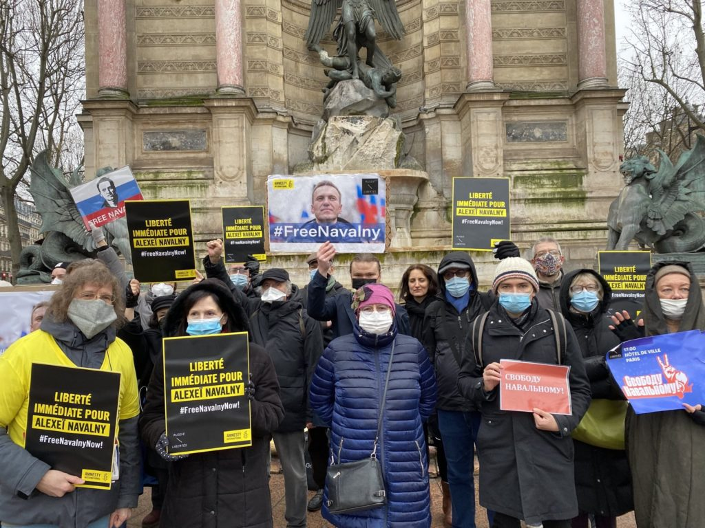
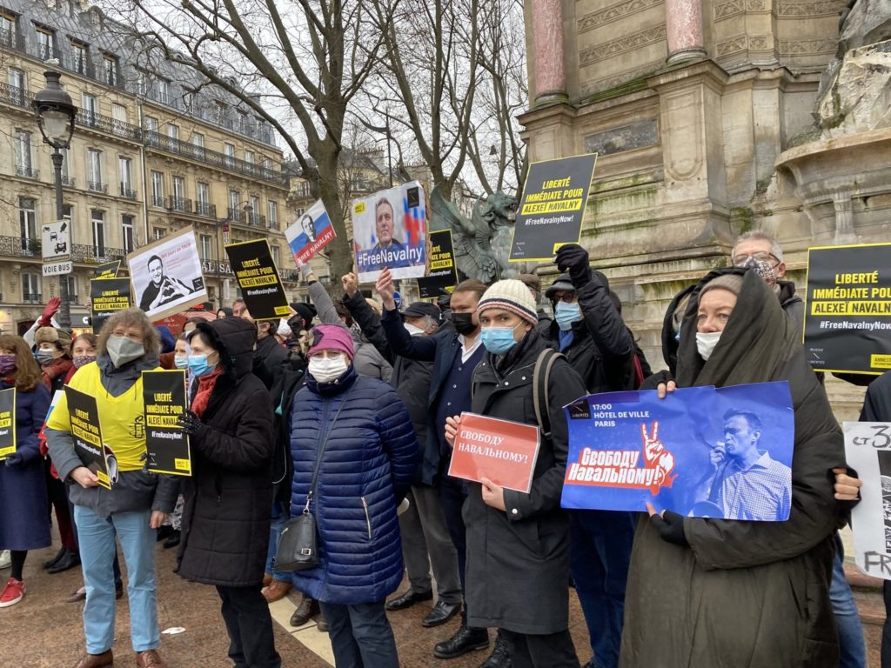
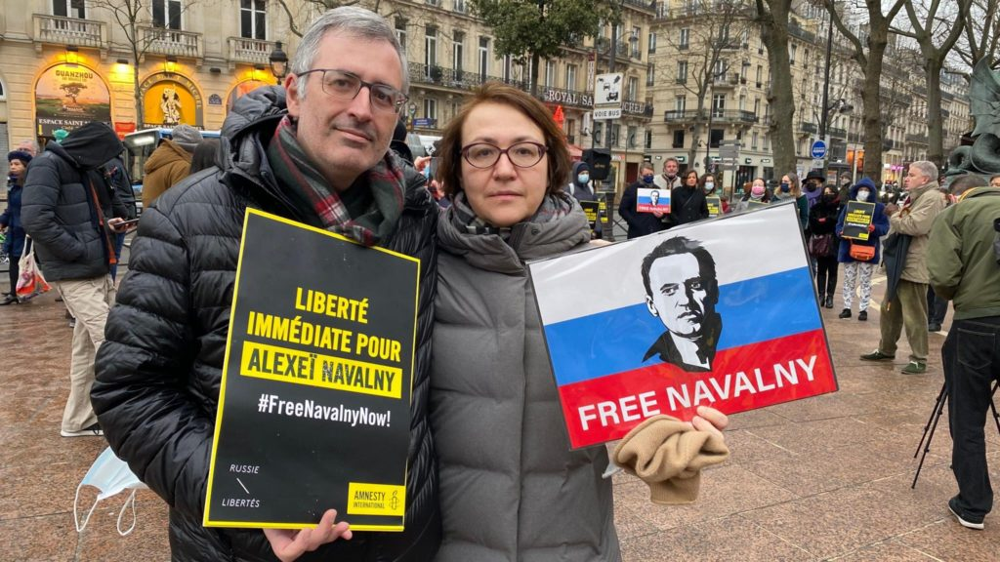
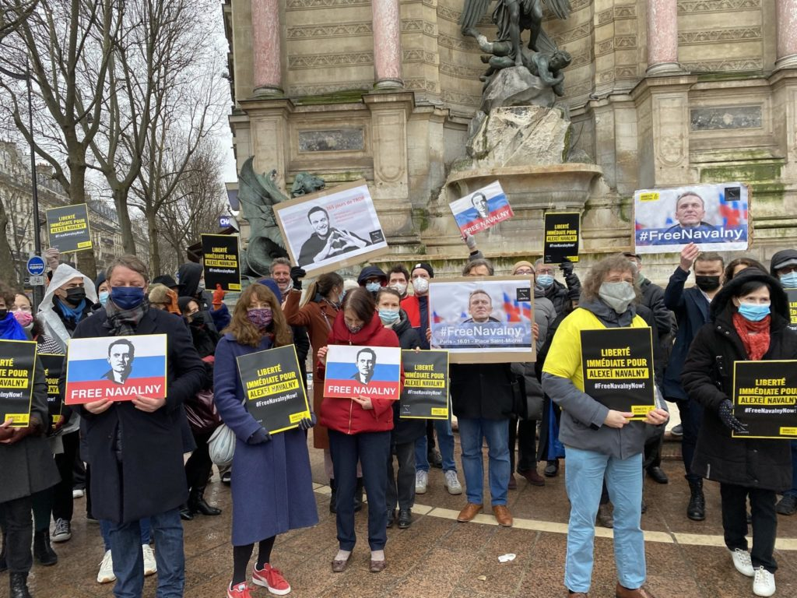

**Manifestation à Paris pour la libération de Navalny, un an après son emprisonnement en Russie**

Hier s’est tenue à Paris, place Saint-Michel, une manifestation en soutien à Alexeï Navalny.

Arrêté il y a un an, le 17 janvier 2021, à l’aéroport de Moscou à son retour d'Allemagne, où il était en convalescence suite à son empoisonnement, Alexeï Navalny est un symbole de courage, reconnu par le Prix Sakharov qui lui a été décerné cette année par le Parlement européen.

Plusieurs dizaines de personnes se sont réunies à Paris pour marquer ce triste anniversaire de 365 jours de détention arbitraire pour Alexeï Navalny. La manifestation a été organisée par Russie-Libertés, Amnesty international France et Les Nouveaux Dissidents. Des personnalités telles que Serguei Guriev, économiste à Sciences Po, Nadejda Kutepova, écologiste et réfugiée politique russe, Nicolas Tenzer, philosophe politique et essayiste, ainsi que Ekaterina Zhuravskaya, économiste, sont venues soutenir Alexeï Navalny.

La porte-parole de Russie-Libertés, Olga Prokopieva, a souligné que cette année 2021 a été marquée par un durcissement, sans précédent depuis la chute de l'URSS, des libertés fondamentales, d'une prise en étau de la société civile, des organisations de défense des droits humains, et par une généralisation de la répression. Mais aussi, que 2022 s’annonce encore plus difficile et qu’il est primordial de continuer la mobilisation. « L'optimisme que tente d’insuffler Alexeï Navalny à la société civile russe muselée par la répression ne doit pas s’affaiblir ! Nous devons être à la hauteur de son courage et de son optimisme. »

Katia Roux, chargée de plaidoyer au sein d’Amnesty International France, a réitéré la demande de « libération immédiate et inconditionnelle d’Alexeï Navalny et de ses partisans », mais aussi a souligné qu’« au cours des 12 derniers mois, les autorités russes mènent une campagne de répression et de représailles sans précédents… en détruisant tout ce qu’il reste encore des droits à la liberté d’expression et d’association en Russie».

Michel Eltchaninoff, rédacteur en chef de Philosophie Magazine et président de l’association Les Nouveaux Dissidents, a quant à lui remarqué que « si les citoyens du monde se désintéressent de Navalny, le pouvoir va chercher à le briser… Sa survie n’existe que par notre soutien ! "

---
- 

- 

- 

- 

---

Notre mobilisation continue. Vous pouvez vous aussi soutenir Navalny en signant la pétition :

[Preview: https://www.change.org/p/emmanuel-macron-pour-la-lib%C3%A9ration-imm%C3%A9diate-de-l-opposant-russe-alexe%C3%AF-navalny](https://www.change.org/p/emmanuel-macron-pour-la-lib%C3%A9ration-imm%C3%A9diate-de-l-opposant-russe-alexe%C3%AF-navalny)

[#freeNavalny](https://www.facebook.com/hashtag/freenavalny?__eep__=6&__cft__%5b0%5d=AZVi-VCUdzN3SF63rFjceCKCCohk0ldz_haIocWQ08oAX4_qZBbHLeUnjL-VkvS4TprdEtTQ_XjpLBd21voZmJQUBjUkuCuqW3ZBj1ZPa2kYIpx0A06pJfPt3tHUG8zhzajCXF7dMLzi5JNpIWI-w3nm&__tn__=q) [#freeprisonnersofconscience](https://www.facebook.com/hashtag/freeprisonnersofconscience?__eep__=6&__cft__%5b0%5d=AZVi-VCUdzN3SF63rFjceCKCCohk0ldz_haIocWQ08oAX4_qZBbHLeUnjL-VkvS4TprdEtTQ_XjpLBd21voZmJQUBjUkuCuqW3ZBj1ZPa2kYIpx0A06pJfPt3tHUG8zhzajCXF7dMLzi5JNpIWI-w3nm&__tn__=q)

[#libérezNavalny](https://www.facebook.com/hashtag/lib%C3%A9reznavalny?__eep__=6&__cft__%5b0%5d=AZVi-VCUdzN3SF63rFjceCKCCohk0ldz_haIocWQ08oAX4_qZBbHLeUnjL-VkvS4TprdEtTQ_XjpLBd21voZmJQUBjUkuCuqW3ZBj1ZPa2kYIpx0A06pJfPt3tHUG8zhzajCXF7dMLzi5JNpIWI-w3nm&__tn__=q) [#libérezlesprisonniersdopinionrusses](https://www.facebook.com/hashtag/lib%C3%A9rezlesprisonniersdopinionrusses?__eep__=6&__cft__%5b0%5d=AZVi-VCUdzN3SF63rFjceCKCCohk0ldz_haIocWQ08oAX4_qZBbHLeUnjL-VkvS4TprdEtTQ_XjpLBd21voZmJQUBjUkuCuqW3ZBj1ZPa2kYIpx0A06pJfPt3tHUG8zhzajCXF7dMLzi5JNpIWI-w3nm&__tn__=q)
