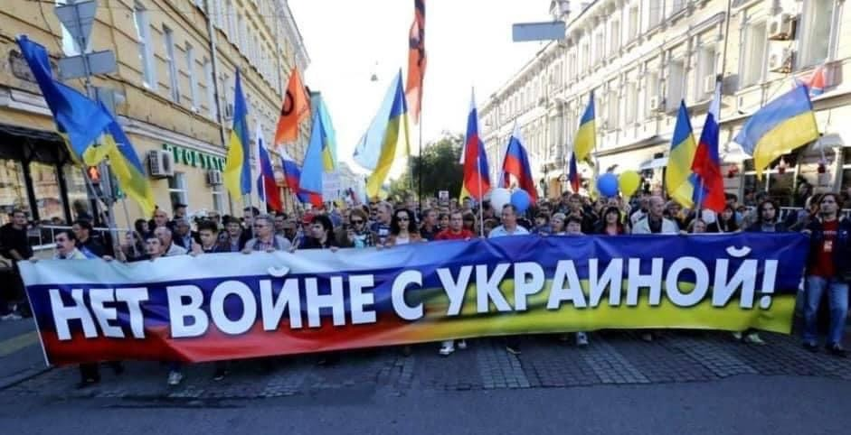

Depuis plusieurs mois, le Kremlin multiplie les menaces contre l’Ukraine et les Ukrainiens. Après avoir occupé militairement et annexé illégalement la Crimée, puis lancé le conflit et l’invasion d’une partie de l’Est de l’Ukraine, Vladimir Poutine menace de nouveau les Ukrainiens, malgré la crainte de la majorité de la population russe (selon le centre Levada) ne souhaite pas s’engager dans cette aventure meurtrière. 

 Russie-Libertés dénonce cette politique de la terreur envers les voisins de la Russie qui fait écho à celle menée par le Kremlin contre la société civile russe a l’intérieur du pays. 

 Nous demandons de respecter les droits des Ukrainiens à la Paix, aux libertés et à la préservation de leur territoire souverain. Nous appelons la France, l’UE et la communauté internationale à agir pour stopper l’escalade dans la région, notamment par des sanctions individuelles ciblées contre le régime de Poutine, ses oligarques et ses proches. 

 Pour votre liberté et pour la nôtre !

