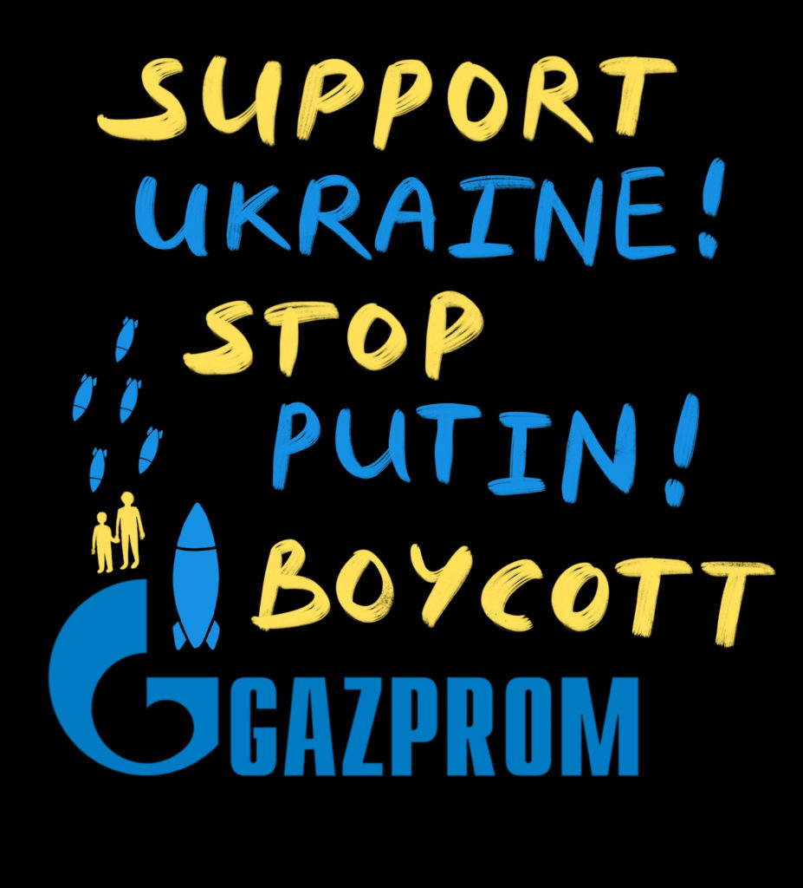

Cette horrible guerre a un nom et un visage : c’est la guerre de Poutine. Nous sommes de tout cœur avec nos amis Ukrainiens qui subissent sa guerre et leur apportons tout notre soutien pour la défense de leur pays et de nos valeurs communes de liberté. Nous appelons la France, l’Union Européenne et la communauté internationale à soutenir les Ukrainiens et à sanctionner le plus fortement possible le régime de Poutine.

En tant qu’une association issue de la société civile qui a à cœur un avenir démocratique pour la Russie, nous avons toujours soutenu des sanctions personnelles ciblées visant le socle du pouvoir de Vladimir Poutine.

Ces sanctions ciblées ont été, et sont aujourd’hui, efficaces car ont un impact direct et tangible sur les personnes responsables des actes répréhensibles sanctionnés par la communauté internationale.

Toutefois, aujourd’hui, nous devons constater que, malgré leur efficacité sur le moyen et long terme, ces sanctions sont insuffisantes pour arrêter le plus vite possible la machine de guerre de Vladimir Poutine et mettre fin à l’invasion russe en Ukraine.

Nous considérons qu’il est de notre responsabilité de tout faire pour arrêter cette machine de guerre.

C’est pourquoi nous avons décidé de lancer, d’une voix unie avec d'autres acteurs de la société civile, une demande adressée à l’Union européenne d’arrêter immédiatement tout achat des hydrocarbures russes et de cesser toute relation commerciale avec la principale société exportatrice du gaz naturel Gazprom. Notre campagne s'intitule #BoycottGazprom et peut être diffusée partout.

Nous sommes convaincus que la guerre menée par le régime actuel aura, et a déjà, des conséquences désastreuses et sans précédent sur la population ukrainienne mais aussi la société russe. Les sanctions visant l’export des hydrocarbures, couplées d’autres sanctions déjà en place, limiteront le financement du pouvoir de Poutine et de ses opérations militaires, et auront un impact considérable sur sa capacité à continuer la guerre. Elles sont nécessaires pour l’Ukraine, pour l’Europe, et pour l'avenir d'une Russie libre.

#BoycottGazprom #SupportUkraine #StopPutin

[https://energyandcleanair.org/financing-putins-war/?utm_campaign=FR+ACT+Kalie+Imports+fossiles+Russes&utm_medium=email&utm_source=autopilot](https://energyandcleanair.org/financing-putins-war/?utm_campaign=FR+ACT+Kalie+Imports+fossiles+Russes&utm_medium=email&utm_source=autopilot)

[https://www.investigate-europe.eu/en/2022/eu-states-exported-weapons-to-russia/](https://www.investigate-europe.eu/en/2022/eu-states-exported-weapons-to-russia/)

[https://www.dropbox.com/s/wmptre3vkfkqysf/Guriev%20Itskhoki.pdf](https://www.dropbox.com/s/wmptre3vkfkqysf/Guriev%20Itskhoki.pdf)

[https://www.ft.com/content/2be6b385-6d96-4745-9c6a-2a835da645e9](https://www.ft.com/content/2be6b385-6d96-4745-9c6a-2a835da645e9)

[https://www.bloomberg.com/news/articles/2022-03-10/goldman-sees-euro-area-economy-shrinking-inflation-close-to-8](https://www.bloomberg.com/news/articles/2022-03-10/goldman-sees-euro-area-economy-shrinking-inflation-close-to-8)
