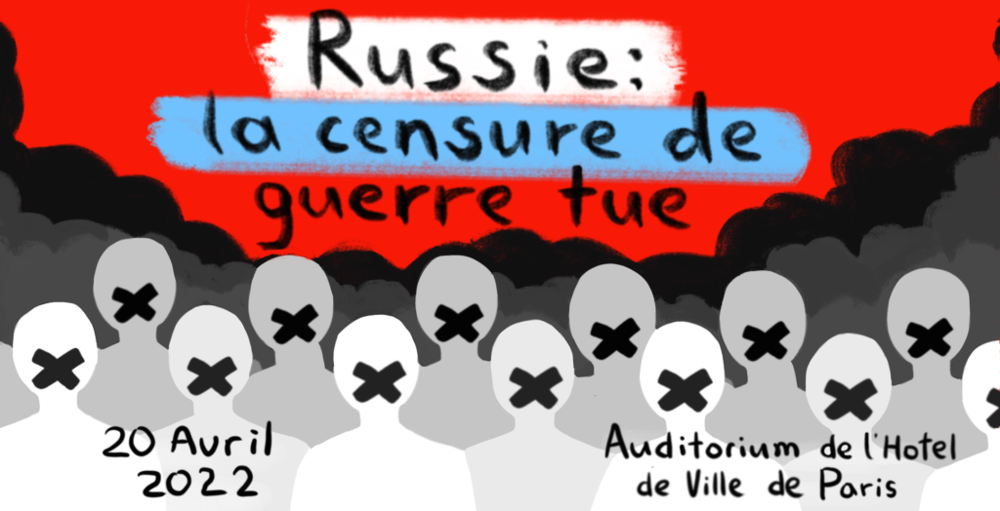
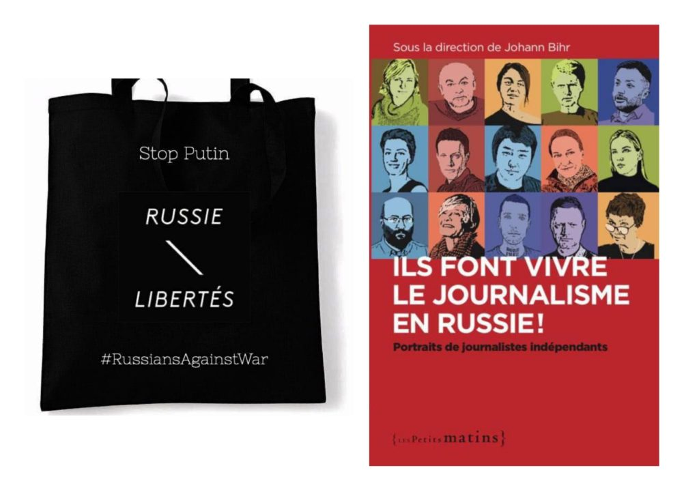

**CONFÉRENCE 20 AVRIL 2022**

**RUSSIE : LA CENSURE DE GUERRE TUE**

**COMMENT POUTINE SE SERT DE LA PROPAGANDE ET DE LA CENSURE DES MÉDIAS EN RUSSIE POUR L’INVASION DE L’UKRAINE**

La conférence sera dédiée à la question du renforcement de la propagande et de la censure en temps de guerre.

A cette occasion, nous invitons :

Introduction par **Katia Roux** , chargée de plaidoyer au sein d’ **Amnesty International France**

sur l’état des lieux des droits et libertés et sur les lois répressives prises en Russie depuis le début de la Guerre en Ukraine

Invités :

**Daniil Beilinson -** cofondateur d'OVD-Info. OVD-Info est une organisation indépendante de défense des Droits de l'Homme qui vise à surveiller les atteintes à la liberté de réunion et aux autres droits politiques fondamentaux en Russie. Elle recueille et analyse des données relatives aux mises en détention lors de rassemblements publics et à d’autres cas de persécutions politiques, et fournit une assistance juridique aux personnes détenues. En septembre 2021, OVD-Info a été inscrit au registre des agents de l’étrangers, et à la fin de l'année le site web de l’organisation a été bloqué par le Service fédéral de supervision des communications, des technologies de l’information et des médias de masse (Roskomnadzor).

**Victor Chenderovitch** , écrivain et présentateur russe d'émissions de télévision et de radio. Il est l'un des plus célèbres écrivains satiriques russes. Il a été notamment le scénariste de la très célèbre émission télévisée Koukly (l'équivalent russe des Guignols). Il critique depuis toujours ouvertement le pouvoir russe et il est victime de nombreuses poursuites. Fin décembre 2021, il est désigné par la justice russe « agent de l’étranger ». Le 10 janvier, il décide de fuir la répression et se réfugie en Europe.

Il est aujourd’hui membre du comité russe anti-guerre en Ukraine.

**Ksenia Bolchakova** - journaliste et réalisatrice, arrivée en France à l’âge de 3 ans, en 1986. Son père fut le dernier correspondant de la Pravda en France – le journal officiel de l’Union Soviétique.

Diplômée de l’école de journalisme de Sciences Po Paris, Ksenia a travaillé pour BFM TV à Paris d’abord puis, à Moscou, pour France 24, France Télévisions, TF1, Europe 1 et d’autres. Elle a couvert les principaux événements de ces dernières années dont l’annexion de la Crimée et la guerre dans le Donbass. Récemment, elle a coréalisé le documentaire “Wagner, l’armée des ombres de Poutine”.

**Denis Kataev** – diplômé de journalisme d'affaires et de politique, Denis Kataev travaille sur le sujet des conflits ethno politiques en Europe dans le cadre d’un doctorat à MGIMO (l’Institut d'État des relations internationales de Moscou) qu’il obtient en 2011.

En même temps, il rejoint, en tant que journaliste, la télévision indépendante russe « Dojd » (TV Rain) dès sa création en 2010.

Le 3 mars 2022 la chaîne est contrainte de suspendre son travail, après avoir été bloquée par le régulateur russe qui lui reproche sa manière de couvrir l'invasion de l'Ukraine par les troupes de Moscou.

Mot d’ouverture par **Jean-Luc Romero-Michel** , Maire-Adjoint de Paris en charge des Droits humains.

Interviendra également **Jeanne Cavelier** , responsable du bureau Europe de l'est et Asie centrale de **Reporters sans frontières.**

**Lieu : Auditorium de l’Hôtel de Ville de Paris, 5 rue de Lobau, 75004, Paris**

**Horaire : 18h30 – 21h00**

Entrée libre dans la limite des places disponibles.

Inscription sur la page de l’événement sur Facebook (indiquez "Participe") : [https://fb.me/e/1rYdJz27S](https://fb.me/e/1rYdJz27S) , ou en nous écrivant à [russie.libertes@gmail.com](mailto:russie.libertes@gmail.com)

**Cagnotte pour nous aider à organiser cette conférence et commander votre livre «Ils font vivre le journalisme en Russie ! » ou votre tote bag "Russians Against War" :** [https://www.helloasso.com/associations/russie-libertes/collectes/votre-aide-pour-la-conference-sur-la-censure-en-russie-en-temps-de-guerre?fbclid=IwAR0ZhjI_7nXahgrn4Kdly6iK_1qDQVEXQ3j3qi-o-itTq75ImuHEdgtcOCw](https://www.helloasso.com/associations/russie-libertes/collectes/votre-aide-pour-la-conference-sur-la-censure-en-russie-en-temps-de-guerre?fbclid=IwAR0ZhjI_7nXahgrn4Kdly6iK_1qDQVEXQ3j3qi-o-itTq75ImuHEdgtcOCw)

