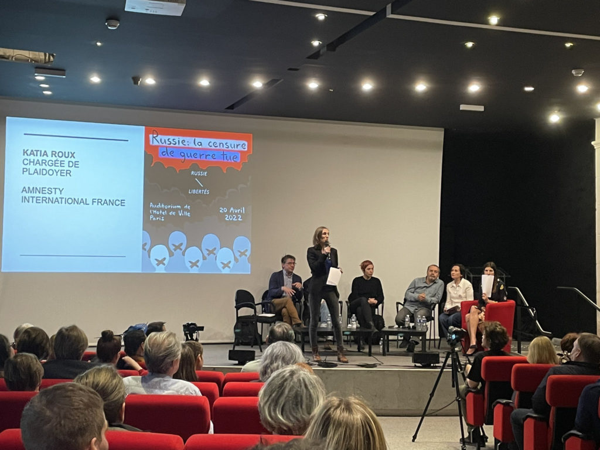
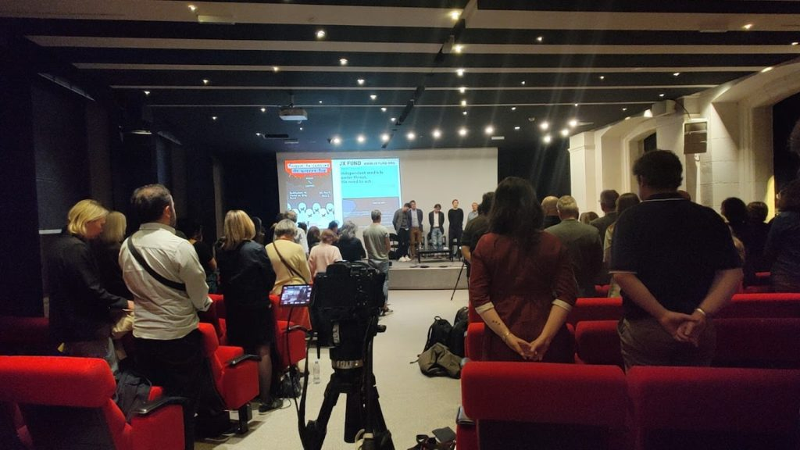

**Le replay de la conférence est disponible >> [ici sur YouTube](https://www.youtube.com/watch?v=n8vdjzXsPJ0) <<**

De janvier à mars 2022, la Fédération de Russie a débloqué plus de 17 millards de roubles (près de 200 millions d’euros) pour la presse et la propagande du régime – un investissement impressionnant et clairement lié à la guerre en Ukraine.  La guerre informationnelle menée par Vladimir Poutine pour soutenir son invasion de l’Ukraine était le thème de la conférence organisée ce mercredi 20 avril 2022 par l’association Russie-Libertés à l’Hôtel de Ville de Paris, intitulée **« Russie : la censure de guerre tue »** . De 18h30 à 21h, quatre invités journalistes et défenseurs des droits humains en Russie ont pris la parole sur ce sujet. La conférence était organisée en partenariat avec Reporters Sans Frontières. Plus de 230 personnes ont participé à la conférence.

Le mot d’ouverture a été prononcé par **M. Arnaud Ngatcha, adjoint à la maire de Paris en charge de l’Europe, des relations internationales et de la francophonie** . Il a rappelé l’existence d’une réelle dissidence en Russie aujourd’hui :

« Il y a aujourd’hui des voix, en Russie et ailleurs, qui se battent contre le régime de Poutine et dénoncent la guerre en Ukraine. Il est important de leur donner la parole. »

**Katia Roux, chargée de plaidoyer pour Amnesty International France** , a ensuite rappelé combien la censure et le contrôle des médias servaient d’arme dans cette guerre :

« Il s’agit d’une guerre de terrain doubléе d’une guerre de l’information, des images, des mots »

**Olga Prokopieva, porte-parole de Russie-Libertés** , a rappelé le soutien de Russie-Libertés et de tous les invités au peuple ukrainien face à la guerre criminelle menée par Vladimir Poutine en Ukraine. Elle a ensuite animé la discussion avec les invités.

**Viktor Chenderovitch, écrivain et présentateur satirique russe, créateur de la célèbre émission télévisée Koukly (équivalent russe des Guignols de l’info, interdit par Poutine)** , a évoqué les menaces et le chantage dont il avait été la cible ces derniers temps. Il a également avancé que la guerre en Ukraine avait été rendue possible notamment par le contrôle de l’information par le Kremlin, initiée depuis l’arrivée de Vladimir Poutine au pouvoir :

« Cette horrible guerre aujourd’hui n’aurait pas pu avoir lieu ainsi sans 20 ans de censure et propagande. Toutes les dictatures commencent par le contrôle de l’information et la limitation de la liberté d’expression. »

Un extrait sous-titré des Koukly (année 2000), mettant en scène de manière burlesque Vladimir Poutine en dirigeant d’une ville de la Renaissance où les citoyens perdent la vue, a été présentée au public. L’extrait témoignait de la relative liberté de la presse durant les années 90 et début des années 2000, par comparaison avec le durcissement qui n’a cessé de s’accentuer depuis l’arrivée de Poutine au pouvoir.

**Denis Kataev, journaliste à la chaîne de télévision russe indépendante « Dojd » (TV Rain), suspendue depuis le 3 mars 2022** , a insisté sur la formation d’une presse russe d’émigration, qui devra continuer, selon lui, à travailler depuis l’étranger pour combattre la propagande officielle.

« Pour moi il était aussi impossible de vivre dans le pays agresseur qui a commencé cette guerre »

**Ksenia Bolchakova, journaliste et réalisatrice franco-russe, qui a couvert ces dernières années l’annexion de la Crimée, la guerre dans le Donbass** , a elle aussi raconté les intimidations dont elle avait été victime lors de la réalisation de son reportage « Wagner, l’armée des ombres de Poutine ». Elle a ensuite rappelé combien l’exercice de la profession de correspondant de presse en Russie avait été rendu difficile depuis les élections législatives falsifiées de 2011 et le mouvement de contestation qui a suivi.

Elle a également commenté un extrait sous-titré de journal télévisé du Kremlin (Vesti) qui niait le bombardement de la maternité de Marioupol par l’armée russe, en analysant les techniques de propagande informationnelle qui y étaient à l’œuvre :

« Pendant cette guerre en Ukraine, on voit la création d’une énorme confusion avec plusieurs versions à la télévision du Kremlin, pour qu’on ne sache plus ce qui est vrai et ce qui faux. C’est une technique de manipulation des esprits »

**Daniil Beilinson, co-fondateur de l’organisation de défense des droits humains en Russie OVD-Info** , inscrite au registre des agents de l’étranger depuis septembre 2021, a rappelé le nombre d’arrestations arbitraires (supérieur à 15000) qui avaient eu lieu depuis le début de la guerre. Il a ensuite commenté la loi sur la « discréditation de l’armée » :

« La loi sur la “discréditation de l'armée” laisse les autorités libres de décider de ce qui constitue une telle “discréditation”. Elle permet ainsi une application arbitraire par la police. »

La discussion s’est terminée par une discussion relative à l’avenir de la presse libre en Russie. Certains, comme Viktor Chenderovitch, sont assez pessimistes, et comptent plus sur un écroulement du régime que sur une réforme. D’autres, comme Denis Kataev, sont optimistes, et soulignent l’importance des médias d’information modernes permettant de combattre la propagande télévisuelle.

__En clôture de la conférence, une minute de silence a eu lieu en mémoire des victimes de la guerre en Ukraine.__

