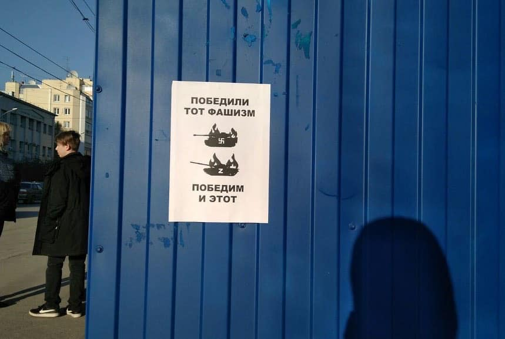
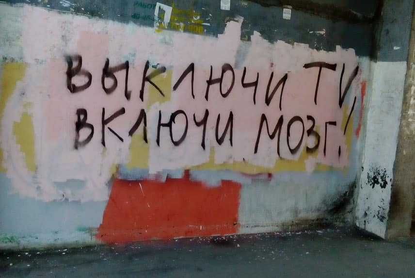
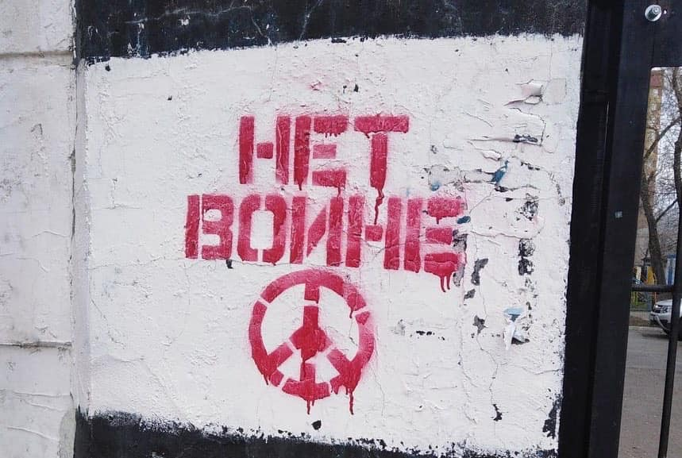

Depuis le 24 février, des membres de la société civile russe se mobilisent contre la guerre en Ukraine par tous moyens :

 des manifestations qui ont déjà conduit à plus de 16000 arrestations en Russie

 des concerts, dans plusieurs pays, contre la guerre et pour aider les réfugiés ukrainiens

 des actions de rues solitaires,

 des affiches collées sur les murs ou des graffitis avec des messages anti-guerre,

 des actes de sabotage des voies ferrées ou sabotages dans les bureaux de conscription ou les blindés.

Ces actes sont souvent des initiatives individuelles, mais aussi parfois coordonnées par les mouvements [Feminist Anti-War Movement](https://www.facebook.com/feministantiwarresistance?__cft__[0]=AZU9svSuHs4sw9HrlqCKu-9Mik7KFtK6Td4B8yhL7jOqgOtD7rihh7gyCeLbzIzUHMhwVt_cbkQKxjXrV_BpV7ujqG4YrCtgyyPXHpcp02gMRoa8w1QKGbN0MxCdDhAl6rSOZ2U0HHToHmkoROcCppzx&__tn__=-]K-R) ou [Движение Весна / Vesna Movement](https://www.facebook.com/vesna.democrat?__cft__[0]=AZU9svSuHs4sw9HrlqCKu-9Mik7KFtK6Td4B8yhL7jOqgOtD7rihh7gyCeLbzIzUHMhwVt_cbkQKxjXrV_BpV7ujqG4YrCtgyyPXHpcp02gMRoa8w1QKGbN0MxCdDhAl6rSOZ2U0HHToHmkoROcCppzx&__tn__=-]K-R) dont les deux principaux coordinateurs sont arrêtés et risquent d’être emprisonnés.

Le 9 mai, cette journée de commémoration des victimes de la Seconde Guerre Mondiale, des Russes ont également manifesté leur désapprobation de la guerre en Ukraine en brandissant des pancartes avec des messages comme « Ils se sont battus pour la Paix. Vous avez choisi la guerre. »

125 personnes ont été arrêtées en ce jour du 9 mai selon [ОВД-Инфо](https://www.facebook.com/ovdinfo/?__cft__[0]=AZU9svSuHs4sw9HrlqCKu-9Mik7KFtK6Td4B8yhL7jOqgOtD7rihh7gyCeLbzIzUHMhwVt_cbkQKxjXrV_BpV7ujqG4YrCtgyyPXHpcp02gMRoa8w1QKGbN0MxCdDhAl6rSOZ2U0HHToHmkoROcCppzx&__tn__=kK-R) . Des fouilles ont lieu tous les jours chez des représentants de la société civile russe, ainsi qu’au domicile de leurs parents. Des arrestations préventives ou encore des arrestations grâce aux caméras de reconnaissance faciale sont courantes.

Nous appelons fermement à l'arrêt immédiat des poursuites contre toutes les personnes qui s’opposent à la guerre en Ukraine. [#нетвойнесукраиной](https://www.facebook.com/hashtag/%D0%BD%D0%B5%D1%82%D0%B2%D0%BE%D0%B8%CC%86%D0%BD%D0%B5%D1%81%D1%83%D0%BA%D1%80%D0%B0%D0%B8%D0%BD%D0%BE%D0%B8%CC%86?__eep__=6&__cft__[0]=AZU9svSuHs4sw9HrlqCKu-9Mik7KFtK6Td4B8yhL7jOqgOtD7rihh7gyCeLbzIzUHMhwVt_cbkQKxjXrV_BpV7ujqG4YrCtgyyPXHpcp02gMRoa8w1QKGbN0MxCdDhAl6rSOZ2U0HHToHmkoROcCppzx&__tn__=*NK-R) [#nonalaguerreenukraine](https://www.facebook.com/hashtag/nonalaguerreenukraine?__eep__=6&__cft__[0]=AZU9svSuHs4sw9HrlqCKu-9Mik7KFtK6Td4B8yhL7jOqgOtD7rihh7gyCeLbzIzUHMhwVt_cbkQKxjXrV_BpV7ujqG4YrCtgyyPXHpcp02gMRoa8w1QKGbN0MxCdDhAl6rSOZ2U0HHToHmkoROcCppzx&__tn__=*NK-R)

