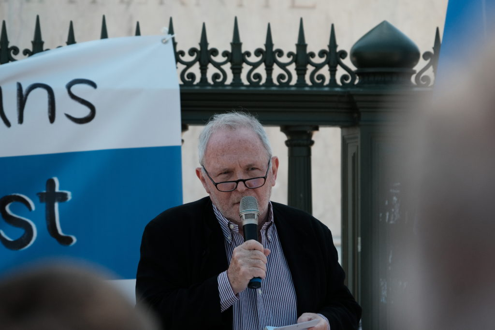
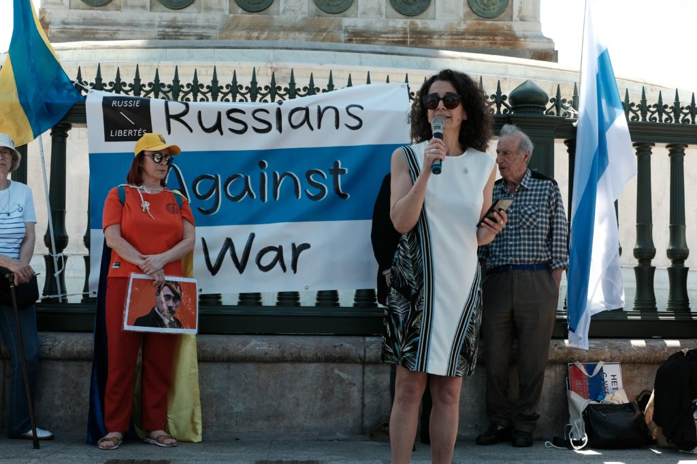
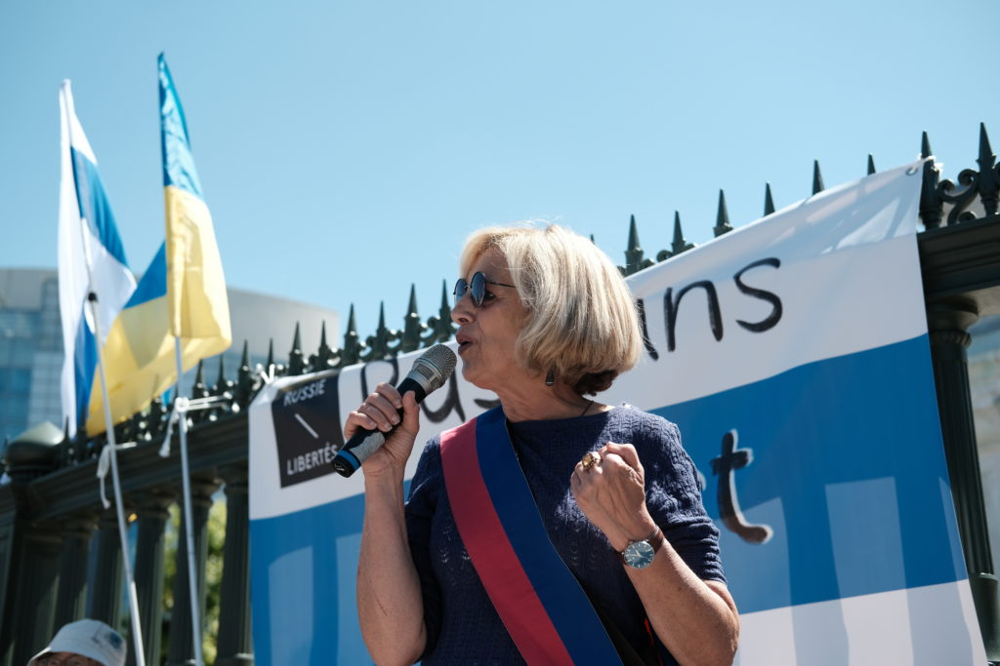
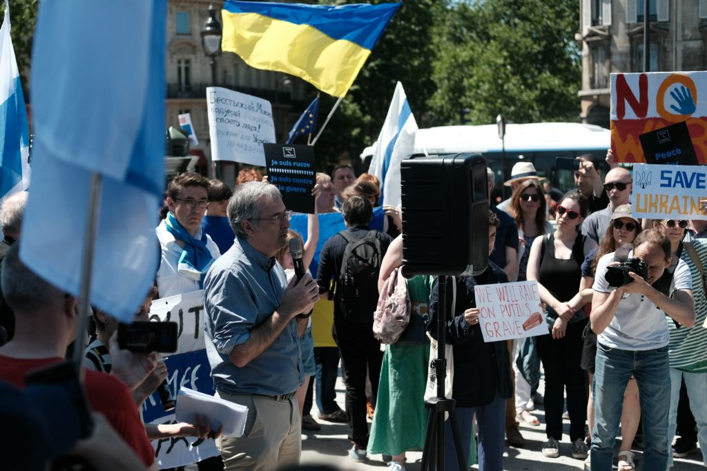
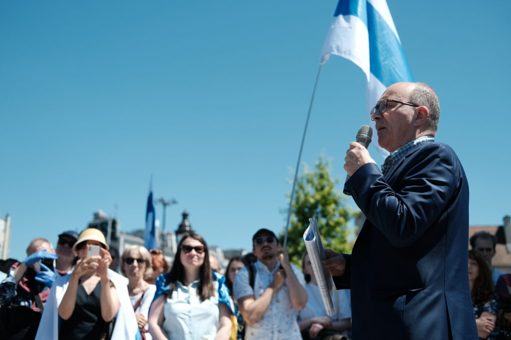
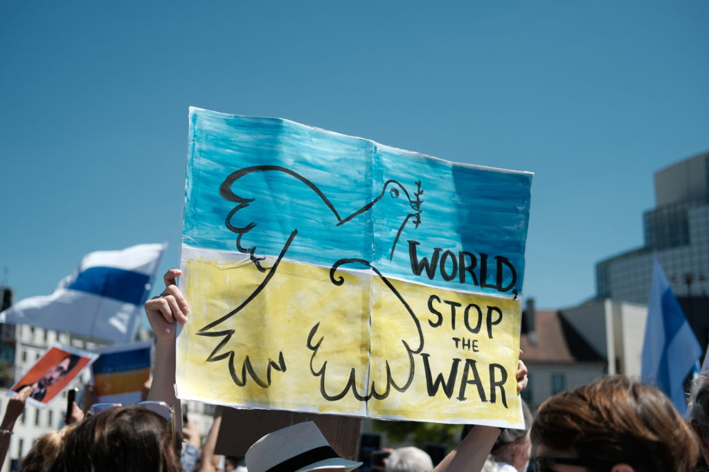
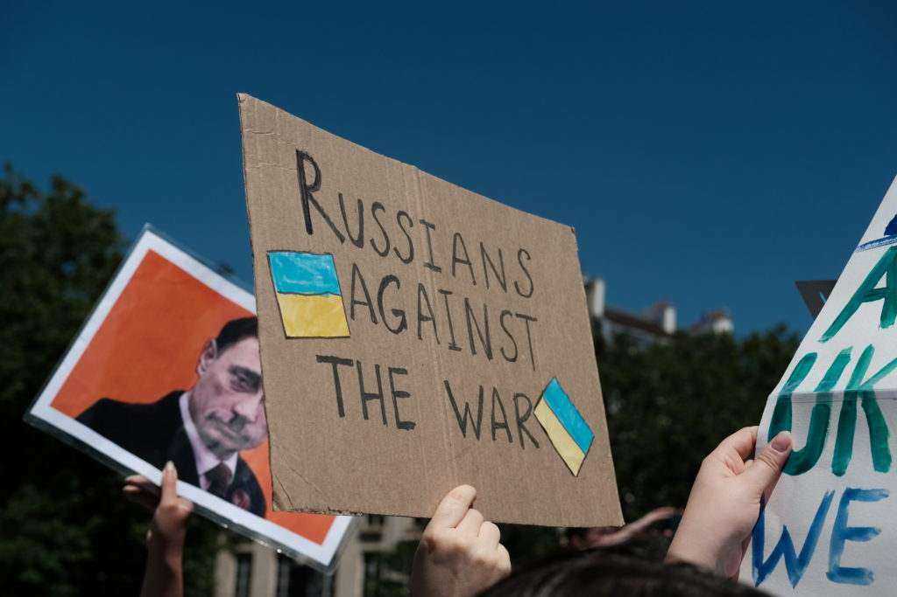
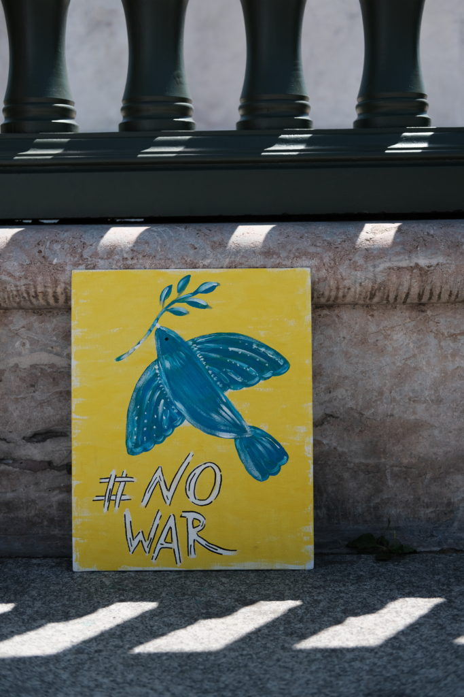
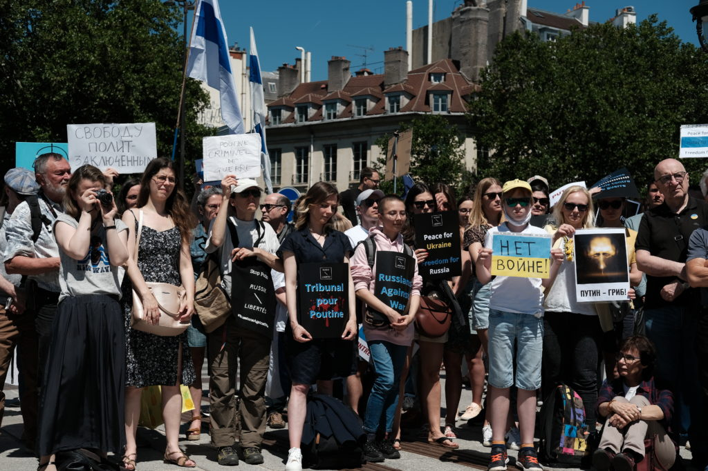

**Bernard Guetta** à la manifestation place de la Bastille le 12/06/2022, organisée par Russie-Libertés

Plus de 400 personnes étaient présentes le dimanche 12 juin 2022, place de la Bastille à Paris, au rassemblement organisé par Russie-Libertés dans le cadre de l’action internationale Russians Against War. Dans plus de 30 pays et 75 villes à travers le monde, des manifestations contre la guerre en Ukraine ont été menées par les Russes résidents à l’étranger et les activistes pour les droits humains. En Russie des actions ont eu lieu en ligne avec la possibilité d’envoyer un courrier à la Douma pour demander l’arrêt de la guerre et la destitution de Poutine, mais aussi sur le terrain grâce à des groupes comme la Feminist Anti-War Resistance, 47 personnes ont été arrêtées ( [https://ovd.news/)](https://ovd.news/) .

Parmi les actions en Russie, un drapeau russe portant le slogan « __Aujourd’hui n’est pas mon jour__ » a été déployé devant le Ministère de la Défense à Moscou. L'artiste militant à l'origine de cette action, Denis Moustafine, a été arrêté. À Saint-Pétersbourg a eu lieu l'action  « __Ciel paisible__ » invitant les citoyens de tout le pays à lancer des avions en papier portant l’inscription « __Non à la guerre__ » a été honorée par de nombreuses participations.

A Paris, de nombreuses personnalités russes comme **Lev Ponomarev** (militant pour les droits humains et co-fondateur de l’ONG Mémorial) et **Sergueï Guriev** (professeur d’économie à Sciences Po) mais aussi françaises telles que **Marie Mendras** (politologue du CERI de Sciences Po), **André Gattolin** (sénateur) et **Bernard Guetta** (eurodéputé et journaliste) se sont exprimées contre la guerre de Poutine en Ukraine, en solidarité avec le combat du peuple ukrainien contre l’agresseur, et avec les Russes qui s’opposent à cette guerre.

**Guriev** a affirmé que __« la guerre se déroule sur plusieurs fronts »__ : en Ukraine où se bat vaillamment le peuple ukrainien, en Russie où les Russes s’opposent à cette guerre illégale menée injustement en leur nom et partout dans le monde, où se déroule un combat médiatisé pour la démocratie et la liberté, car comme l’a dit **Bernard Guetta** __« les peuples se révoltent quand l’espoir se montre »__ .

Après 109 jours de guerre atroce, les mobilisations continuent pour une Ukraine en paix, souveraine et indépendante, et pour que la Russie devienne un pays libre et démocratique.

Retrouvez le déroulé de l'évènement sur Twitter :

[Preview: https://twitter.com/Rus_Lib/status/1535960217602740224?s=20&t=jArsE6x_jit1or61634P8g](https://twitter.com/Rus_Lib/status/1535960217602740224?s=20&t=jArsE6x_jit1or61634P8g)

<video playsinline muted loop controls src="images/2022_06_slava_ukraine.mp4"></video>

<video playsinline muted loop controls src="images/2022_06_StopPutin.mp4"></video>

