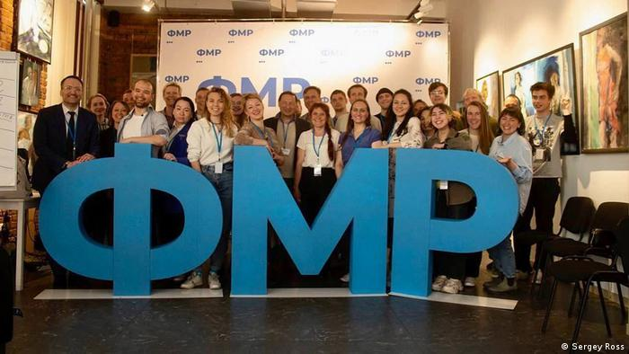

Dans un contexte de guerre de la Russie contre l'Ukraine et dans un climat de répressions et de propagande, la première édition du **Forum d'opposition pour une Russie en Paix** s'est tenu à Saint-Pétersbourg du 16 au 18 juin 2022.

Cet **espace de réflexion alternatif** a eu lieu **sans être perturbé** par les forces de l'ordre grâce à une organisation sans précédent passant par une communication prudente et discrète, des lieux de réunions tenus secrets et des issues de secours pour les intervenants.

Le forum a réuni **25 orateurs et 50 participants** venantde Russie et d'ailleurs venant du monde de la recherche en sciences sociales, de l'activisme pour les droits humains, du monde du journalisme et de la politique.

Parmi eux : **Sergueï Guriev** (économiste à Sciences Po), **Abbas Gallyamov** (analyste politique et ancienne plume de Poutine), **Maksim Reznik** (député d'opposition de St Pétersbourg), **Ioulia Galiamina** (universitaire et opposante politique) ou encore **Elena Panfilova** (activiste anti-corruption et directrice de Transparency International Russie).

Le Forum pour une Russie en Paix a offert un **espace alternatif** pour discuter de la politique russe et du **futur de la Russie** entre opposants au régime de Poutine et militants **pour une Russie démocratique** .

En se déroulant à Saint-Pétersbourg, le Forum pour une Russie en Paix s'est placé en **opposition directe** au Forum économique international de Saint-Pétersbourg pro-poutine se déroulant du 15 au 18 juin.

Le Forum pour une Russie en Paix aspire à proposer un **modèle différent** de celui imposé par Poutine en incarnant une **opposition active** sur le sol russe et en s'emparant des questions de la **Russie de demain** pour montrer aux Russes que :

" __En dépit de toutes les formes de répression, la société civile est toujours plus grande qu'un appareil d'État__ "

- **Sergueï Ross** (homme politique et avocat, organisateur du Forum)

