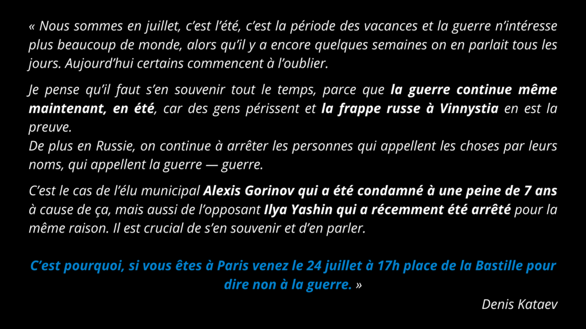

[YouTube: https://youtu.be/sDlR2U_9IOk](https://img.youtube.com/vi/sDlR2U_9IOk/0.jpg)

Le 24 juillet 2022, nous, citoyens russes en France et en Europe, et activistes engagés du monde entier, appelons à une journée de mobilisation internationale. 

 Ce dimanche 24 juillet 2022, au 5ème mois de la guerre en Ukraine, il est important de continuer la mobilisation ! 

 Et à nouveau, le rassemblement Russians Against War fait partie d’une action internationale dans plus de 30 pays et 60 villes.Nous, l'association Russie-Libertés, appelons à manifester à Paris contre cette guerre atroce menée par le régime de Vladimir Poutine, en solidarité avec les ukrainiens et avec tous ceux qui se battent en ce moment contre cette agression. 

 Nous appelons à manifester pour que l’agression russe soit stoppée, pour que la souveraineté du territoire ukrainien soit respectée, pour que la lumière soit faite sur l’ensemble des crimes de guerre commis par l’armée russe et que les responsables de ces crimes soient jugés. 

 Nous appelons aussi à manifester pour que la Russie devienne démocratique et soit libérée du régime de Poutine. 

 Plus de 100 personnes sont poursuivies aujourd’hui en Russie parce qu’elles osent s’opposer à la guerre et des opposants, tels qu’Alexei Gorinov ou Ilya Yashin sont déjà emprisonnés et risquent de rester des années derrière les barreaux juste pour avoir dit la vérité sur la guerre.A toutes celles et ceux qui souhaitent exprimer leur opposition à l'invasion de l’Ukraine, affirmer leur solidarité et leur soutien au peuple ukrainien, dénoncer les atrocités de l’armée russe contre les civils ukrainiens, ainsi qu’appuyer la société civile russe en lutte contre la dictature poutinienne, rejoignons-nous : 

 👉 Ce dimanche, 24 juillet à 17h, place de la Bastille, Paris 

 👉 Manifestation organisée par l'association Russie-Libertés en coordination avec le mouvement international Russians Against War.

Russians Against war - день международной акции 24ого июля 

 24ого июля мы, граждане России во Франции и в Европе и активисты во всем мире призываем на день международной мобилизации. 

 В воскресенье 24ого июля 2022 года, 5 месяцев с начала полномасштабной войны России против Украины, важно продолжать сопротивление! 

 Вновь в международной акции участвуют более чем 30 стран и 60 городов.Мы, ассоциация Russie-Libertés призываем выходить на митинг в Париже против чудовищной войны начатой режимом Владимира Путина, в знак солидарности с украинцами и со всеми, кто сопротивляется против этой агрессии. 

 Мы призываем манифестовать за прекращение войны, за уважение суверенности Украины и что-бы все военные преступления совершенные русской армией были выявлены и их виновники были привлекли к ответственности.Мы так-же призываем манифестовать за то, что-бы Россия стала демократичной и свободной от путинского режима страной. 

 С 24ого февраля более 16 тысяч человек было задержано в России за антивоенные высказывания. Оппозиционеры Алексей Горинов и Илья Яшин уже в заключении и рискуют остаться на много лет за решеткой, только из-за того, что они сказали правду про войну.Все, кто хочет выразить противостояние нападению на Украину, оказать солидарность и поддержку украинскому народу, осудить преступления российской армии против мирного народа Украины и поддержать русское сопративление против путинской диктатуры, присоединяйтесь к нам:

👉 В это воскресение 24ого июля на площаде Бастилии, в Париже.

👉 Митинг организован ассоциацией Russie-Libertés, в координации с движением Russians Against War

<video playsinline muted loop controls src="images/2022_07_Kataev-24072022.mp4">Appel de Denis Kataev, journaliste de la TV Dojd à manifester contre la guerre place de la Bastille, le 24 juillet 2022.</video>

