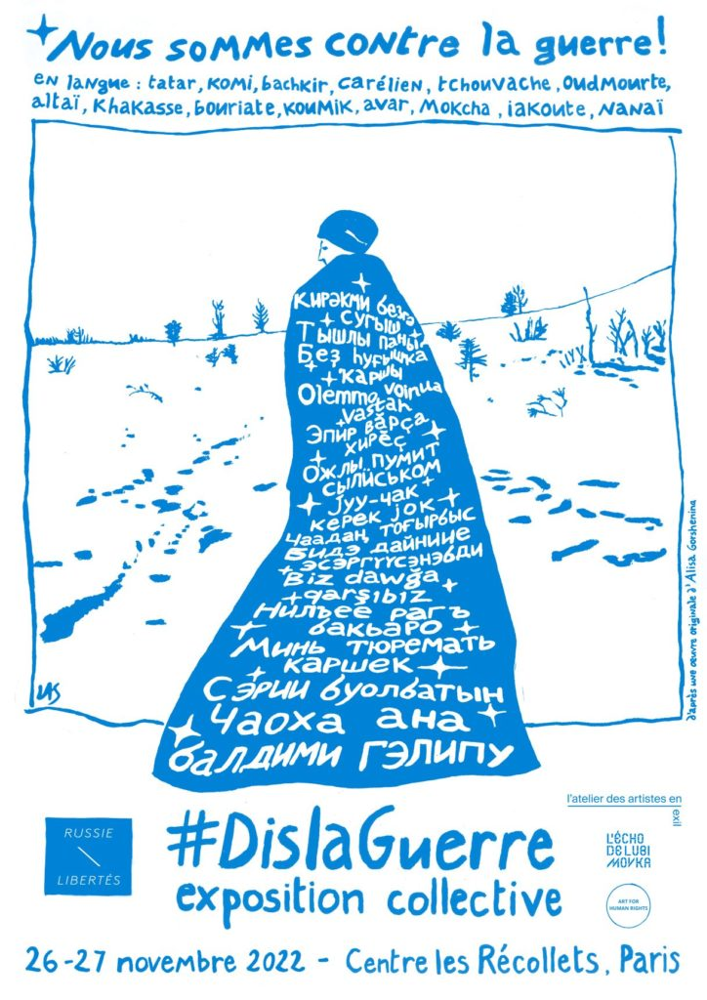
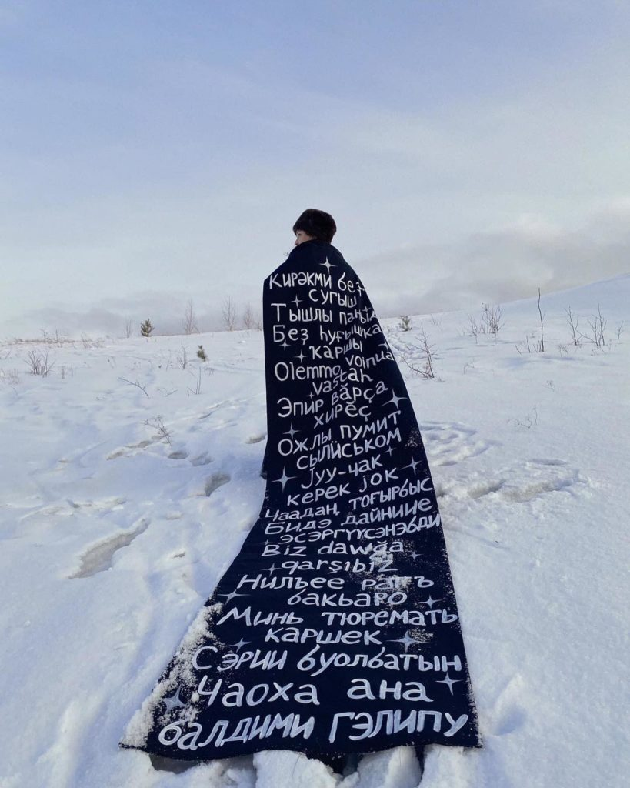
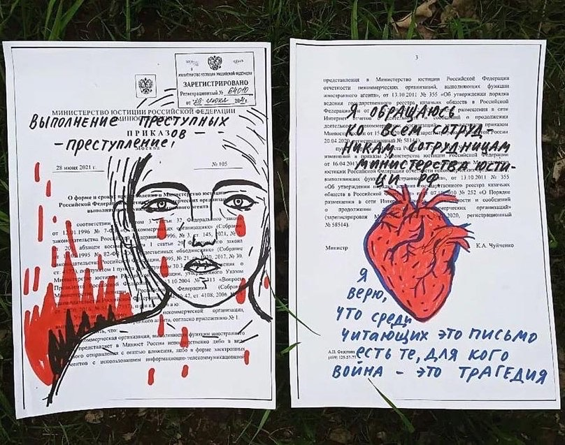
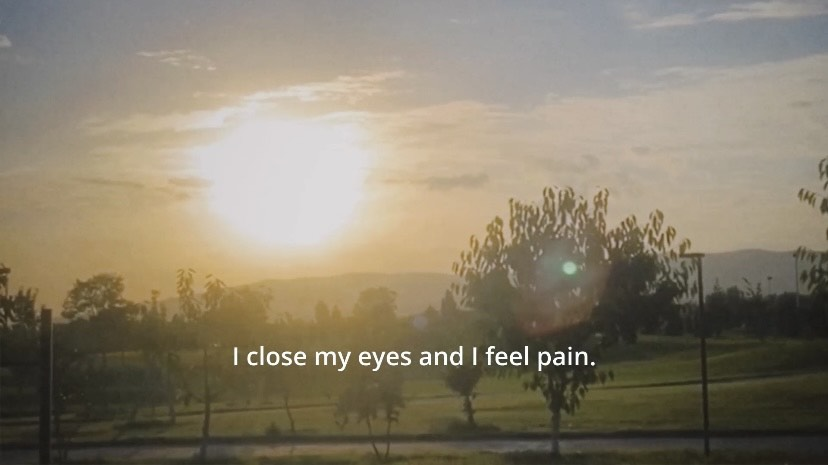
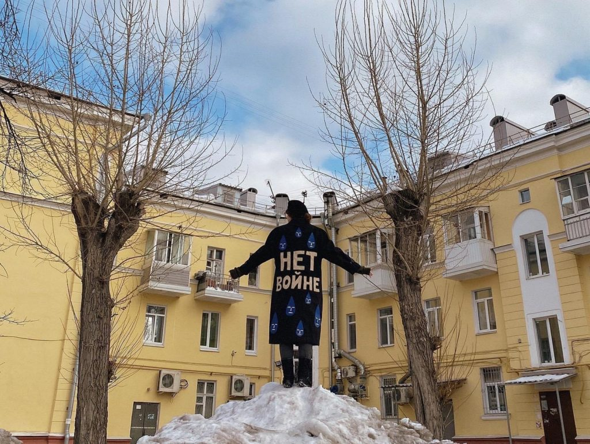
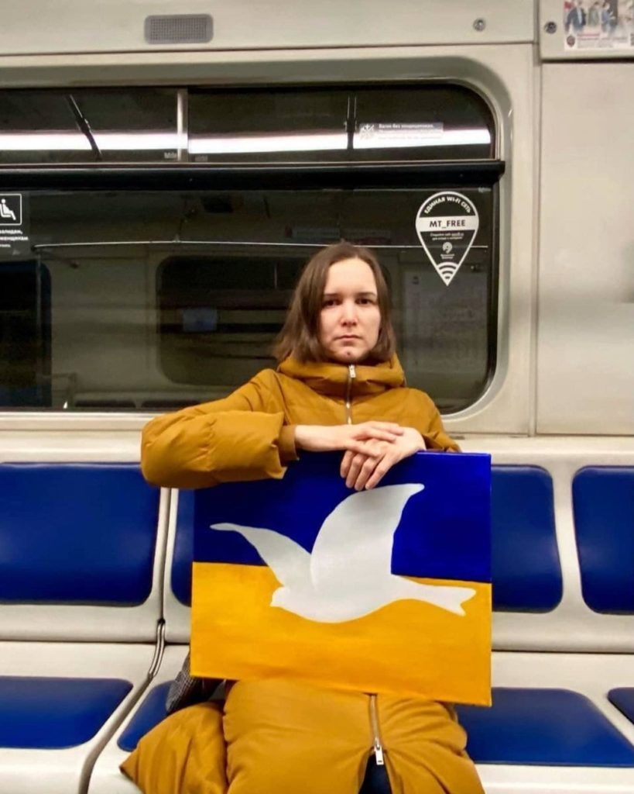
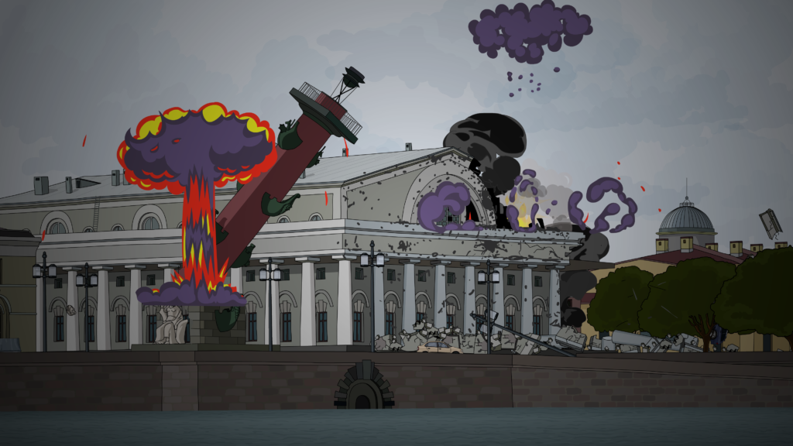

**Russie-Libertés** , en partenariat avec l' **[Atelier des Artistes en Exil](https://aa-e.org/fr/)** et **Art for Human Rights** , présente à travers le prisme des productions artistiques militantes, un autre visage de la Russie : celui d’une Russie Libre.

**Une Russie contre la guerre en Ukraine.**

La **résistance artistique** a commencé en Russie dès le début de la guerre. Depuis Moscou, l’Oural et la Sibérie, les artistes affirment leur opposition à la guerre en Ukraine. Pour faire entendre leur voix, ils revendiquent la pluralité ethnique de la Russie et emploient différentes stratégies pour diffuser leurs messages. Ils passent par la fabrication de costumes, le détournement de documents officiels, les piquets silencieux (manifestation à une personne).

Certains des artistes présentés ont pu émigrer, d’autres se trouvent actuellement en proie à la censure et en danger. Il s’agit de montrer par cette exposition notre soutien aux voix dissidentes des artistes qui se sont élevées dans toute la Russie ces derniers mois pour dénoncer la guerre.

Il s’agit d’une rare initiative pour présenter la résistance de ces artistes opposants et de faire entendre leur voix au public en France. Nous souhaitons également les soutenir en donnant des informations sur leur situation et le contexte extrêmement répressif de création en Russie.

L'exposition a lieu dans le cadre du Festival de la dramaturgie russophone [Lubimovka](https://fb.me/e/2Y4BdD15O) .

**Curatrice de l’exposition : Louise Morin** (Atelier des Artistes en Exil)

**LES ARTISTES**

 **Daria Apakhonchich 

 Marina Antonova 

 Alexandra Dashevskaya 

 Ekaterina Demina 

 Oleg Kuvaev 

 Alisa Gorshenina 

 Vika Privalova** 

 Collectif **Feminist Anti-war Resistance** 

 et d'autres

**DATES** : 26 et 27 novembre 2022

**HORAIRES** : 11h30 - 22h00

**VERNISSAGE** : 26 novembre à 20h30, en présence d'artistes

**ADRESSE** : Centre des Récollets, 150 rue du Faubourg Saint-Martin, Paris 10éme.

---
- [**AIDER LES ARTISTES RUSSES CONTRE LA GUERRE**](https://www.helloasso.com/associations/russie-libertes/collectes/aidez-les-artistes-russes-contre-la-guerre-poursuivis-par-le-regime-poutinien)
---

De nombreux de ces artistes ont dû quitter leur domicile et se retrouvent dans des situations de précarité. Vous pouvez les aider en contribuant via [ce crowdfunding](https://www.helloasso.com/associations/russie-libertes/collectes/aidez-les-artistes-russes-contre-la-guerre-poursuivis-par-le-regime-poutinien) lancé par Russie-Libertés ou alors acheter certaines œuvres lors de l'exposition.

Tous les bénéfices collectés seront reversés aux artistes en besoin.

---
- 

- 

- 

- 

- 

- 

---

**Retrouvez les portraits de ces artistes sur notre page [Facebook](https://fb.me/e/2HC4kxvQc)**
