**L'UKRAINE EST AU BORD D'UNE CATASTROPHE HUMANITAIRE!**

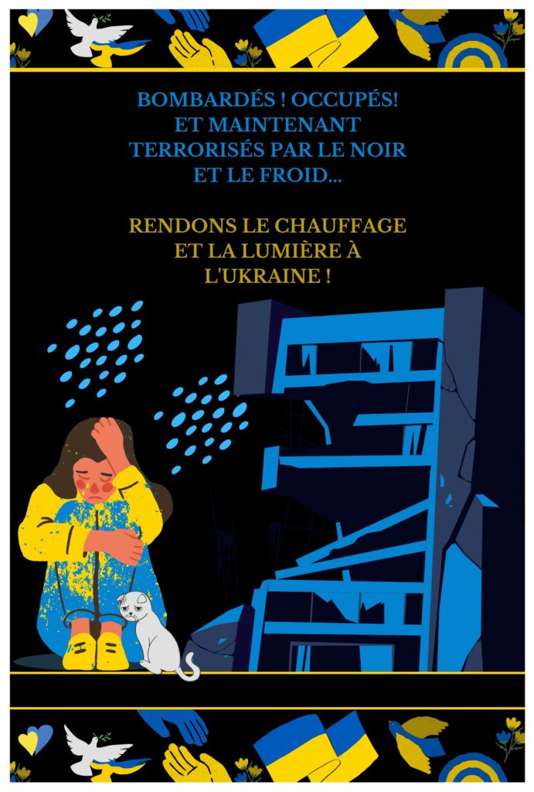

---

Poutine recourt à nouveau au chantage, détruit les infrastructures énergétiques civiles de l'Ukraine et condamne les gens à mourir de froid. Depuis plusieurs mois, son armée essaye de complètement détruire tout l’équipement vital et laisser les peuples sans l’électricité, l’eau et le chauffage.

---

---

**RESULTATS DE VOTRE PARTICIPATION À NOTRE CAMPAGNE POUR FOURNIR AUX CITOYENS D'UKRAINE DES GROUPES ÉLECTROGÈNES** !

---

---

**Nous avons une excellente nouvelle à vous partager !**
 
Grâce à vos contributions généreuses, nous avons pu collecter **8039.28 €** pour notre projet humanitaire "Rendons le chauffage et la lumière à l'Ukraine!". Nous avons utilisé cette somme pour acheter **23 groupes électrogènes** de 5,2 kW de la marque KOWAL. Nous sommes fiers de vous annoncer que ces groupes électrogènes sont déjà arrivés en Ukraine, à Kiev ainsi qu'à la région de Kharkiv. Nos partenaires ukrainiens ont commencé à les distribuer, permettant ainsi d'apporter de l'aide concrète aux populations locales qui en ont grandement besoin.
 
Nous souhaitons remercier tous les gens, les bénévoles, les donateurs, nos partenaires qui ont participé à ce projet. Grâce à leur soutien indéfectible, nous avons pu contribuer à la survie des Ukrainiens qui font face à une situation extrêmement difficile en raison de la guerre menée par Poutine et de la catastrophe humanitaire qui en résulte. Sans vous, rien de tout cela n'aurait été possible. Nous tenons à souligner l'importance de votre soutien qui reste primordial pour les projets en cours et à venir. Nous espérons que vous continuerez à nous soutenir dans nos actions humanitaires.

---

---

**Encore une fois, un grand merci à tous pour votre aide et votre solidarité** !

---

---
- 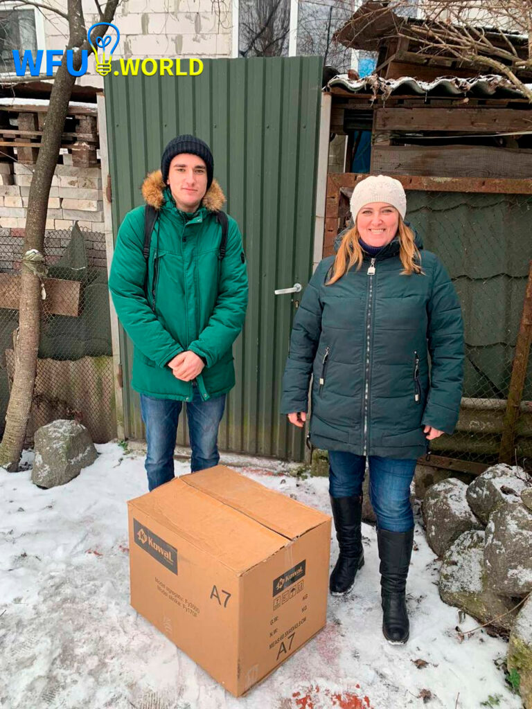

- 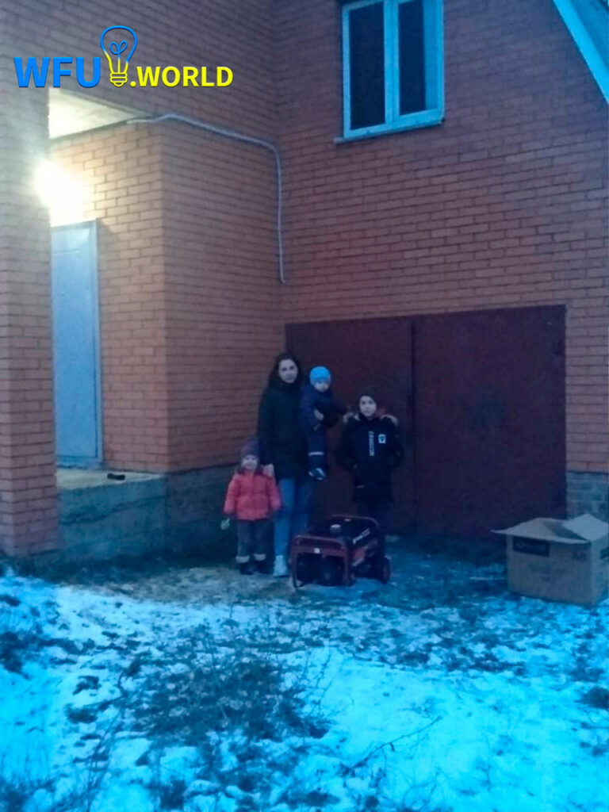

- 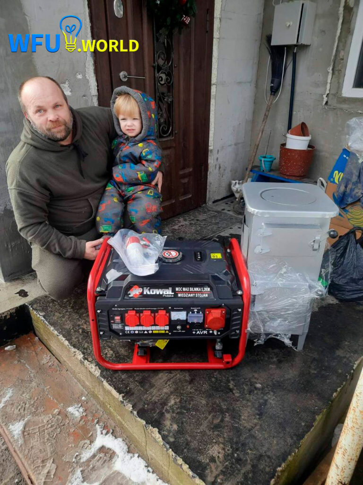

---

---

---

**COMMENT LE PROJET A COMMENCÉ** :

---

---

Nous, Russie-Libertés, appelons à une aide financière à tous ceux qui se caractérisent par l'humanité et l’empathie pour les autres. 

 La campagne “Rendons le chauffage et la lumière à l'Ukraine !" est une action conjointe d'associations de russes et d’ukrainiens opposés à la guerre en Ukraine, de pays du monde entier. Les fonds collectés pour l'initiative "WARM FOR UKRAINE" permettent l'achat de groupes électrogènes et de poêles à bois. Ces équipements sont ensuite stockés et contrôlés par les initiateurs du projet en Pologne avant d'être transportés en Ukraine. L'association ukrainienne "ASSISTANCE TO CHILDREN OF WAR 2022", ainsi que d'autres partenaires ukrainiens, sont chargés de la distribution et de l'installation du matériel reçu dans les zones qui en ont le plus besoin.
 

---

---

**TOUTES CES AIDES SONT DESTINÉES AUX FAMILLES À FAIBLE REVENU, AUX RETRAITÉS, AUX FAMILLES NOMBREUSES ET AUX AUTRES CITOYENS QUI ONT UN BESOIN VITAL DE VOTRE SOUTIEN!**
 

 **TOUT MONTANT DONNÉ EST UNE CONTRIBUTION POUR SAUVER DES VIES!** 

 **VOUS AIDEZ  À SAUVER LES GENS DU FROID !**
 

 **VOUS AIDEZ À RÉSISTER AU RÉGIME INHUMAIN DE POUTINE !** 

 **MERCI INFINIMENT!**
 

---

---
- [**JE FAIS UN DON**](https://www.helloasso.com/associations/russie-libertes/collectes/rendons-le-chauffage-et-la-lumiere-a-l-ukraine)
---

---

**DES GENS COMME EUX ONT BESOIN DE VOTRE AIDE** !
 
__Madame M. Ludmila, née en 1944. 

 Monsieur M. Nikolay, né en 1941. 

 Ukraine, l'oblast d'Odessa. 

 Pas d'électricité dans tout le village ! 

 Nikolay, 81 ans et Ludmila 78 ans, mariés déjà depuis 57 ans. Ils habitent dans la région d’Odessa, là où il n’y a pas d’abris de bombardement. Nikolay est né en mai 1941, juste avant la guerre. Son enfance est passée dans les abris souterrains, les catacombes d’Odessa, où sa mère était une aide-soignante chez les partisans. Ludmila est née en 1944 dans une grande famille des paysans. Son frère aîné, un pilote d’avion, vient de revenir après une blessure de guerre. Il était très étonné par la naissance de sa sœur. Les vrais “enfants de la guerre”. Ils ont vécu une vie heureuse en Ukraine, construit une maison, élevé leurs enfants, petits-enfants et arrières petits-enfants. Et aujourd’hui Poutine les prive du chauffage et de la lumière.__

---

**NOS PARTENAIRES**

---

---

---
- 

- 

- 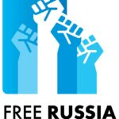

- 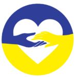

- 

- 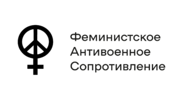

- 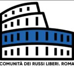

- 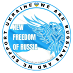

- 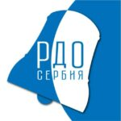

- 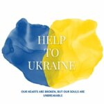

- 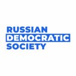

- 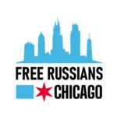

- 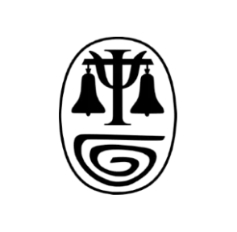

- 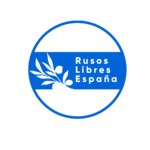

- 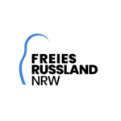

- 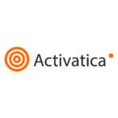

- 

- 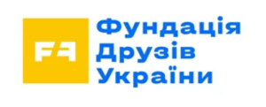

- 

- 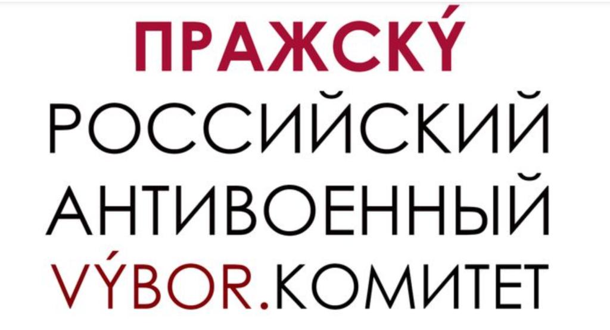

---

**FAITES UN DON ET PARLEZ-EN À VOS AMIS** .

Diffusez le lien sur  les réseaux sociaux. Vos actions peuvent sauver des vies !

* [Facebook](https://facebook.com)
* [Twitter](https://twitter.com)
* [Instagram](https://instagram.com)
