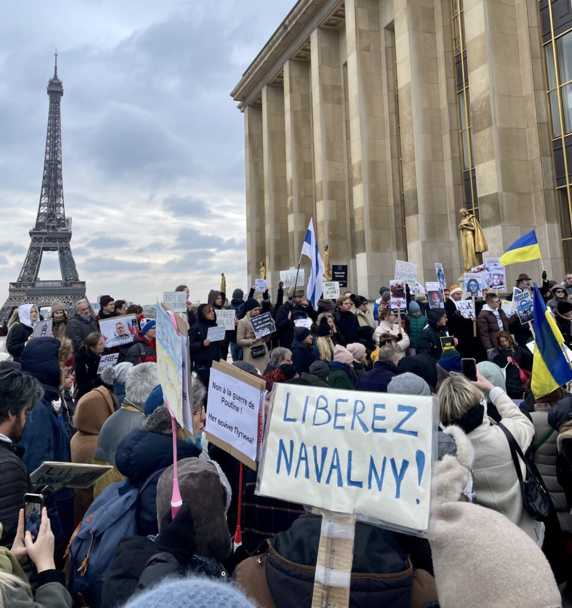
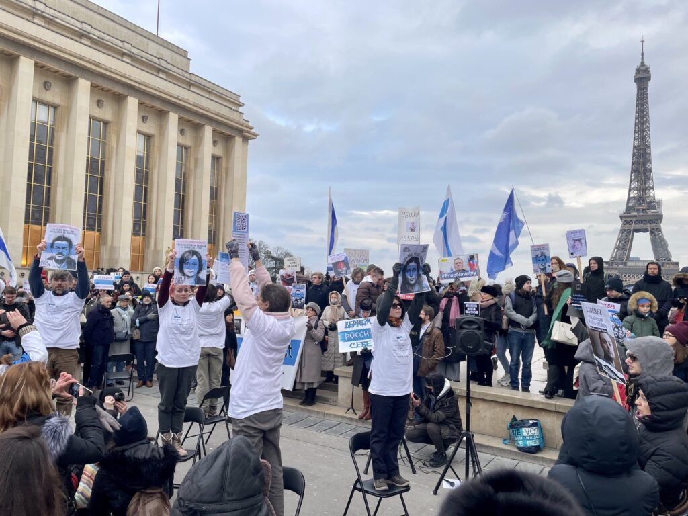
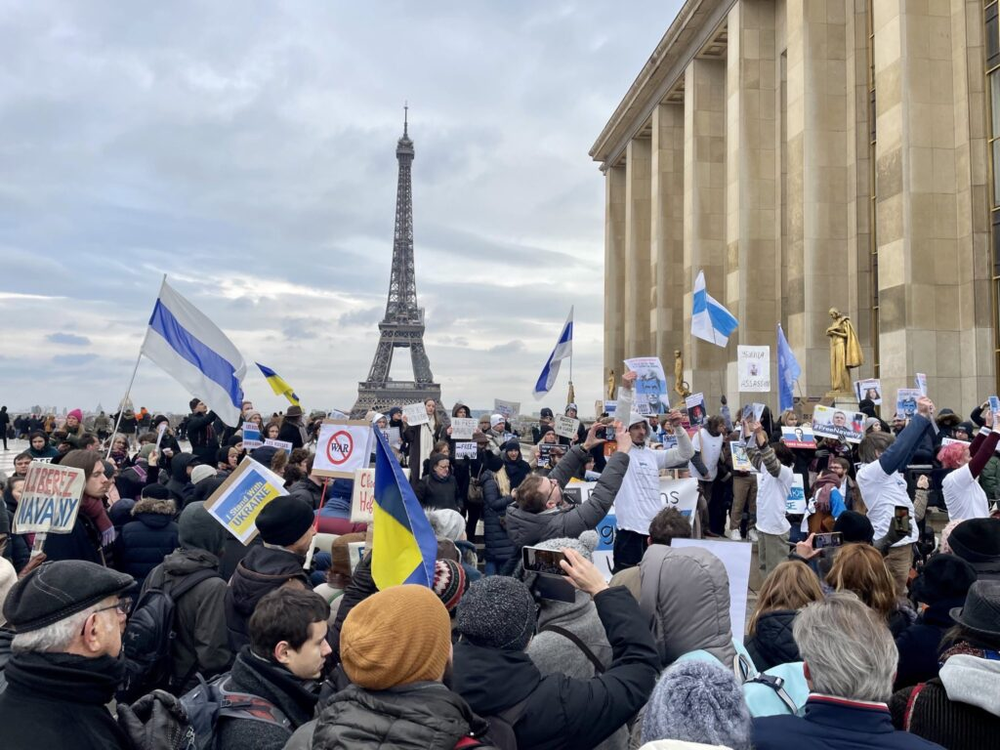
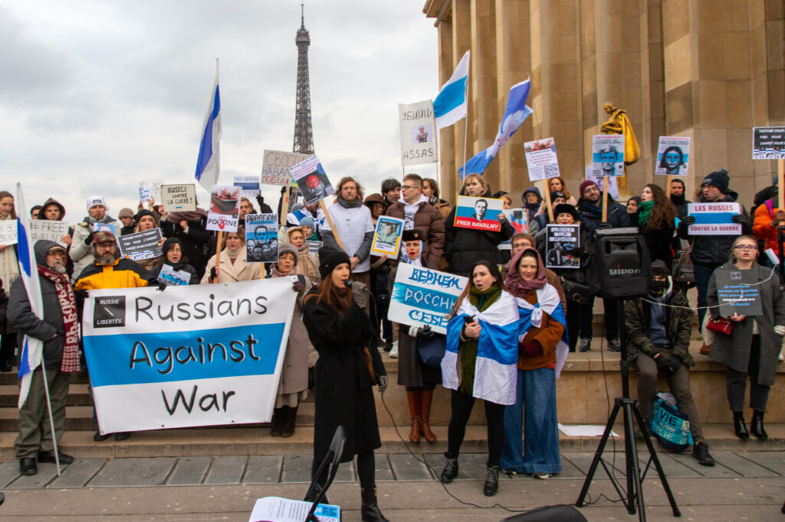

Le 22 janvier, nous nous réunissons, à Paris et dans de nombreuses villes du monde, pour crier notre colère et notre indignation face à la répression en Russie. Coordonnée avec la communauté des russes contre la guerre ( [www.freerussians.net/events-worldwide](http://www.freerussians.net/events-worldwide?fbclid=IwAR3GcwnbrkRT6yKe5ANYpxMD48OXBbvw5fMzEk9gy3mSAzO-E_oZHTBNqa8) ), cette manifestation marque les 2 ans d’emprisonnement d’Alexei Navalny et notre soutien à son courage ainsi qu’à celui de tous les prisonniers politiques en Russie.

Depuis de nombreuses années, le régime de Poutine s'efforce de réprimer toute forme de contestation et de censurer toute voix dissidente. Les élections sont falsifiées et les partis d'opposition sont interdits. 

 Les journalistes, les opposants politiques et les militants des droits de l'homme sont régulièrement arrêtés, emprisonnés et torturés. 

 Avec la guerre en Ukraine, les arrestations arbitraires, les jugements expéditifs et les violences policières se sont considérablement accrus.

Janvier 2023 marque le deuxième anniversaire de l'emprisonnement de l'opposant politique russe Alexei Navalny. Il y a deux ans exactement, alors que Navalny rentrait d’Allemagne, où il était en convalescence suite à l’empoisonnement par le FSB, il a été arrêté à l’aéroport de Moscou et condamné à 3 ans et 6 mois de prison. Puis, lors d’un procès sans précédent qui s’est tenu directement dans l'enceinte de la colonie pénitentiaire, il a été condamné à 9 ans de détention. Aujourd’hui, plus de 10 affaires pénales pèsent sur lui. Cet acharnement judiciaire, politiquement motivé, est totalement arbitraire et vise à réduire au silence l’opposant à Poutine le plus célèbre. Depuis la prison, il continue à dénoncer les dérives du régime poutinien et la guerre en Ukraine. Ce courage et cette persévérance lui valent d’être régulièrement placé en cellule d’isolement avec des conditions très dures : un accès limité à la lumière, aux activités, aux vêtements chauds, des visites extrêmement rares de sa famille…

**Sa vie est en danger !**

**Les prisonniers politiques en Russie:**

**Alexeï NAVALNY, Ilya YASHIN, Lilia TCHANYSHEVA, Alexei GORINOV, Aleksandra SKOCHILENKO, Vladimir KARA-MOURZA, Artem KAMARDINE, Viktoria PETROVA…**

**+350 prisonniers politiques sont détenus dans les prisons russes**

**+2000 poursuites pénales sont en cours pour l'opposition au régime et à la guerre en Ukraine**

> > Nous refusons de rester silencieux. Nous refusons de laisser ces violations des droits humains se produire en toute impunité et exigeons la libération d'Alexeï Navalny et de tous les prisonniers politiques en Russie. 
> > 
> >  Nous vous appelons à nous rejoindre pour manifester en soutien à ces Femmes et Hommes russes courageux qui défient chaque jour le régime poutinien et s’opposent à la guerre en Ukraine.

**PARTENAIRES** **DE LA MANIFESTATION**

La manifestation est organisée avec le soutien d' [Amnesty International France](https://www.amnesty.fr/) et de l'association Pour l'Ukraine, pour leur liberté et la nôtre !

**DATE ET LIEU**

22 janvier 2023, Paris, place du Trocadéro, à 15h.

Trouvez la ville la plus proche de vous parmi les 42 villes participantes en Europe, mais aussi aux Etats-Unis, en Nouvelle Zélande etc.. : 

 [https://www.freerussians.net/events-worldwide](https://www.freerussians.net/events-worldwide?fbclid=IwAR2mqHrlXUcO-ZMVaLLBuB-2BM4zPdKdbdbVxb3-Kp08yg2El_F-UX3KLB0)

-----------

**Signez la pétition :** [Pétition pour la libération d'Alexeï Navalny](https://www.change.org/p/emmanuel-macron-pour-la-lib%C3%A9ration-imm%C3%A9diate-de-l-opposant-russe-alexe%C3%AF-navalny/u/31210994)

[#RussiansAgainstWar](https://www.facebook.com/hashtag/russiansagainstwar?__eep__=6&__cft__[0]=AZWpQC6dNFNzdp61YSmisHiw-ZGLEqfUNeJj5mbTRSR_QSa-buJVJkv5gHVHwCIrAOGRSQVOh6vU3EkfEQL058sqeAb6POC25JqJLlGDXCowAswUpze-cwSrPpgBUEDZyN8&__tn__=q) [#NonalaGuerre](https://www.facebook.com/hashtag/nonalaguerre?__eep__=6&__cft__[0]=AZWpQC6dNFNzdp61YSmisHiw-ZGLEqfUNeJj5mbTRSR_QSa-buJVJkv5gHVHwCIrAOGRSQVOh6vU3EkfEQL058sqeAb6POC25JqJLlGDXCowAswUpze-cwSrPpgBUEDZyN8&__tn__=q) [#Freepoliticalprisonners](https://www.facebook.com/hashtag/freepoliticalprisonners?__eep__=6&__cft__[0]=AZWpQC6dNFNzdp61YSmisHiw-ZGLEqfUNeJj5mbTRSR_QSa-buJVJkv5gHVHwCIrAOGRSQVOh6vU3EkfEQL058sqeAb6POC25JqJLlGDXCowAswUpze-cwSrPpgBUEDZyN8&__tn__=q) [#Liberezlesprisonnierspolitiques](https://www.facebook.com/hashtag/liberezlesprisonnierspolitiques?__eep__=6&__cft__[0]=AZWpQC6dNFNzdp61YSmisHiw-ZGLEqfUNeJj5mbTRSR_QSa-buJVJkv5gHVHwCIrAOGRSQVOh6vU3EkfEQL058sqeAb6POC25JqJLlGDXCowAswUpze-cwSrPpgBUEDZyN8&__tn__=q) [#FreeNavalny](https://www.facebook.com/hashtag/freenavalny?__eep__=6&__cft__[0]=AZWpQC6dNFNzdp61YSmisHiw-ZGLEqfUNeJj5mbTRSR_QSa-buJVJkv5gHVHwCIrAOGRSQVOh6vU3EkfEQL058sqeAb6POC25JqJLlGDXCowAswUpze-cwSrPpgBUEDZyN8&__tn__=q) [#FreeYashin](https://www.facebook.com/hashtag/freeyashin?__eep__=6&__cft__[0]=AZWpQC6dNFNzdp61YSmisHiw-ZGLEqfUNeJj5mbTRSR_QSa-buJVJkv5gHVHwCIrAOGRSQVOh6vU3EkfEQL058sqeAb6POC25JqJLlGDXCowAswUpze-cwSrPpgBUEDZyN8&__tn__=q) [#FreeGorinov](https://www.facebook.com/hashtag/freegorinov?__eep__=6&__cft__[0]=AZWpQC6dNFNzdp61YSmisHiw-ZGLEqfUNeJj5mbTRSR_QSa-buJVJkv5gHVHwCIrAOGRSQVOh6vU3EkfEQL058sqeAb6POC25JqJLlGDXCowAswUpze-cwSrPpgBUEDZyN8&__tn__=q) [#FreeKaraMurza](https://www.facebook.com/hashtag/freekaramurza?__eep__=6&__cft__[0]=AZWpQC6dNFNzdp61YSmisHiw-ZGLEqfUNeJj5mbTRSR_QSa-buJVJkv5gHVHwCIrAOGRSQVOh6vU3EkfEQL058sqeAb6POC25JqJLlGDXCowAswUpze-cwSrPpgBUEDZyN8&__tn__=q) [#FreeSkotchilenko](https://www.facebook.com/hashtag/freeskotchilenko?__eep__=6&__cft__[0]=AZWpQC6dNFNzdp61YSmisHiw-ZGLEqfUNeJj5mbTRSR_QSa-buJVJkv5gHVHwCIrAOGRSQVOh6vU3EkfEQL058sqeAb6POC25JqJLlGDXCowAswUpze-cwSrPpgBUEDZyN8&__tn__=q) [#FreeTchanysheva](https://www.facebook.com/hashtag/freetchanysheva?__eep__=6&__cft__[0]=AZWpQC6dNFNzdp61YSmisHiw-ZGLEqfUNeJj5mbTRSR_QSa-buJVJkv5gHVHwCIrAOGRSQVOh6vU3EkfEQL058sqeAb6POC25JqJLlGDXCowAswUpze-cwSrPpgBUEDZyN8&__tn__=q) 

 [#Pourvotreliberteetpourlanotre](https://www.facebook.com/hashtag/pourvotreliberteetpourlanotre?__eep__=6&__cft__[0]=AZWpQC6dNFNzdp61YSmisHiw-ZGLEqfUNeJj5mbTRSR_QSa-buJVJkv5gHVHwCIrAOGRSQVOh6vU3EkfEQL058sqeAb6POC25JqJLlGDXCowAswUpze-cwSrPpgBUEDZyN8&__tn__=q) [#Завашуинашусвободу](https://www.facebook.com/hashtag/%D0%B7%D0%B0%D0%B2%D0%B0%D1%88%D1%83%D0%B8%D0%BD%D0%B0%D1%88%D1%83%D1%81%D0%B2%D0%BE%D0%B1%D0%BE%D0%B4%D1%83?__eep__=6&__cft__[0]=AZWpQC6dNFNzdp61YSmisHiw-ZGLEqfUNeJj5mbTRSR_QSa-buJVJkv5gHVHwCIrAOGRSQVOh6vU3EkfEQL058sqeAb6POC25JqJLlGDXCowAswUpze-cwSrPpgBUEDZyN8&__tn__=q) [#свободуполитзаключенным](https://www.facebook.com/hashtag/%D1%81%D0%B2%D0%BE%D0%B1%D0%BE%D0%B4%D1%83%D0%BF%D0%BE%D0%BB%D0%B8%D1%82%D0%B7%D0%B0%D0%BA%D0%BB%D1%8E%D1%87%D0%B5%D0%BD%D0%BD%D1%8B%D0%BC?__eep__=6&__cft__[0]=AZWpQC6dNFNzdp61YSmisHiw-ZGLEqfUNeJj5mbTRSR_QSa-buJVJkv5gHVHwCIrAOGRSQVOh6vU3EkfEQL058sqeAb6POC25JqJLlGDXCowAswUpze-cwSrPpgBUEDZyN8&__tn__=q) [#нетвойне](https://www.facebook.com/hashtag/%D0%BD%D0%B5%D1%82%D0%B2%D0%BE%D0%B9%D0%BD%D0%B5?__eep__=6&__cft__[0]=AZWpQC6dNFNzdp61YSmisHiw-ZGLEqfUNeJj5mbTRSR_QSa-buJVJkv5gHVHwCIrAOGRSQVOh6vU3EkfEQL058sqeAb6POC25JqJLlGDXCowAswUpze-cwSrPpgBUEDZyN8&__tn__=q)

---
- 

- 

- 

- 

---
