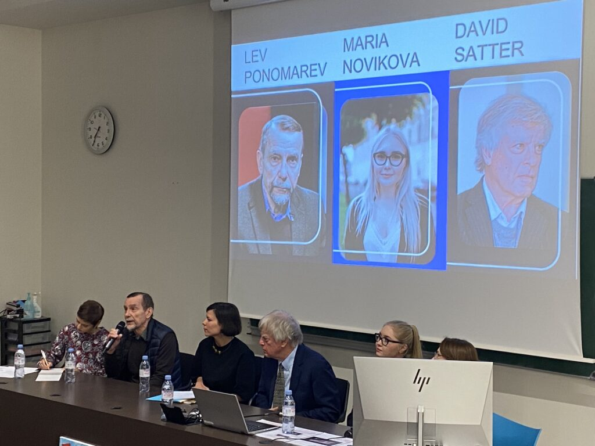
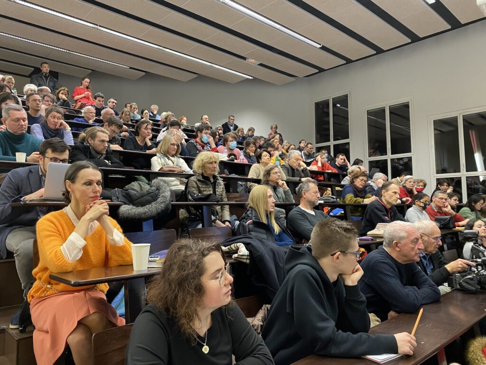
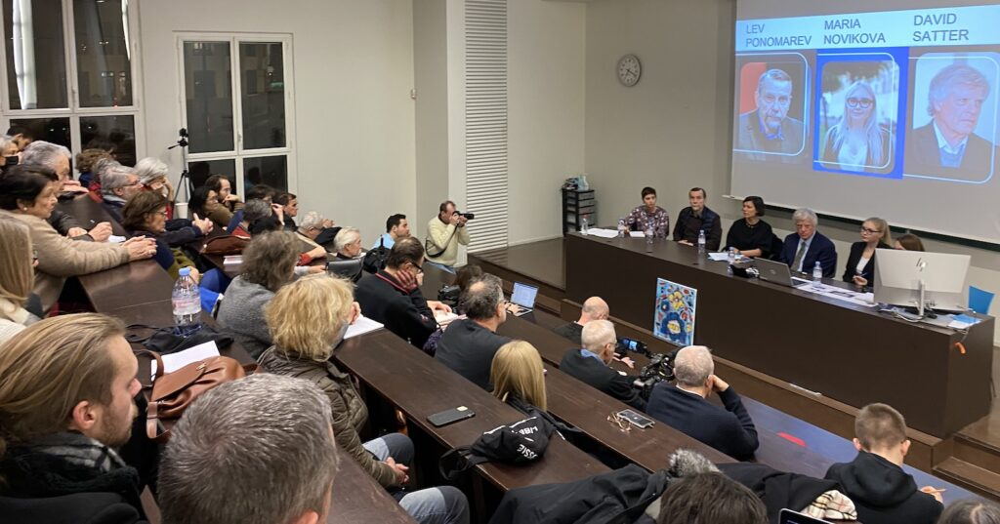
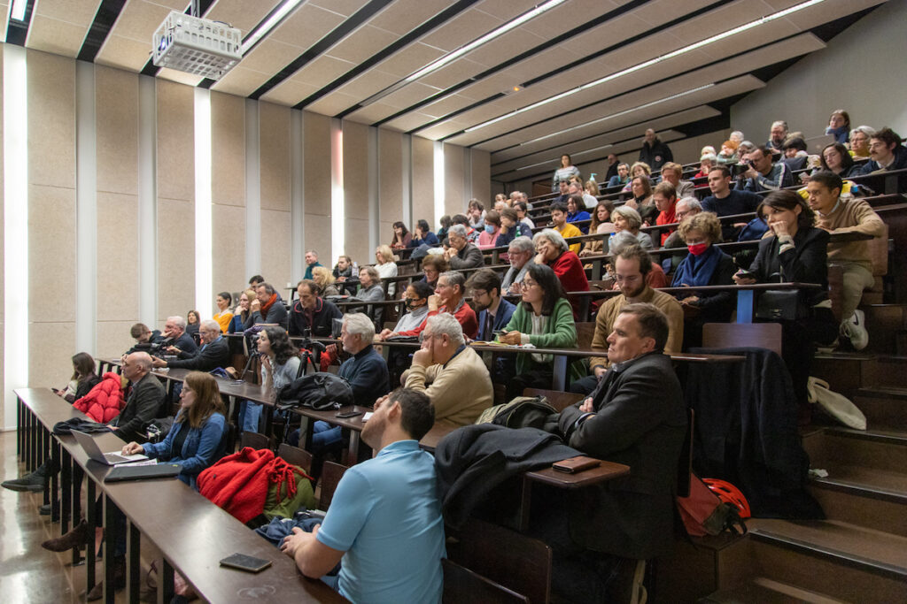
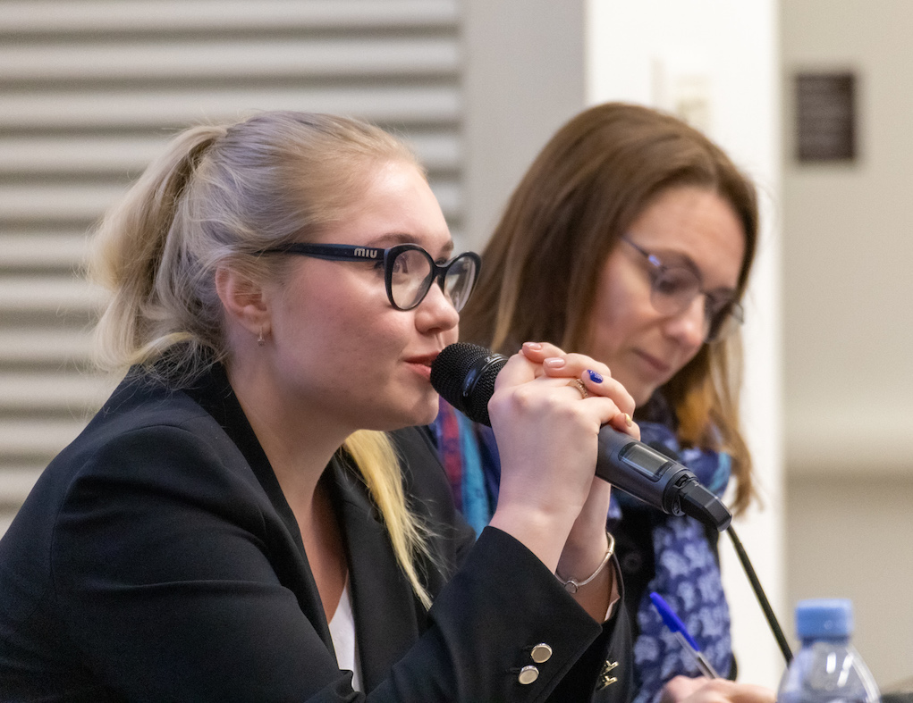
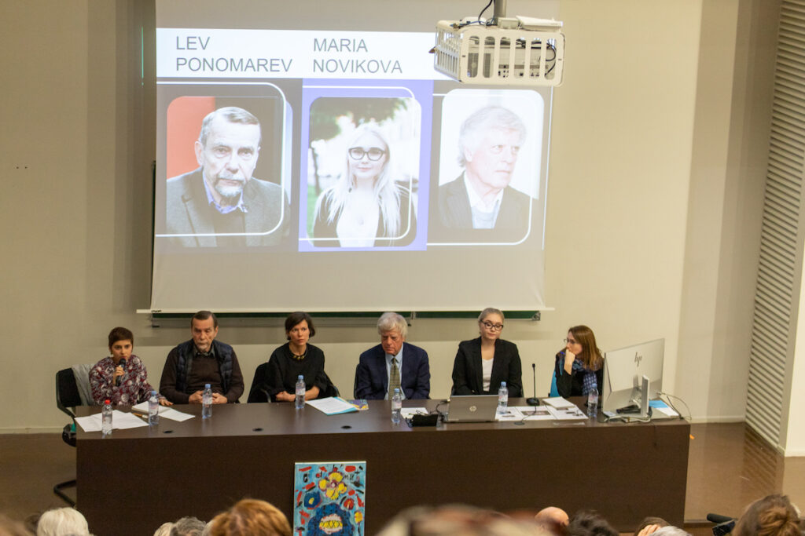
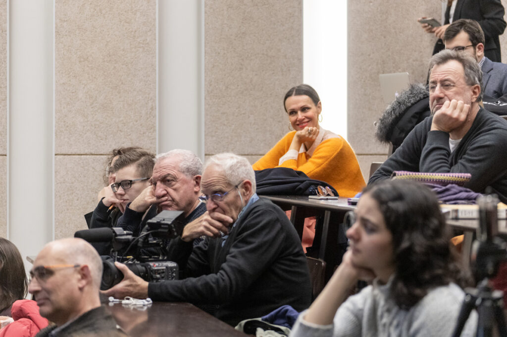
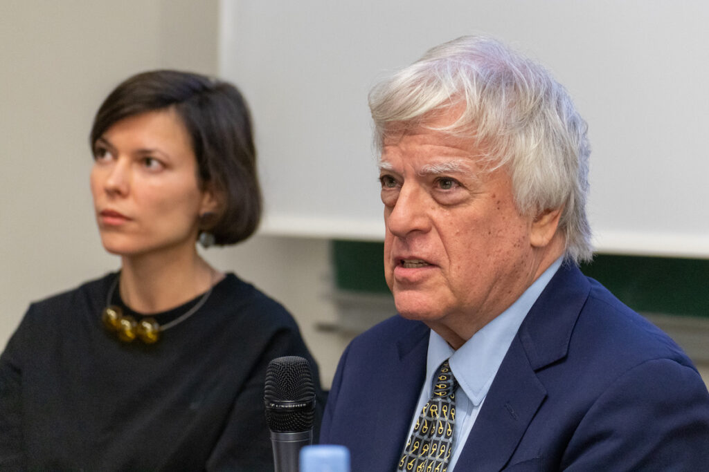
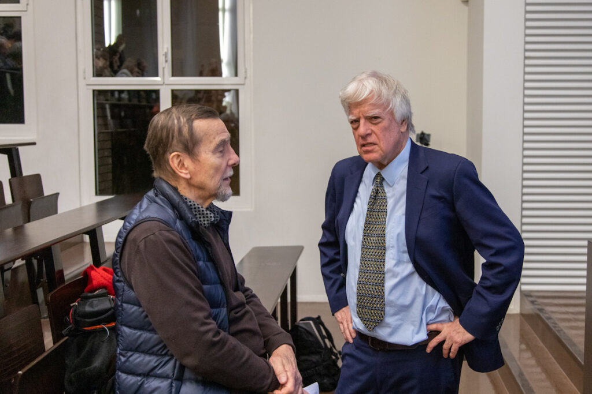
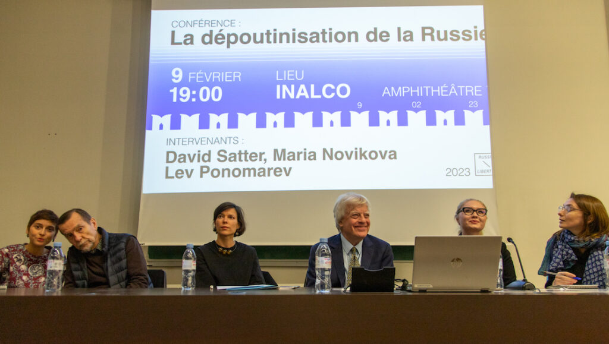

**La paix en Europe ne sera garantie qu’après la «dépoutinisation» de la Russie, tel est le constat que nous faisons aujourd’hui.** Comment assurer cette défaite de Poutine en Russie et organiser la dépoutinisation du pays soumis depuis 20 ans à un régime répressif et une propagande de grande ampleur ?

Nous en avons parlé le **9 février 2023 lors d'un conférence qui s’est tenue à l'INALCO** .

Cet événement nous a permis de réfléchir ensemble sur les chemins que pourraient prendre la Russie pour atteindre un état démocratique. Trois personnalités sont intervenues à cette occasion, trois regards croisés qui ont donné leur vision de la Russie d'après Poutine : **__David Satter, Maria Novikova et Lev Ponomarev.__**

---
- 

- 

- 

- 

- 

- 

- 

- 

- 

- 

---

**David Satter** est revenu sur la **montée au pouvoir de Vladimir Poutine** pour rappeler qu’il est devenu président **à la suite de la vague d'attentats** visant des immeubles en Russie et **la guerre de Tchétchénie** .  M. Satter a insisté sur la nécessité de

«D **ire la vérité sur les explosions des années 1990, raconter les crimes, l’attentat de Beslan, de Dubrovka, les assassinats de Nemtsov, de Politkovskaia** , […] parler de tout cela pour commencer la dépoutinisation et créer des conditions démocratiques pour la Russie», David Satter.

**Lev Ponomarev** a, quant à lui, alerté sur le risque de montée en puissance, même dans les pays démocratiques, de **l’autoritarisme susceptible d’ébranler les fondements constitutionnels** . Il a également rappelé que, « dans les années 90 [les russes ont] réussi à faire une révolution démocratique et pacifique et [ont] su créer une constitution démocratique. La crise économique, a fait que […] la tcheka [ __ndlr__ . la police politique de la période soviétique, ici au sens figuré] a pris le pouvoir ».

Lev Ponomarev a souligné qu’en Russie « **seules 10-15% de la population soutient vraiment Poutine** », « les autres restent juste silencieux ».

Selon **Maria Novikova** , la dépoutinisation de la Russie mènera à l’état où **l’être humain aura « la valeur suprême ».** La priorité pour Maria sur le chemin de la dépoutinisation est « d’atteindre notre public, propager la vraie information, lutter contre la propagande. Discuter avec les gens en utilisant un langage accessible pour les différentes populations ». Il est important, selon Maria, que les citoyens comprennent pourquoi les valeurs démocratiques, la liberté d'expression et les élections libres sont nécessaires.

« Nous devons expliquer mais pas imposer, nous devons **inculquer un amour de la liberté à des gens qui ne savent pas ce qu'est la liberté car nous ne sommes pas des gens libres** », a souligné Maria Novikova.

Il ne serait pas possible d’avancer sur le chemin de dépoutinisation de la Russie sans la victoire de l’Ukraine. Ainsi, l’ensemble des intervenants ont appelé à la nécessité d’accélérer **l’aide à l’Ukraine à vaincre la guerre** , en regagnant l'ensemble de ses territoires, y compris l’aide militaire. En dépendra la liberté et l’indépendance de l’Ukraine, mais aussi celles de l’Europe, de la Russie et du Bélarus.

Retrouvez le replay (en français et en russe) ici et la conférence en images plus bas (photos par Nikita Mouraviev) :

---
- [**REPLAY** **FR**](https://youtu.be/0LrWkuB1UYI)
- [**REPLAY** **RU**](https://youtu.be/FNiOHzvzyWI)
---

Nous remercions l'INALCO pour le soutien.

---

**PORTRAITS DES INTERVENANTS**

__**David Satter** est un journaliste et historien américain spécialiste de la Russie et de l'Union soviétique. Il est l'auteur de livres et d'articles sur le déclin et la chute de l'Union soviétique et la montée de Poutine au pouvoir dans la Russie post-soviétique, dont notamment "Darkness at Dawn: The Rise of the Russian Criminal State" publié en 2003 et qui est un des premiers à accuser le FSB d'avoir organisé les attentats à Moscou qui ont conduit à la 2nde guerre en Tchétchénie et à la montée au pouvoir de Vladimir Poutine. Satter a aussi été le premier journaliste américain expulsé de Russie par le gouvernement en 2013.__

__**Lev Ponomarev** est militant politique russe et un des plus grands défenseurs des droits humains, homme de confiance de Sakharov, député du 1 er parlement après la chute de l’URSS, cofondateur de l’ONG Mémorial (prix Nobel de la Paix). Lev Ponomarev a lancé une pétition "Non à la guerre" dès le lendemain de l'invasion russe de l'Ukraine et a recueilli plus de 1 250 000 signatures. Aujourd’hui, Lev Ponomarev est réfugié en France, où il a fondé l’Institut Sakharov, pour poursuivre la coordination de son travail de défense des droits humains en Russie depuis la France.__

__**Maria Novikova** est une juriste russe spécialisée dans les droits humains et cofondatrice du projet du média anti-guerre en ligne NITKA. Militante depuis 2018, Maria a d'abord été coordinatrice régionale du mouvement de jeunesse démocratique Vremya (le Temps) et a participé aux élections municipales de Saint-Pétersbourg en tant que candidate indépendante. Elle poursuit désormais son travail depuis la France, en faisant du conseil aux militants russes et en gérant des dossiers de plaintes pour la Cour européenne des Droits de l'Homme.__

---

__**POUR ALLER PLUS LOIN :**__

nous vous invitons à lire notre tribune publiée dans le journal Le Monde: __[« La paix en Europe ne sera garantie qu’après la “dépoutinisation” de la Russie »](https://www.lemonde.fr/idees/article/2022/12/15/la-paix-en-europe-ne-sera-garantie-qu-apres-la-depoutinisation-de-la-russie_6154505_3232.html)__

ainsi que les deux articles suivants sur notre site internet :

[https://russie-libertes.org/index.php/2022/10/28/2012-2022-retour-sur-une-decennie-de-luttes-pour-la-liberte-et-de-repressions-en-russie/](https://russie-libertes.org/index.php/2022/10/28/2012-2022-retour-sur-une-decennie-de-luttes-pour-la-liberte-et-de-repressions-en-russie/)

[https://russie-libertes.org/index.php/2023/01/21/des-russes-sopposent-a-la-guerre-en-ukraine/](https://russie-libertes.org/index.php/2023/01/21/des-russes-sopposent-a-la-guerre-en-ukraine/)
