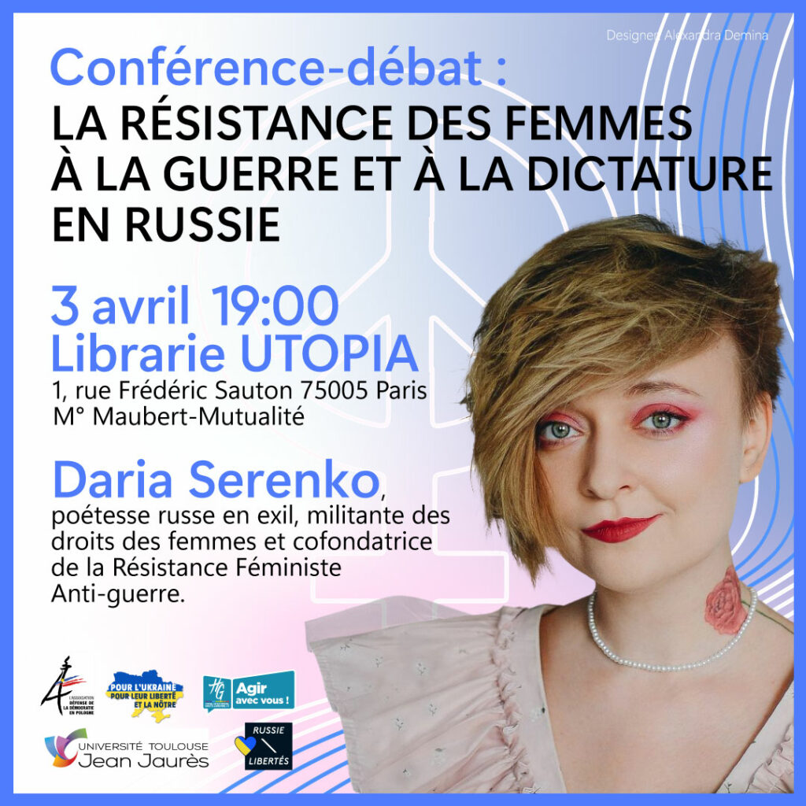

Lundi 3 avril à 19h, aura lieu une conférence-débat avec la présence exceptionnelle de Daria Serenko, artiste, militante anti-guerre russe, cofondatrice du mouvement FAS (Feministskoïe antivoïennoïe soprotivlenié) ou « Résistance Feministe anti-guerre », qui agit dans la Fédération de Russie, Véronique Nahoum-Grappe, anthropologue, spécialiste des violences de guerre contre les civils, Daria Burleshina, professeure de langues, artiste et Svitlana Konovalova, doctorante en littérature.

Créée en février 2022, au moment de l’invasion russe de l’Ukraine, la FAS réunit 45 associations à travers tout le territoire de la Fédération de Russie auxquelles s’ajoutent des dizaines de militantes anonymes, sans compter celles qui ont dû s’exiler. 

 La force de ce réseau vient de ce qu’il s’appuie sur des structures qui préexistaient à la guerre et des liaisons horizontales rendant plus difficile le contrôle et l’arrestation de ses membres. Toutefois, plus de 200 militantes font aujourd’hui l’objet de poursuites en Russie.

Les actions de la FAS, qui mobilisent des citoyennes ordinaires, vont du rassemblement public à l’incendie des bureaux de recrutement de l’armée. La résistance à la propagande du régime passe par l’intervention dans des groupes WhatsApp de quartier, la diffusion de conseils pour échapper à la conscription sur les chaînes Telegram dédiées, jusqu’à la distribution dans les boîtes aux lettres du samizdat anti-guerre Jenskaya Pravda (la Pravda des femmes), rédigé aussi dans les langues minoritaires de la Fédération.

La violence en Ukraine et les violences contre les femmes sont un seul et même fléau de la Russie : le virilisme et le culte de la brutalité sont le ciment idéologique du régime de Poutine et d’une société où la violence est partout : de la sphère familiale, où les violences s’exercent sur les femmes et les enfants, jusqu’aux bizutages criminels dont s’accompagne la formation militaire, en passant par l’école désormais militarisée.

« La guerre et les droits des femmes sont étroitement liés, explique Daria Serenko, car […] ceux qui commettent les pires crimes [sur le champ de bataille] sont souvent les mêmes qui se montrent les plus brutaux chez eux. »

En Ukraine, la mobilisation des femmes montre leurs capacités dans l’organisation de la société civile : en Russie, peuvent-elles constituer une force de mobilisation politique face à la dictature machiste et masculiniste ?

L’événement est co organisé par :

- Pour l’Ukraine, pour leur liberté et la nôtre ! Association créée par 130 universitaires rejoints par de très nombreux partisans et partisanes de la cause ukrainienne, publie des tribunes et mène des actions en soutien à la cause de l’Ukraine.

- Russie-Libertés : Fondée en 2012, l’association a pour principal objectif la défense des droits humains et le soutien au développement d’une démocratie en Russie. Elle est le membre de la coalition internationale des russes anti-guerre.

- L’ association Défense de la Démocratie en Pologne (ADDP) a été créée en 2016 à Paris en vue de défendre les valeurs démocratiques européennes (droits des femmes, des réfugiés, etc.). Elle apporte son soutien aux femmes survivantes des violences sexuelles perpétrées par les Russes en Ukraine en collaboration avec la Fondation Dr. Denis Mukwege.

Avec la participation de:

- L'université Toulouse Jean Jaurès. 

 - Conseil Départemental de la Haute-Garonne.

Merci à Alexandra Demina pour le design de l'affiche.

```


```


---
- [Inscrivez-vous pour y assister](https://www.helloasso.com/associations/russie-libertes/evenements/la-resistance-des-femmes-a-la-guerre-et-a-la-dictature-en-russie?fbclid=IwAR18JB02cUmkug2evwncoH5UPNoBZmJpTq4GXSTcev7yRJ4o8U6QxE9e54w)
---

```


```

