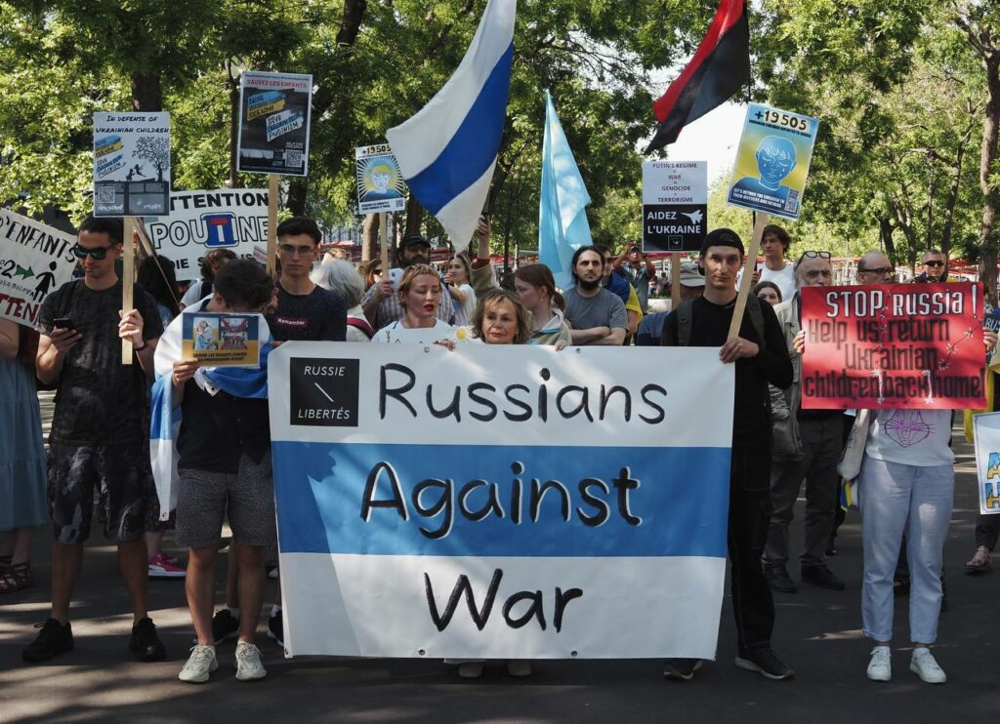
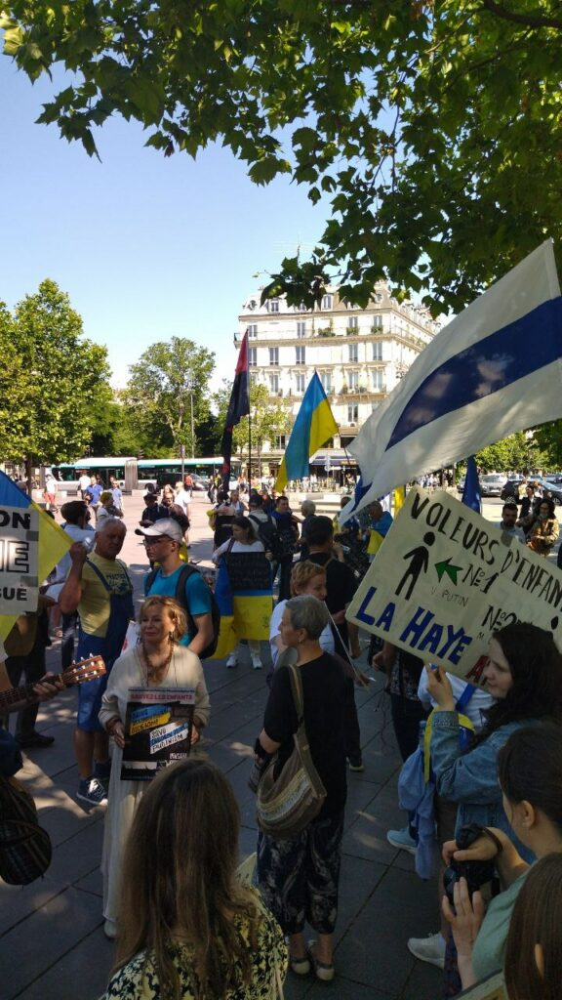
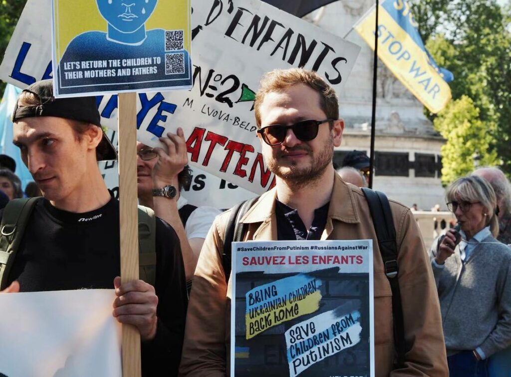
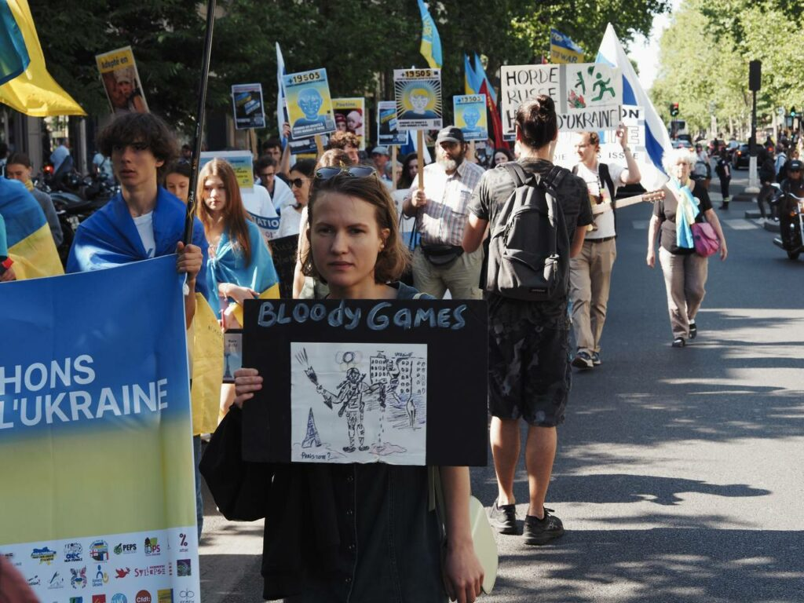
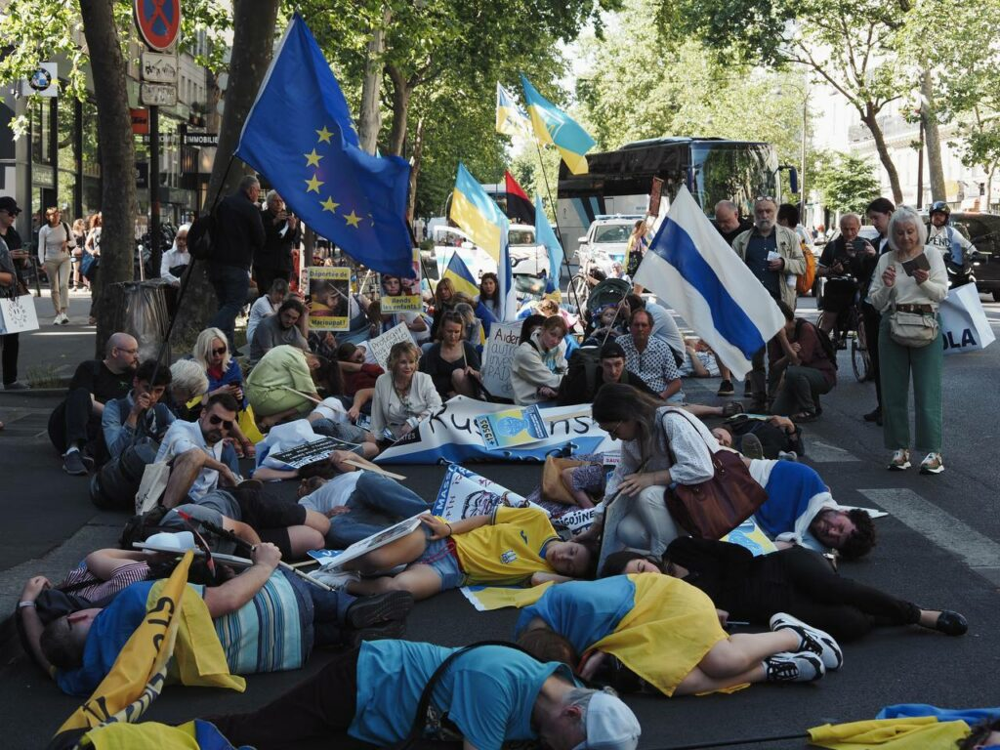
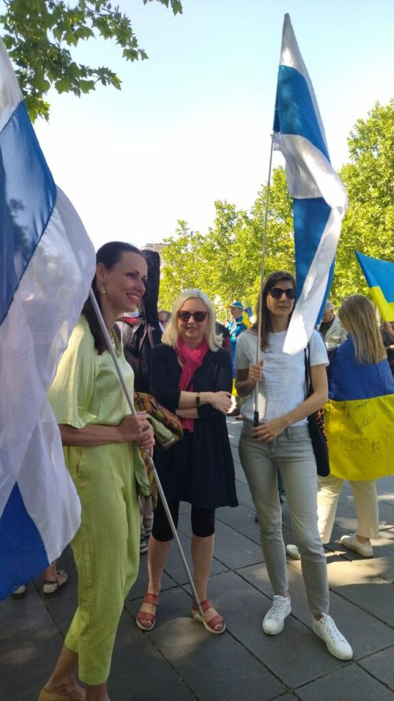
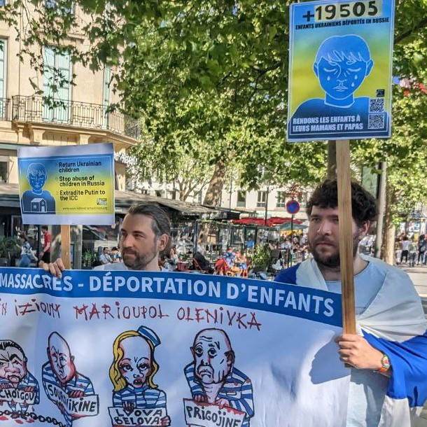
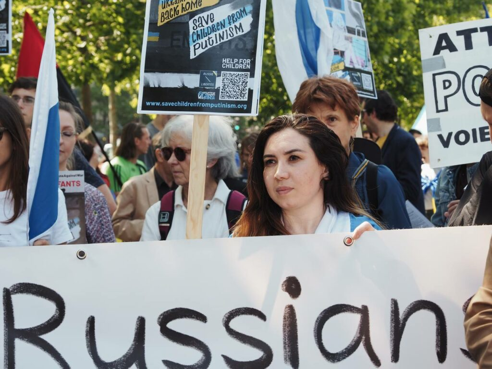
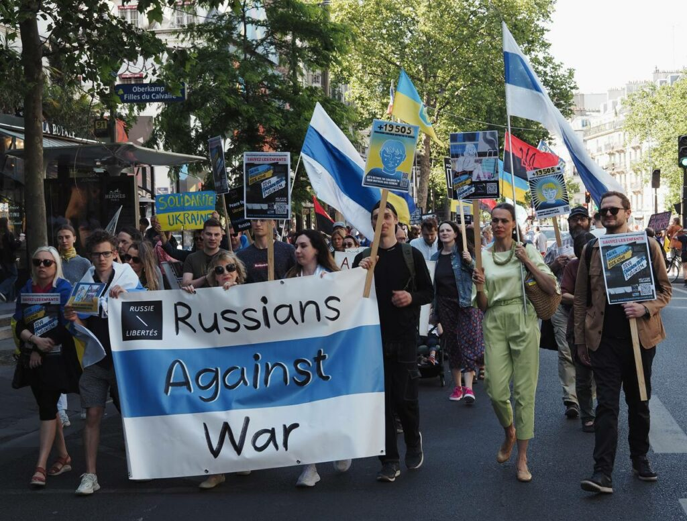

Les communautés et les associations démocratiques et opposées à la guerre formées par les russes dans le monde entier, dont notamment le mouvement [«Voice of Free Russia»](https://linktr.ee/voiceoffreerussia) , organisent la campagne **[« Sauvons les enfants du poutinisme »](https://www.savechildrenfromputinism.org/en/)** . Au cours d’un mois et demi les militants russes organisent manifestations, cortèges, événements caritatifs et autres initiatives. L’étape finale va coïncider avec la Journée internationale des enfants victimes innocentes d’agression, instituée par l’ONU et fixée au 4 juin.


### Enfants ukrainiens


L'ONU a déjà reconnu la déportation des enfants d'Ukraine, notamment à partir des territoires occupés par la Russie, comme un crime de guerre. La Cour Pénale Internationale a émis le premier mandat d'arrestation à l'encontre de V. Poutine et M. Lvova-Belova, concernant précisément leurs crimes envers les enfants. En langage juridique, on a déjà qualifié ces actes barbares de génocide. Selon les informations du site de l'État ukrainien ["Children of War"](https://childrenofwar.gov.ua/en/) , au 03 juin 2023, 19 505 enfants ont été illégalement déportés de l'Ukraine, et tous n'ont pas été retrouvés, loin de là. Selon certaines estimations, ce chiffre pourrait atteindre les centaines de milliers. Il existe plusieurs témoignages confirmés du fait que les structures qui accueillent les enfants cherchent à les « rééduquer » idéologiquement et politiquement, tandis que certaines leur imposent un entraînement militaire.


### Enfants russes


Les enfants de Russie sont également ciblés par le gouvernement de Poutine. Le gouvernement soumet les enfants à une propagande massive et intensifie cette pression idéologique chaque jour. Le gouvernement de Poutine déforme les situations réelles en modifiant les programmes d'étude. Il cherche à instiller aux enfants un pseudo-patriotisme et de fausses valeurs, afin d'élever une génération de zombies pro-Kremlin, ce qui représente une énorme menace pour le futur. L'éducation et l'instruction sont de plus en plus militarisées. Depuis l'école maternelle, on force les enfants à participer à des « fêtes » et concours militarisés. Les cours de préparation à la guerre ont été réintroduits dans les écoles. Des colonies de vacances militaires-patriotiques ont été organisées.

Les enfants qui expriment des opinions contre la guerre subissent des punitions et des persécutions. On exerce une pression sur les enfants en les séparant de leurs parents qui n'approuvent pas la politique du pouvoir.

```


```


---

```


```


La campagne globale ["Sauvons les enfants du poutinisme"](https://www.savechildrenfromputinism.org/en/) s'oppose à ces actions atroces du gouvernement poutinien, qui vont à l'encontre de toute humanité et du droit international. Dans le cadre de la campagne, les Russes adressent leurs préoccupations aux organisations et structures suivantes, qui ont le pouvoir d'intervenir dans cette situation inconcevable dans le monde civilisé et de mettre fin à la guerre de Poutine contre les enfants :

#### l’UNICEF et le Comité International de la Croix Rouge


Ils doivent solliciter auprès du gouvernement de la Fédération de Russie la possibilité de rendre visite aux enfants ukrainiens qui y ont été portés. Ils doivent inspecter les conditions dans lesquelles ils se trouvent et garantir leur déplacement en Ukraine ou dans un pays tiers.

#### Les gouvernements des pays qui reconnaissent la Cour Pénale Internationale


Afin de respecter le Statut de Rome et d'exécuter le mandat d'arrestation émis contre V. Poutine et M. Lvova-Belova, ils doivent les remettre à cette même Cour.

#### la Cour Pénale Internationale


Afin qu'elle émette des mandats d'arrestation contre tous les criminels dont leur implication dans la déportation des enfants ukrainiens a été démontrée.

#### les gouvernements des pays qui ne reconnaissent pas la Cour Pénale Internationale


Nous demandons qu'ils émettent un mandat d'arrestation contre V. Poutine, M. Lvova-Belova et tous les complices connus de la déportation d'enfants.

#### Les pays démocratiques


Nous demandons aux gouvernements respectifs d'intervenir et d'exiger des criminels, en premier lieu V. Poutine et M. Lvova-Belova, la restitution immédiate de tous les enfants ukrainiens déportés. Ces gouvernements devraient contribuer au rapatriement de ces enfants ou à leur déplacement en Ukraine ou dans un pays tiers.

#### Le Comité des droits de l’enfant de l’ONU


Nous leur demandons de prêter attention aux mesures répressives prises contre les enfants en Fédération de Russie, telles que les poursuites administratives et pénales contre ceux qui s'expriment activement en tant que dissidents. Nous leur demandons de réagir à la militarisation de l'instruction et de l'éducation, à la propagande belliciste ciblant les enfants, ainsi qu'à l'utilisation des enfants pour exercer une pression sur les parents mécontents du pouvoir.


---


La campagne-relais globale "Sauvons les enfants du poutinisme" propose non seulement des initiatives publiques dans la rue, telles que des manifestations, des rassemblements ou des performances, mais aussi d'écrire personnellement aux gouvernements et aux autorités de plusieurs pays, et de participer à des événements et rencontres thématiques.

Voici la liste des villes du monde qui participent à la campagne : [https://www.savechildrenfromputinism.org/](https://www.savechildrenfromputinism.org/) ( __Les lieux et les horaires des initiatives seront rajoutés au fur et à mesure qu’elles seront confirmées__ )

```


```


## Collecte de fonds


```


```


**Les manifestations sont terminées, mais le projet continue !** Nous avons lancé une collecte de fonds qui sera reversée aux organisations travaillant sur les projets suivants :

* recherche d'enfants ukrainiens déportés ;
* recherche et retour des enfants ukrainiens déportés ;
* l'assistance aux enfants russes qui ont souffert des répressions de Poutine ;
* la lutte contre la propagande dans les établissements d'enseignement russes ;

Save Ukraine, KidMapping, Russia Behind Bars et d'autres portent ces importants projets qui correspondent à notre collecte de fonds.

```


```


---
- [Je veux aider](https://www.helloasso.com/associations/russie-libertes/collectes/save-children-from-putinism)
---

```


```


## Manifestation à Paris "Sauvons les enfants"


```


```


3 Juin 2023 à Paris Marche de la place de la République à la place de la Bastille à 16h00. 

 Joignez-vous à notre manifestation pour le retour des enfants ukrainiens déportés en Russie et contre l'endoctrinement des enfants russes par le régime de Poutine.

Cette marche organisée conjointement par l’ ["Union des Ukrainiens de France"](https://uduf.fr/) , l’association ["Pour l'Ukraine, pour leur Liberté et la Nôtre"](https://www.pourlukraine.com/) et ["Russie-Libertés"](https://russie-libertes.org/about/) a lieu à l'occasion de la Journée internationale des enfants victimes d’agression du 4 juin.

```


```


---
- 

- 

- 

- 

- 

- 

- 

- 

- 

---
