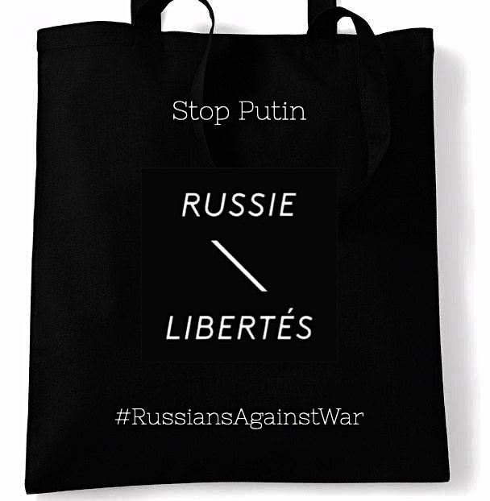

ЛЕТНЯЯ ВСТРЕЧА RUSSIE-LIBERTES

ADRESSE/ АДРЕС : Maison des Associations, 181 avenue Daumesnil, Paris 12

HEURE / ВРЕМЯ : 14h30 à 17h00

LANGUE / ЯЗЫК : FR & RU

Дорогие друзья, члены и соратники Russie-Libertés!

Мы приглашаем вас на летнюю встречу с Russie-Libertés и нашими гостями 8 июля в Доме ассоциаций в 12-м округе. 

 Эта встреча будет иметь новый для вас формат: мы предлагаем интерактивные дебаты, в которых вы будете полноправным участником. 

 Темы дебатов будут самыми разнообразными: 500 дней войны в Украине, формы российского сопротивления, оппозиция в изгнании, борьба с пропагандой...

Дебаты будут вести наши гости:

**Ксения Большакова** , журналистка, писательница и лауреат премии Альберта Лондона за документальный фильм о Вагнере 

 **Лев Пономарев** , правозащитник и президент Института Сахарова

Также, в рамках встречи, **Анастасия Буракова** основательница Ковчега, презентует новый проект Первым Рейсом (по zoom)

После дебатов, приглашаем вас на дружественный пик-ник !

ЗАПИСЬ ОБЯЗАТЕЛЬНА

---
- [ЗАПИСЬ НА ВСТРЕЧУ](https://www.helloasso.com/associations/russie-libertes/evenements/debat-sur-l-opposition-russe-et-la-presentation-du-projet-first-flight)
---

Chers amis, membres et sympathisants de Russie-Libertés !

Nous vous convions à une rencontre d'été avec Russie-Libertés et nos invités le 8 juillet à la Maison des Associations du 12ème arrondissement.

Cette rencontre aura un nouveau format pour vous: nous vous proposons un débat interactif, où vous serez partie prenante à part entière. 

 Les thèmes du débat seront variées: les conclusions des 500 jours de la guerre en Ukraine, les formes de résistance des russes, l'opposition en exil, la lutte avec la propagande...

Le débat sera animé par nos invités : 

 **Ksenia Bolchakova** , journaliste, autrice et détentrice du Prix Albert-Londres pour le documentaire sur le Groupe Wagner 

 **Lev Ponomarev** , défenseur de droits humains et président de l'Institut Sakharov

Après les débats, nous vous invitons à un pique-nique participatif amical.

INSCRIPTION OBLIGATOIRE

---
- [INSCRIPTION](https://www.helloasso.com/associations/russie-libertes/evenements/debat-sur-l-opposition-russe-et-la-presentation-du-projet-first-flight)
---

ADRESSE/ АДРЕС : Maison des Associations, 181 avenue Daumesnil, Paris 12

HEURE / ВРЕМЯ : 14h30 à 17h00

__Закажите нашу сумку и получите её на встрече / Commandez notre totebag et retirez le le 8 juillet. 

 Цена/Prix : 15 EUR (заказ при записи через Hello Asso / commande à l'inscription sur Hello Asso)__

