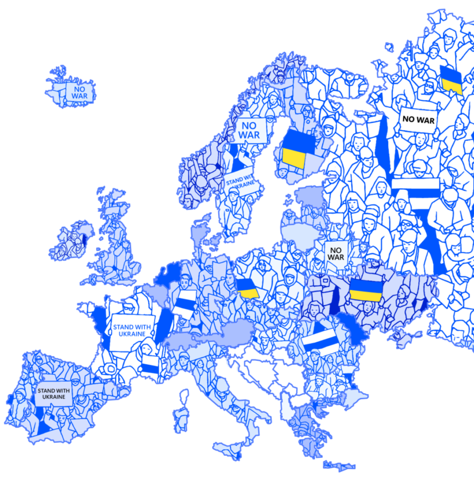

---

## **ПОДДЕРЖКА РОССИЙСКИХ ГОЛОСОВ ПРОТИВ ВОЙНЫ : ЗАЛОГ МИРА В ЕВРОПЕ**

 
!! НА КОНФЕРЕНЦИЮ 30.09 С 14 ДО 18 МЕСТ БОЛЬШЕ НЕТ !!
 
Вы можете записать на остальные мероприятия Форума.
 
Регистрация на воркшопы завершена.
 
---
- [Регистрация на форум в Gaîté Lyrique](https://my.weezevent.com/forum-russie-libertes-2023-ru)
- [Регистрация на круглый стол в Sciences Po](https://www.eventbrite.fr/e/political-opposition-and-anti-war-resistance-in-russia-external-guests-tickets-722030060347)
---
 


---


---

```


```


Целью ежегодного форума ассоциации "Russie-Libertés" является взаимная дискуссия между европейскими общественными деятелями и представителями российского гражданского общества на такие темы, как способствование прекращению агрессии России в Украине. А также обсуждение методов ненасильственного сопротивления войне в Украине и способов демократизации России.

Форум будет проводиться в рамках недельной программы посвященной голосам России против войны с обширной культурной программой включающей эхо международного фестиваля независимого документального кино ART DOC FEST (21-25 сентября : [программа](https://russie-libertes.org/wp-content/uploads/2023/09/Artdocfest-completete-presentation.pdf) ), а также художественные, музыкальные и театральные перформансы. Для активистов сетевых демократических движений будут предложены закрытые воркшопы.

Эта коллективная дискуссия в Париже, в самом сердце Европы, является частью проекта, осуществляемого [**Институтом Франции**](https://institutfrancais.com/fr) под названием **"Перед лицом войны - европейские диалоги"** .

```


```


---

****Задача форума направлена на привлечение внимания французской и европейской общественности к вопросам поддержки антивоенного и демократического сопротивления в России, справедливости для Украины, и на разработку дорожной карты для устойчивой демократизации России, которая в результате не будет больше представлять угрозы для Европы и мира.****

---

```


```


## Наша программа


### ****День** 1 - 29.09.2023**


---

<br class="unsupported style" data-shortcode="" />
 
14:30-16:00 

 Место: Gaîté Lyrique
 
<br class="unsupported svg" data-shortcode="" />
 
### Workshops для активистов

 
**1. Как нам это вывозить: психологическая устойчивость для активистов, журналистов и волонтеров** 

 Тренер: Ирина Костерина – кандидат социологический наук, с 2009 по 2022 программный координатор Фонда им. Генриха Белля, основательница и тренер проекта «Устойчивый активизм» 

 

 **2. Инструменты и практики фандрайзинга. Особенности коммуникации с институциональными донорами** 

 Тренер: Григорий Фролов - Вице-президент Free Russia Foundation, координатор сети ресурсных центров Reforum Spaces 

 

 Закрыто для публики, на русском языке
 
15:30-17:00 

 

 Место: Gaîté Lyrique 

 Auditorium
 
<br class="unsupported svg" data-shortcode="" />
 
### Презентации творческих антивоенных проектов 1

 
- TNG Lyon : "Музей (не)воображаемых историй" 

 - ON/OFF_France : платформа, объединяющая русскоязычных танц-художников в условиях войны. 

 

 __На французском и русском языках__ 

 __Вход по регистрации обязателен__
 
****17:45-19:45**** 

 

 Место: ****Sciences Po****
 
<br class="unsupported svg" data-shortcode="" />
 
### Round-table :    Political opposition and anti-war resistance in Russia

 


 Chair: **Sergei Guriev** , Professor, Sciences Po 

 

 Speakers: 

 **Evgenia Kara-Murza** , Advocacy coordinator, Free Russia Foundation 

 **Mariana Katzarova** , Special Rapporteur for the situation of human rights in Russia, United Nations Human Rights Council 

 **Timofei Martynenko** , Coordinator of Youth Democratic Movement VESNA (Spring) 

 **Vadim Prokhorov** , Lawyer for Vladimir Kara-Murza, former lawyer for Ilya Yashin 

 

 Discussant: **Marie Mendras** , Researcher and Professor, Sciences Po 

 

 The event is organized in cooperation with Russie-Libertés and the Institut Français, as part of the annual Paris Forum Russie-Libertés. 

 

 Discussions will take place in English. 

 __Registration required by this [link](https://www.eventbrite.fr/e/political-opposition-and-anti-war-resistance-in-russia-external-guests-tickets-722030060347)__

---

### ****День** 2 - 30.09.2023**


---

<br class="unsupported style" data-shortcode="" />
 
**10:45-12:15** 

 

 Место: **Gaîté Lyrique**
 
<br class="unsupported svg" data-shortcode="" />
 
### Workshops для активистов

 
**3. Как рассказывать про свой проект: каналы дистрибуции медиа-продукта** 

 Тренер: Лола Тагаева - главный редактор издания “Верстка” 

 

 4. **Краудфандинг. Как собирать сторонников и частные пожертвования** 

 Тренер: Софья Жукова - исполнительный директор Helpdesk Media, бывший директор фонда "Нужна помощь". 

 

 Закрыто для публики, на русском языке
 
****11:45-13:15**** 

 

 Место: **Gaîté Lyrique** 

 Auditorium
 
<br class="unsupported svg" data-shortcode="" />
 
### Презентации творческих антивоенных проектов 2

 
- " **Сопротивление через искусство** ", дискуссия с **Викой Приваловой** , художницей и соосновательницей движения Феминистское антивоенное сопротивление, c **Александрой Дёминой** , художницей и **Naum Bleek** , рэппер-поэт 

 - Медиаинсталляция " **Женщины против войны: узницы России** ", в сотрудничестве с Фемнистским Антивоенным Сопротивлением. 

 - Показ эпизодов **Масяня** 

 - Показ анимаций проекта **Animators Against War** 

 

 __На французском и русском языках__ 

 __Вход по регистрации обязателен__
 
**14:00-18:00** 

 

 Место: ****Gaîté Lyrique****
 
<br class="unsupported svg" data-shortcode="" />
 
 
### ОСНОВНАЯ КОНФЕРЕНЦИЯ

 
Открытие ассоциацией __**Russie-Libertés**__ и партнёры 

 

 Выступление __**Дельфин БОРИОН**__ , посол по правам человека, Министерство Европы и иностранных дел Франции 

 

 **Два круглых стола** 

 **Многообразие российских голосов против войны: какие действия еще возможны ?** 

 Докладчики: 

 __- **Лев Пономарев**__ , правозащитник и политический диссидент 

 - __**Дмитрий Колезев**__ , главный редактор REPUBLIC 

 - __**Надежда Скочиленко**__ , мать Александры Скочиленко, художница, находящаяся в заключении 

 - __**Катя Ру**__ , специалист по адвокации, AMNESTY INTERNATIONAL FRANCE 

 __- **Григорий Свердлин**__ , директор антивоенного проекта ИДИТЕ ЛЕСОМ 

 - __**Ирина Князева**__ , координатор ПЛАТФОРМЫ антивоенных инициатив 

 Модератор - __**Татьяна Кастуева-Жан**__ , директор Центра Россия/Евразия IFRI 

 

 

 **Дорожная карта демократизации России и роль Европы.** 

 Докладчики: 

 - __**Елизавета Осетинская**__ , основатель THE BELL 

 - __**Наталия Арно**__ , основатель FREE RUSSIA FOUNDATION 

 - __**Борис Акунин**__ , писатель, соучредитель гуманитарной организации TRUE RUSSIA 

 - __**Бернар Гетта**__ , депутат Европарламента 

 - __**Сергей Голубок**__ , адвокат, специалист по международному праву 

 - __**Анастасия Шевченко**__ , политик, активист, член Антивоенного Комитета 

 Модератор - __**Матэо Малик**__ , главный редактор Le Grand Continent 

 

 Регистрация завершена
 
18:30-20:30 

 

 Место: ******Gaîté Lyrique****** 

 Auditorium
 
<br class="unsupported svg" data-shortcode="" />
 
 
### Показ фильма Андрея Лошака "Разрыв связи" и дискуссия с журналистом-режиссером

 
__Вход свободный__
 
20:30-21:00 

 

 Место: ******Gaîté Lyrique****** 

 1er étage
 
<br class="unsupported svg" data-shortcode="" />
 
 
### Showcasing [Naum Bleek](https://www.facebook.com/naum.bleek/)

 
__Вход свободный__
 
29 и 30 сентября 

 Место: Gaîté Lyrique, Chambre sonore
 
<br class="unsupported svg" data-shortcode="" />
 
 
### Женщины против войны: узницы России

 
Медиа инсталляция организованная совместно с Феминистским Антивоенным движением.

---

```


```


## Наши партнеры и Дружественные ассоциации


```


```


---
- 
- 
- 
- 
- 
- 
- 
- 
- 
- 
---

```


```

