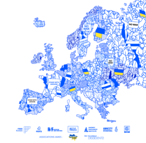
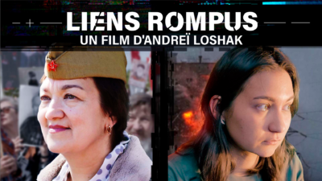
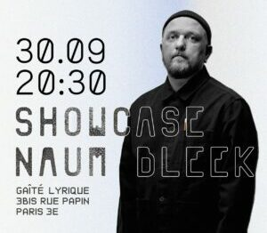
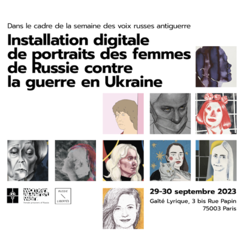

---

## **SOUTENIR LES VOIX RUSSES EN RÉSISTANCE À LA GUERRE, POUR UNE PAIX DURABLE EN EUROPE**

 
!! ATTENTION : LES CONFERENCES SONT COMPLETES !!
 
---
- [S'inscrire](https://my.weezevent.com/forum-russie-libertes-2023)
---

---


---

```


```


L’association Russie-Libertés et ses partenaires ont le plaisir de vous présenter le forum intitulé **« Soutenir les voix russes en résistance à la guerre, pour une paix durable en Europe »** qui se tiendra les **29 et 30 septembre 2023** , à Paris, dans le cadre de la semaine des voix russes antiguerre.

Comme chaque année, le Forum organisé par l'association Russie-Libertés, réunit et facilite les échanges entre des personnalités françaises et européennes et des représentants de la société civile russe ainsi que des membres de l'opposition démocratique.

En 2023, l’actualité oriente le Forum autour des thématiques des résistances à la guerre en Ukraine, de la nécessaire réflexion sur la démocratisation de la Russie après la guerre, ainsi que la transition vers une société plus apaisée et pacifique.

Cette discussion collective, à Paris, au cœur de l’Europe, est organisée avec le soutien de **[l’Institut Français](https://www.institutfrancais.com/fr)** dans le cadre du projet **"Face à la guerre- Dialogues Européens"** .

Le forum se tiendra dans le cadre d'un programme d'une semaine consacré aux nombreuses voix en résistance à la guerre en Ukraine, avec un vaste programme culturel comprenant des représentations artistiques, musicales, théâtrales et cinématographiques, dont notamment l'écho du festival international du film documentaire indépendant **[ART DOC FEST](https://m.facebook.com/story.php?story_fbid=122094695840037431&id=61551122932598)** (21-25 septembre : [PROGRAMME ART DOC FEST](https://russie-libertes.org/wp-content/uploads/2023/09/Artdocfest-full-presentation-fr_compressed.pdf) ).

```


```


---

**Nous visons à créer une réflexion commune et à sensibiliser l'opinion publique française et européenne sur les questions de soutien à la résistance démocratique et anti-guerre russe, la mise en place d’un processus de justice pour l’Ukraine et la feuille de route pour la démocratisation durable de la Russie afin qu’elle ne soit plus une menace pour ses voisins, l’Europe et le monde.**

---

```


```


## Notre Programme    **__prévisionnel__**


### **Jour 1 - 29.09.2023**


---

<br class="unsupported style" data-shortcode="" />
 
****15:30-17:00**** 

 

 Lieu : **Gaîté Lyrique** 

 Auditorium
 
<br class="unsupported svg" data-shortcode="" />
 
### **Projets culturels russes contre la guerre et en soutien aux Ukrainiens. Partie 1**

 
– **__TNG Lyon__ :** “Musée des histoires (non) imaginées”, présentation du projet d'exposition interactive et performative d'artistes en exil. 

 - __**ON/OFF_France**__ : une plateforme qui réunit des artistes de danse russophones dans le contexte de guerre. 

 

 __En français et russe.__ 

 __Entrée sur inscription__
 
****17:45-19:45**** 

 

 Lieu : ********Sciences Po********
 
<br class="unsupported svg" data-shortcode="" />
 
### Round-table :    Political opposition and anti-war resistance in Russia

 


 Chair: **Sergei Guriev** , Professor, Sciences Po 

 

 Speakers: 

 **Evgenia Kara-Murza** , Advocacy coordinator, Free Russia Foundation 

 **Mariana Katzarova** , Special Rapporteur for the situation of human rights in Russia, United Nations Human Rights Council 

 **Timofei Martynenko** , Coordinator of Youth Democratic Movement VESNA (Spring) 

 **Vadim Prokhorov** , Lawyer for Vladimir Kara-Murza, former lawyer for Ilya Yashin 

 

 Discussant: **Marie Mendras** , Researcher and Professor, Sciences Po 

 

 The event is organized in cooperation with Russie-Libertés and the Institut Français, as part of the annual Paris Forum Russie-Libertés. 

 

 Discussions will take place in English. 

 __Registration required by this [link](https://www.eventbrite.fr/e/political-opposition-and-anti-war-resistance-in-russia-external-guests-tickets-722030060347)__

---

### **Jour 2 - 30.09.2023**


---

<br class="unsupported style" data-shortcode="" />
 
****11:45-13:15**** 

 

 Lieu : **Gaîté Lyrique** 

 Auditorium
 
<br class="unsupported svg" data-shortcode="" />
 
### **Projets culturels russes contre la guerre et en soutien aux Ukrainiens. Partie 2**

 
- " __**La Résistance par l'art**__ ", discussion avec **Vika Privalova** , artiste et cofondatrice de Feminist Anti-War Resistance, **Alexandra Demina** , artiste et **Naum Bleek** , rappeur-poète. 

 - Installation digitale " **Les femmes contre la guerre : prisonnières de Russie** ", en coopération avec Feminist Anti-War Resistance. 

 - Projection d'animations du projet **Animators Against War** et présentation du projet par réalisatrices des films d’animation **Sofie Grozovski** , **Daria Yurishcheva** et **Eliza Olkinitskaya** 

 – Projection d'épisodes de la série d'animation “ **Masyanya** ”. 

 

 ____En français et russe.__ 

 __Entrée sur inscription____ .
 
**14:00-18:00** 

 

 Lieu : ******Gaîté Lyrique****** , Auditorium
 
<br class="unsupported svg" data-shortcode="" />
 
 
### **CONFÉRENCE PRINCIPALE**

 
**Mot d'ouverture** par l'association **Russie-Libertés** 

 

 Intervention de Mme __**Delphine BORIONE** , Ambassadrice pour les droits de l’Homme,__ __Ministère de l’Europe et des Affaires étrangères__ 

 

 **Deux tables rondes 

 - LA DIVERSITE DES VOIX RUSSES EN RESISTANCE A LA GUERRE : QUELLES ACTIONS ET MOYENS RESTENT POSSIBLES ?** 

 Intervenants : 

 **Lev Ponomarev** , défenseur de droits humains et grand dissident politique russe 

 __**Dimitri Kolezev**__ , rédacteur en chef du média REPUBLIC 

 __**Nadejda Skotchilenko**__ , mère d'Alexandra Skotchilenko, artiste emprisonnée 

 __**Katia Roux**__ , chargée de plaidoyer d'AMNESTY INTERNATIONAL FRANCE 

 __**Grigoriy Sverdline**__ , directeur du projet antiguerre GET LOST 

 __**Irina Kniazeva**__ , coordinatrice de la PLATEFORME DES INITIATIVES ANTIGUERRE 

 Modération par __**Tatiana Kastoueva-Jean**__ , directrice du Centre Russie / Eurasie de l'IFRI 

 **- PENSER LA RUSSIE LIBRE : QUELLE FEUILLE DE ROUTE POUR LA DEMOCRATISATION DU PAYS ET QUEL ROLE DE L'EUROPE ?** 

 Intervenants : 

 __**Elizaveta Osetinskaya**__ , fondatrice du média THE BELL 

 __**Natalia Arno**__ , fondatrice de FREE RUSSIA FOUNDATION 

 __**Boris Akounine**__ , écrivain et cofondateur de l’organisation humanitaire TRUE RUSSIA 

 __**Bernard Guetta**__ , eurodéputé 

 __**Serguei Golubok**__ , avocat, spécialiste du droit international 

 **__Anastasia Shevchenko__** , personnalité politique, membre du COMITE ANTIGUERRE 

 Modération par __**Mathéo Malik**__ , rédacteur en chef, Le Grand Continent 

 

 __En français et russe.__ 

 __Entrée sur inscription__ .
 
18:30-20:30 

 

 Lieu : ******Gaîté Lyrique****** 

 Auditorium
 
<br class="unsupported svg" data-shortcode="" />
 
 
### Projection du film "Liens rompus" d'Andrei Loshak suivi d'une discussion avec le journaliste-réalisateur

 


 __En russe, sous-titré en français.__ 

 __Entrée sur inscription__ .
 
20:30-21:00 

 

 Lieu : ******Gaîté Lyrique****** 

 1er étage
 
<br class="unsupported svg" data-shortcode="" />
 
 
### Showcasing Naum Bleek, rappeur russe engagé

 
__Entrée libre__
 
Les 2 jours : 29 et 30  septembre 

 Lieu : Gaîté Lyrique, Chambre Sonore
 
<br class="unsupported svg" data-shortcode="" />
 
 
### __Les femmes contre la guerre : prisonnières de la Russie__

 
__installation digitale coorganisée avec le mouvement "Résistance Féministe antiguerre"__

---

```


```


## Nos Partenaires et Associations Amies


---
---
- 
- 
- 
- 
- 
- 
- 
- 
- 
- 
---

---
