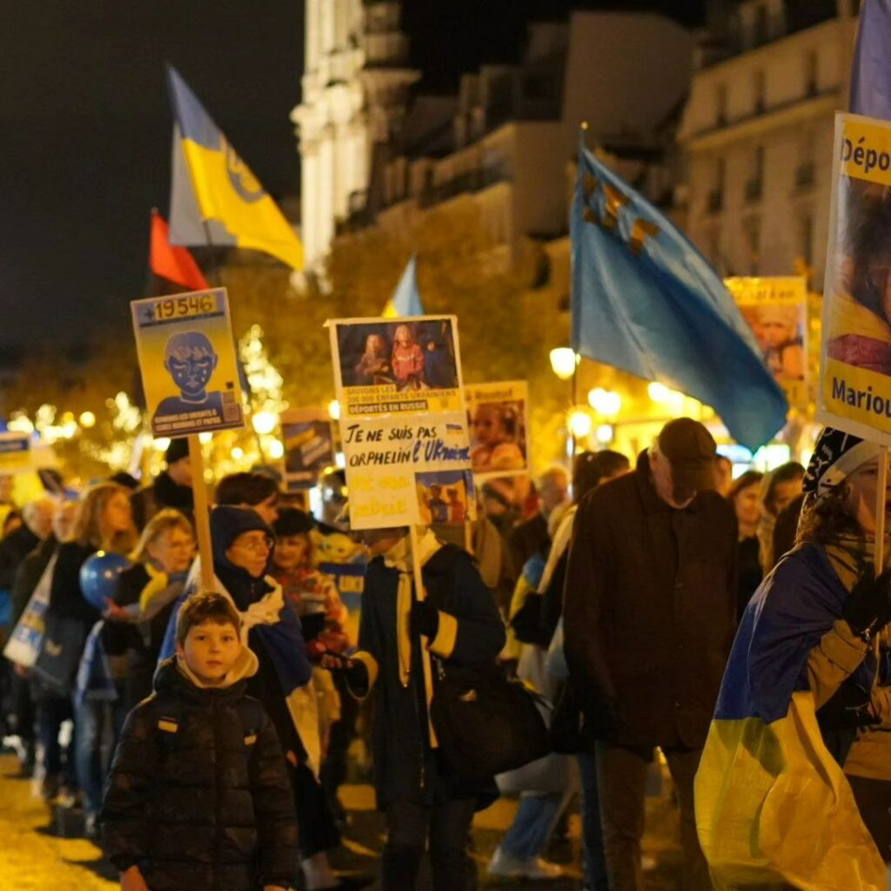
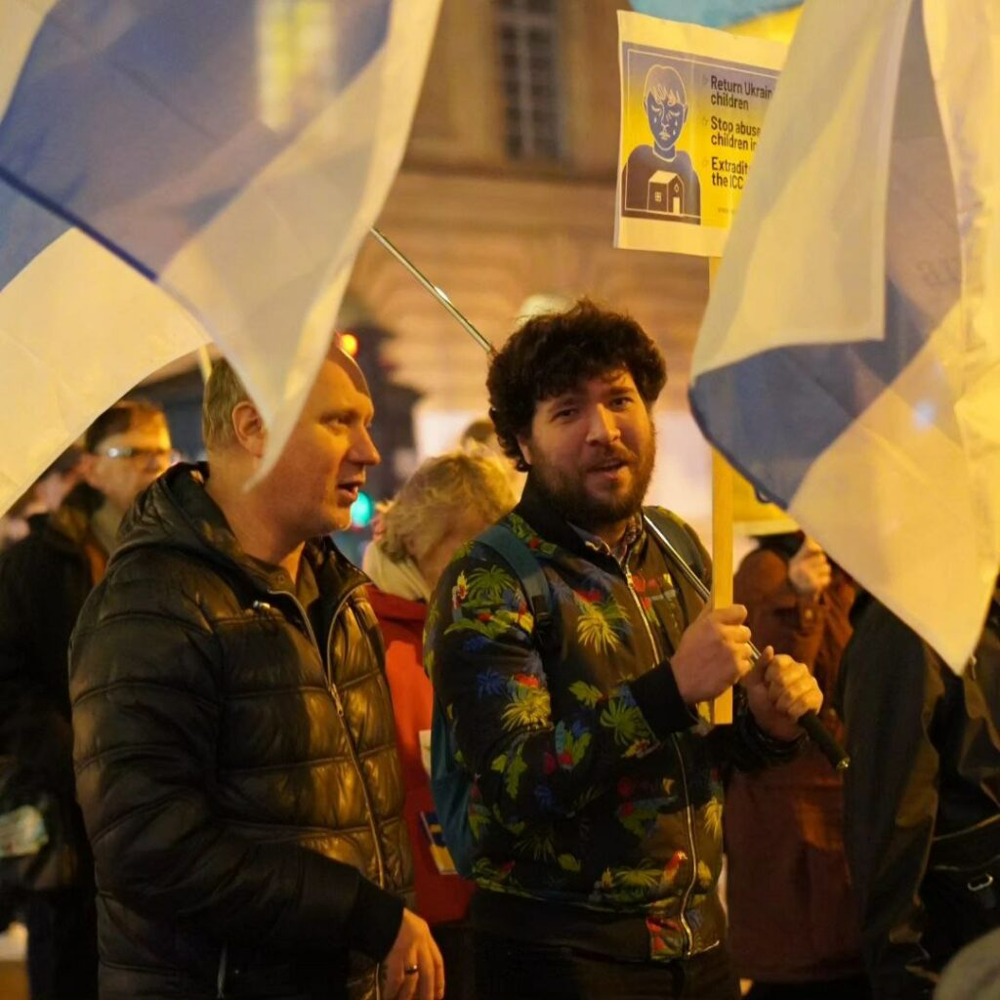
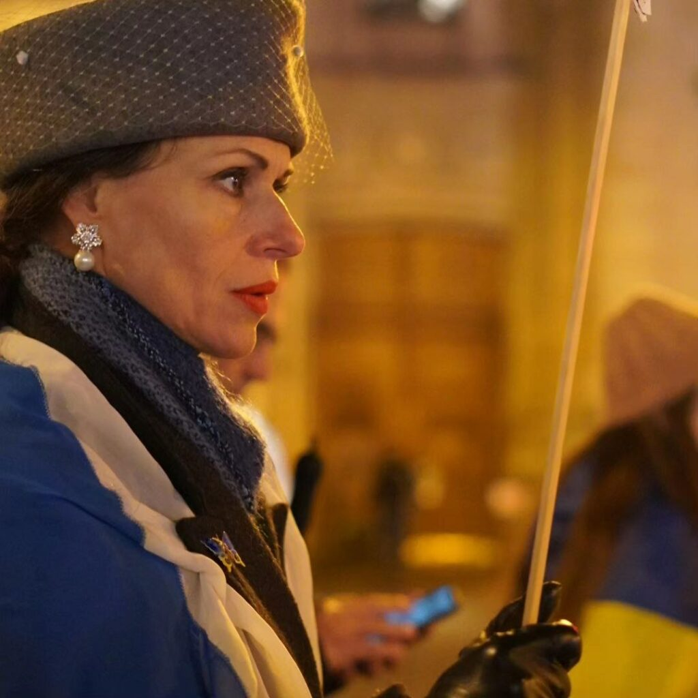
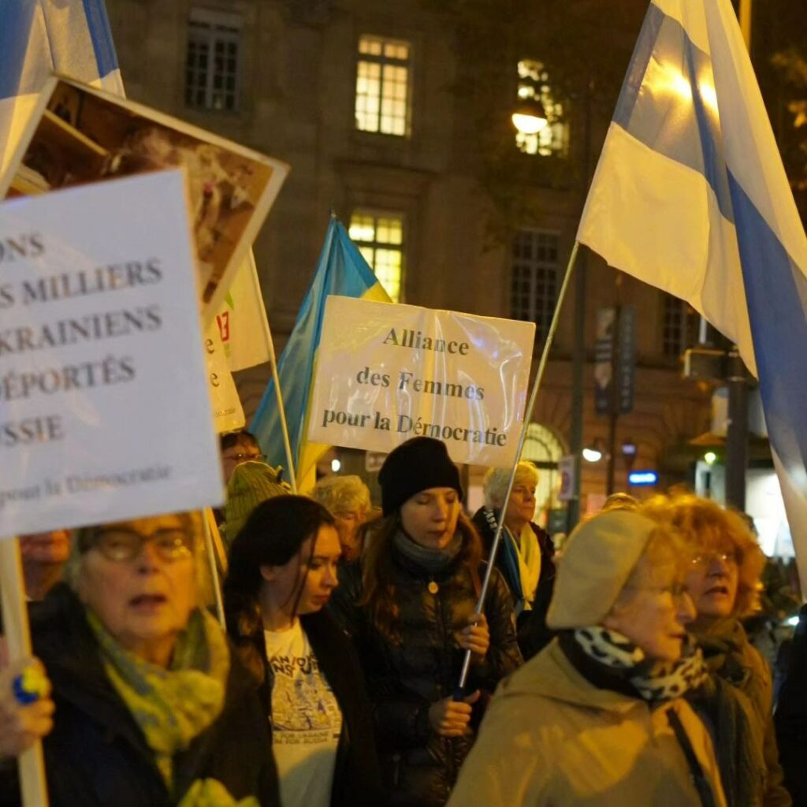

Le 20 novembre, lors de la Journée mondiale de l'enfance, la coalition française de soutien à l'Ukraine, incluant l'association Russie-Libertés, a mené une action pour sensibiliser le public à la déportation d'enfants ukrainiens vers la Russie. D'après les chiffres officiels du gouvernement ukrainien, 19 546 enfants ont été transférés en Russie, un nombre qui ne représente qu'une fraction du problème dans son ensemble. Ces statistiques cachent des histoires d'enfants arrachés de force à leurs familles, symbolisant les conséquences désastreuses de cette situation.

Le gouvernement russe, dans sa tentative d'effacer l'identité ukrainienne, impose une russification forcée à ces jeunes innocents. Cette pratique inhumaine et cruelle doit cesser immédiatement. La coalition appelle [l'UNICEF](https://www.unicef.fr/) , les [Nations Unies](https://www.un.org/fr/) et le gouvernement français à prendre des mesures concrètes et rapides pour faciliter le retour de ces enfants à leurs familles. Chaque jour de retard ne fait qu'exacerber cette tragédie, rendant la situation encore plus désespérée pour ces enfants et leurs familles.

Pour des informations complémentaires sur la situation des enfants en Russie, consultez nos autres articles. [Cliquez ici](https://russie-libertes.org/2023-06-04-sauvons-les-enfants-du-poutinisme/) pour en savoir plus et plonger dans l'analyse détaillée.

```


```


__Photos: Alexandre Borisenko__

---
- 

- 

- 

- 

---
